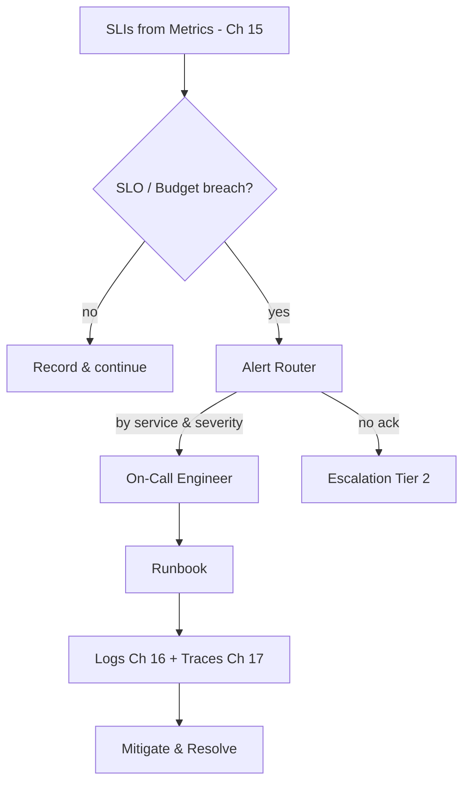

# Volume 11 - Alerting

| Field | Value |
|---|---|
| Document ID | WORLD-VOL11-018 |
| Title | Alerting |
| Version | 1.0 |
| Status | Approved |
| Classification | Internal |
| Founder | Mahesh Choudhary |

## Purpose

This chapter defines how WORLD converts observability signals into timely human action through alerting. Its purpose is to close the loop opened by the three pillars - Monitoring (Chapter 15), Logging (Chapter 16), and Tracing (Chapter 17) - by specifying how the platform decides that something is wrong enough to interrupt a person, whom it notifies, and how that person is guided to a resolution. Alerting is where observability becomes operations: without it, dashboards are watched by no one at 3am, and degradation detected by the pillars goes unactioned.

## Scope

Covered: the alerting concept, service-level objectives and indicators, error budgets, alert rules and routing, on-call rotations and escalation, runbooks, and alert quality. Excluded: the collection of the underlying signals, which belongs to the three preceding chapters, and incident post-mortem process, which is an organizational rather than infrastructure concern. This chapter concerns the decision-to-notify layer and the human response it triggers, built on top of the metrics, logs, and traces already defined.

## Concept

An alert is an automated judgement that a system's behaviour has crossed a threshold that warrants human attention. From first principles, alerting exists because humans cannot watch dashboards continuously, and because not every anomaly deserves a page - alerting on everything trains responders to ignore alerts, while alerting on nothing means outages are discovered by customers. WORLD anchors alerting in service-level objectives (SLOs): explicit targets for reliability, such as serving ninety-nine point nine percent of requests under a latency bound, measured by service-level indicators (SLIs) derived from metrics. The gap between the objective and perfection is the error budget, and alerts fire when that budget is being consumed too fast. This makes alerting principled rather than arbitrary: the platform pages a human when, and only when, the tenant-facing promise is genuinely at risk. Every alert then routes to an owner and carries a runbook.

## Application in WORLD

In WORLD each critical service carries defined SLOs, and alert rules are written against SLIs and error-budget burn rate rather than against raw resource metrics, so alerts reflect user-facing impact rather than incidental noise. When a rule fires, an alert router classifies it by service and severity and dispatches it to the owning team's on-call engineer through a rotation, with automatic escalation to a second tier if it is not acknowledged within a defined window. Every alert links to a runbook - a concrete, versioned procedure describing what the alert means, how to confirm it, and the first diagnostic and mitigation steps - which points the responder directly into the relevant logs and traces. Alerts are deduplicated and grouped so that one underlying fault raises one actionable notification, not a storm. Alert definitions and runbooks live in version control alongside service code.

### Enterprise Example

At 02:40 the payment-processing service's latency SLI begins burning its monthly error budget at ten times the sustainable rate. A fast-burn alert fires, and the router pages the payments on-call engineer; because it is a severity-one, customer-impacting alert, it also opens an incident channel. The engineer acknowledges within two minutes and opens the linked runbook, which explains that the alert indicates degraded checkout latency and directs them first to the payments dashboard, then to a pre-filtered log query and a slow-trace view. The trace shows a saturated connection pool to the payment gateway. Following the runbook's mitigation step, the engineer raises the pool size and latency recovers; the error-budget burn returns to normal within fifteen minutes. Escalation was never needed, and because the alert was tied to an SLO, it fired precisely when the customer promise was at risk - not on incidental resource noise.

## Key Components

| Component | Role | Notes |
|---|---|---|
| SLO / SLI | Defines and measures the reliability target | SLIs derived from monitoring metrics |
| Error Budget | Quantifies allowable unreliability | Burn rate drives alert urgency |
| Alert Rule | Encodes the firing condition | Written against SLIs, not raw resources |
| Alert Router | Classifies and dispatches alerts | Dedup, grouping, severity routing |
| On-Call & Escalation | Ensures a human responds | Rotation with tiered escalation |
| Runbook | Guides diagnosis and mitigation | Versioned, links to logs and traces |

## Trade-offs & Considerations

The central tension of alerting is sensitivity versus fatigue: too many alerts and responders numb to them, too few and incidents surface via customers. WORLD manages this by alerting on symptoms that map to SLOs rather than on every underlying cause, and by tuning burn-rate windows so slow degradations and sudden outages are handled differently. Every alert must be actionable and carry a runbook; an alert no one can act on is deleted, not tolerated. On-call is a human cost that must be humane - sustainable rotations, clear escalation, and blameless follow-up - or the best tooling still fails. Alert rules can themselves be wrong, so they are reviewed after incidents and version-controlled. Finally, alerting depends wholly on the three pillars: an alert is only as trustworthy as the signal beneath it.

## Relationship to Other Layers

Alerting is the capstone of the observability section, consuming the SLIs produced by Monitoring (Chapter 15) and directing responders into Logging (Chapter 16) and Tracing (Chapter 17) for diagnosis through its runbooks. It expresses at the infrastructure tier the reliability objectives and operational discipline framed at the platform tier in Volume 08 (Chapter 22) and applies to the API surfaces monitored in Volume 10 (Chapter 21). It depends on the orchestration layer (Chapter 05 - Kubernetes) for the scaling actions that many runbooks invoke, and it is the point at which the entire observability stack delivers its ultimate value: protecting the tenant-facing reliability promise.

## Cross-References

- [Monitoring](/docs/blueprint/volume-11-infrastructure/section-e-observability/15-monitoring.md)
- [Logging](/docs/blueprint/volume-11-infrastructure/section-e-observability/16-logging.md)
- [Tracing](/docs/blueprint/volume-11-infrastructure/section-e-observability/17-tracing.md)
- [Volume 10 - API Monitoring](/docs/blueprint/volume-10-api/README.md)

## References

- [Volume 01 - Vision and Philosophy](/docs/blueprint/volume-01-vision-and-philosophy/README.md)
- [Document Standards](/docs/governance/document-standards.md)

## Change Log

| Version | Date | Author | Notes |
|---|---|---|---|
| 1.0 | 2026-07-12 | Lead Software Engineer | Initial approved version. |
