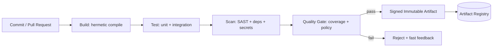

# Volume 11 - CI Infrastructure

| Field | Value |
|---|---|
| Document ID | WORLD-VOL11-019 |
| Title | CI Infrastructure |
| Version | 1.0 |
| Status | Approved |
| Classification | Internal |
| Founder | Mahesh Choudhary |

## Purpose

This chapter defines the continuous integration (CI) infrastructure of WORLD - the automated system that takes every proposed code change, proves it is correct and safe, and turns it into an immutable, signed artifact ready for deployment. Its purpose is to establish a single, uniform pipeline in which no change reaches a deployable state without passing deterministic build, test, and security gates, so that the artifact promoted to production carries verifiable evidence of its own integrity rather than the hope that it works.

## Scope

Covered: the CI concept, the pipeline stages from commit to artifact, the mandatory quality gates (build, test, scan), artifact provenance, and the boundary with delivery. Excluded: the promotion and release of artifacts into environments, which belongs to CD Infrastructure (Chapter 20), and the environment definitions themselves, governed by Section H. This chapter concerns how a change earns the right to be deployed - not how it is subsequently rolled out.

## Concept

Continuous integration exists to close the gap between the moment a developer changes code and the moment the team knows whether that change is safe. From first principles, integration risk grows with batch size and with time-to-feedback, so CI attacks both: changes are integrated in small increments, and every increment is verified automatically within minutes. A CI pipeline is a deterministic function - given the same commit, it must always produce the same result - which requires hermetic builds, pinned dependencies, and isolated runners. The pipeline is structured as a sequence of gates, each of which can only pass or fail; a failure at any gate stops the change and returns fast, precise feedback. The output of a successful run is not merely a green checkmark but an immutable, versioned, cryptographically attested artifact whose provenance can be traced back to the exact source commit that produced it.

## Application in WORLD

WORLD runs one standardized CI pipeline definition across every service, expressed as code and versioned alongside the source it builds. When an engineer opens a pull request, ephemeral isolated runners execute the pipeline: a hermetic build compiles the service into a container image using pinned dependency versions; the test stage runs unit and integration suites and enforces a minimum coverage threshold; the scan stage runs static analysis (SAST), dependency vulnerability scanning, and secret detection against the diff and the full tree. Only when every gate passes is the resulting image signed and its provenance recorded, then published to the artifact registry with an immutable digest. That digest - never a mutable tag - is what the delivery layer later promotes. Because the pipeline is identical for all services and deterministic per commit, the same evidence of quality is guaranteed regardless of which team authored the change.

### Enterprise Example

A payments service team submits a change adding a new refund endpoint. The pipeline builds the image hermetically, runs the test suite where an integration test catches a rounding error, and the run fails within four minutes - the change never advances. The engineer fixes the calculation and resubmits; this time tests pass, but the dependency scanner flags a transitive library with a known critical CVE. The quality gate blocks the merge until the dependency is upgraded. On the third run every gate is green, the image is signed and pushed to the registry under an immutable digest, and its provenance record links it to the exact commit. The change is now eligible for delivery - and the team can prove, months later during an audit, precisely what was built, tested, and scanned before that artifact ever touched an environment.

## Key Components

| Component | Role | Notes |
|---|---|---|
| Pipeline Definition | CI workflow expressed as code | Uniform across all services, versioned with source |
| Ephemeral Runners | Isolated, hermetic build/test hosts | Clean state per run for determinism |
| Build Stage | Compile source to immutable image | Pinned dependencies, reproducible output |
| Test Gate | Unit + integration + coverage | Blocks on failure or low coverage |
| Scan Gate | SAST, dependency, secret scanning | Blocks on critical findings |
| Artifact Registry | Stores signed images by digest | Immutable, provenance-attested |

## Trade-offs & Considerations

Strict gating maximizes safety but adds latency and can frustrate engineers when flaky tests or noisy scanners block legitimate changes; WORLD counters this by quarantining flaky tests, tuning scanner signal-to-noise, and keeping pipeline runtime within a few minutes so feedback stays fast. Hermetic, deterministic builds demand disciplined dependency pinning and isolated runners, which is more operational work than convenient shared caches - but the payoff is reproducibility and trustworthy provenance. Coverage thresholds guard against untested code yet can be gamed by low-value tests, so review culture must complement the metric. Enforcing signing and immutable digests everywhere is more rigorous than mutable tags, but it is the foundation on which the entire supply-chain security story rests. WORLD accepts these costs because a deployable artifact must carry proof, not assumption, of its integrity.

## Relationship to Other Layers

CI is the upstream half of the software supply chain; its signed artifacts are the sole input to CD Infrastructure (Chapter 20), which promotes them through environments. It depends on the container model of Section B (Chapter 04 - Docker) to produce images and on Secrets Management (Chapter 13) to inject build credentials without leaking them. Its security gates operationalize the deployment discipline described in Volume 08 (Chapter 26 - Deployment). The observability instrumentation added during build feeds the monitoring and logging layers of Section E, closing the loop from build-time to run-time visibility.

## Cross-References

- [CD Infrastructure](/docs/blueprint/volume-11-infrastructure/section-f-cicd-and-resilience/20-cd-infrastructure.md)
- [Secrets Management](/docs/blueprint/volume-11-infrastructure/section-d-storage-and-configuration/13-secrets-management.md)
- [Volume 08 - Deployment](/docs/blueprint/volume-08-architecture/section-f-operations-and-scale/26-deployment.md)

## References

- [Volume 01 - Vision and Philosophy](/docs/blueprint/volume-01-vision-and-philosophy/README.md)
- [Document Standards](/docs/governance/document-standards.md)

## Change Log

| Version | Date | Author | Notes |
|---|---|---|---|
| 1.0 | 2026-07-12 | Lead Software Engineer | Initial approved version. |
