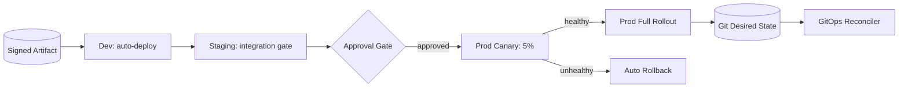

# Volume 11 - CD Infrastructure

| Field | Value |
|---|---|
| Document ID | WORLD-VOL11-020 |
| Title | CD Infrastructure |
| Version | 1.0 |
| Status | Approved |
| Classification | Internal |
| Founder | Mahesh Choudhary |

## Purpose

This chapter defines the continuous delivery (CD) infrastructure of WORLD - the automated system that takes a signed artifact produced by CI and promotes it safely through environments into production. Its purpose is to establish a GitOps-driven, progressively-gated delivery model in which every deployment is a reviewed, versioned, and reversible change to declared desired state, so that releasing software is routine, auditable, and instantly recoverable rather than risky and manual.

## Scope

Covered: the CD concept, the environment progression, promotion and approval gates, GitOps-based reconciliation, progressive deployment strategies, and rollback. Excluded: the production of artifacts, governed by CI Infrastructure (Chapter 19), and the internal definition of each environment, governed by Section H. This chapter concerns how a proven artifact moves into use safely - not how it was built.

## Concept

Continuous delivery decouples the act of building from the act of releasing, so that a validated artifact can be deployed at any time with low risk. From first principles, deployment risk is a function of change size, blast radius, and reversibility; CD minimizes all three. It represents each environment's desired state declaratively in Git, so a deployment is a merged commit rather than an imperative operation, and a reconciler continuously drives the live environment to match. Promotion moves the same immutable artifact - identified by its digest - forward through a staircase of environments, each with tighter gates than the last. Rather than switching all traffic at once, progressive strategies such as canary and blue-green expose the new version to a small slice first, observe health signals, and either advance or automatically revert. Because desired state is versioned, rollback is simply reconciling to a previous commit.

## Application in WORLD

WORLD delivers software through a GitOps flow. Each environment has a declarative manifest in a Git repository pinning the exact artifact digest it should run. Promotion is a change to that manifest: development updates automatically on every green CI run; staging requires the integration gate to pass; production requires an explicit human approval recorded as a pull-request review. A GitOps reconciler watches the manifests and drives each cluster to the declared state, correcting any drift. Production rollouts are progressive - a canary receives a small traffic percentage while the alerting layer (Chapter 18) watches error rate and latency; if signals stay healthy the rollout advances, otherwise the reconciler automatically reverts the manifest to the prior digest. Every promotion, approval, and rollback is a commit, giving a complete, auditable release history with no direct server access.

### Enterprise Example

A new version of the inventory service clears CI and auto-deploys to development. It passes the staging integration gate, and a release manager approves promotion to production via a pull-request review. The reconciler begins a canary at five percent of traffic; within minutes the alerting layer detects a rising p99 latency caused by a missing database index. The health check fails, and the reconciler automatically reverts the production manifest to the previous digest - full traffic never saw the regression, and no engineer had to log into a node at 2 a.m. The team adds the index, and the next promotion sails through the canary to full rollout. The entire episode, including the automatic rollback, is preserved as a sequence of reviewable commits.

## Key Components

| Component | Role | Notes |
|---|---|---|
| Environment Manifests | Declarative desired state in Git | Pin exact artifact digest per environment |
| Promotion Gates | Control advancement between stages | Auto for dev, integration for staging, human for prod |
| GitOps Reconciler | Drives live state to match Git | Detects and corrects drift continuously |
| Progressive Strategy | Canary / blue-green rollout | Limits blast radius, observes before advancing |
| Health Evaluator | Consumes alerting signals | Advances or triggers rollback automatically |
| Rollback Mechanism | Reconcile to prior commit/digest | Fast, deterministic, code-unchanged |

## Trade-offs & Considerations

GitOps delivery gives auditability, reproducibility, and trivial rollback, but it forbids emergency edits directly on servers; genuine break-glass actions must follow a logged exception path. Progressive rollouts reduce blast radius yet lengthen total deployment time and require trustworthy health signals - a canary is only as good as the metrics that judge it, so WORLD invests in the observability layer as a precondition. Human approval gates on production add safety but can become bottlenecks; WORLD keeps them lightweight and clearly owned. Automatic rollback is powerful but must guard against flapping, so hysteresis and cooldowns are applied. Maintaining strict digest-based promotion is more disciplined than redeploying from tags, but it guarantees that what ran in staging is bit-for-bit what runs in production. These constraints are accepted because they turn releasing into a safe, boring, reversible routine.

## Relationship to Other Layers

CD is the downstream half of the supply chain begun in CI Infrastructure (Chapter 19), consuming only signed artifacts. It is realized through the orchestration layer of Section B (Chapter 05 - Kubernetes), whose reconciliation model makes GitOps possible, and it shares the configuration delivery mechanism of Chapter 14. Its canary decisions depend on Alerting (Chapter 18) and the wider observability of Section E. It operationalizes the deployment strategies described in Volume 08 (Chapter 26 - Deployment) and hands off to Disaster Recovery (Chapter 21) when failure exceeds what rollback alone can address.

## Cross-References

- [CI Infrastructure](/docs/blueprint/volume-11-infrastructure/section-f-cicd-and-resilience/19-ci-infrastructure.md)
- [Disaster Recovery](/docs/blueprint/volume-11-infrastructure/section-f-cicd-and-resilience/21-disaster-recovery.md)
- [Configuration Management](/docs/blueprint/volume-11-infrastructure/section-d-storage-and-configuration/14-configuration-management.md)
- [Volume 08 - Deployment](/docs/blueprint/volume-08-architecture/section-f-operations-and-scale/26-deployment.md)

## References

- [Volume 01 - Vision and Philosophy](/docs/blueprint/volume-01-vision-and-philosophy/README.md)
- [Document Standards](/docs/governance/document-standards.md)

## Change Log

| Version | Date | Author | Notes |
|---|---|---|---|
| 1.0 | 2026-07-12 | Lead Software Engineer | Initial approved version. |
