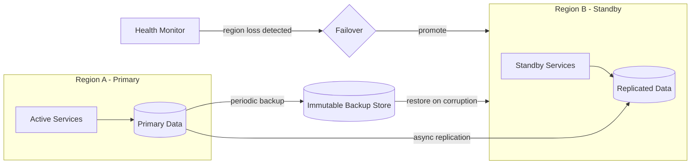

# Volume 11 - Disaster Recovery

| Field | Value |
|---|---|
| Document ID | WORLD-VOL11-021 |
| Title | Disaster Recovery |
| Version | 1.0 |
| Status | Approved |
| Classification | Internal |
| Founder | Mahesh Choudhary |

## Purpose

This chapter defines the disaster recovery (DR) infrastructure of WORLD - the systems and procedures that restore service after a catastrophic failure such as the loss of a region, a data-corrupting incident, or a large-scale provider outage. Its purpose is to bound the worst case with explicit recovery objectives, a multi-region topology, and tested backup and restore mechanisms, so that recovery from disaster is a rehearsed, time-bounded operation rather than an improvised scramble.

## Scope

Covered: the DR concept, recovery objectives (RTO/RPO), the multi-region failover topology, backup and restore aligned with the data lifecycle, and DR testing. Excluded: routine deployment rollback, governed by CD Infrastructure (Chapter 20), and the organizational response to disruption, governed by Business Continuity (Chapter 22). This chapter concerns the technical restoration of systems and data - not the business processes that surround it.

## Concept

Disaster recovery answers two quantitative questions for every critical system: how much data can we afford to lose, and how long can we afford to be down. The recovery point objective (RPO) bounds acceptable data loss and is met by the frequency and durability of backups and replication; the recovery time objective (RTO) bounds acceptable downtime and is met by the speed and automation of failover. From first principles, a system cannot recover from a failure larger than its widest failure domain, so DR replicates state and capacity across independent domains - separate regions that do not share a common failure mode. A backup that has never been restored is a hypothesis, not a safeguard; therefore DR treats restore, not backup, as the deliverable, and proves it through regular drills. The design goal is to convert a catastrophic, unbounded event into a bounded, practiced procedure.

## Application in WORLD

WORLD classifies every service and dataset by criticality and assigns each a target RTO and RPO. Critical transactional systems run active in a primary region with data continuously replicated to an independent standby region and periodic immutable backups written to a separate durable store. A health monitor watches the primary region; on confirmed region-level loss it initiates failover, promoting the standby's replicated data and shifting traffic via the DNS and load-balancing layers (Chapters 07 and 09). For data-corruption events - where replication would faithfully copy the corruption - recovery is a point-in-time restore from the immutable backup store rather than a failover. Backups follow the retention and immutability rules of the data lifecycle, guaranteeing a clean recovery point exists before any corruption window. DR procedures are codified as runbooks and exercised on a schedule so the recovery path is proven, not assumed.

### Enterprise Example

A cloud provider suffers a full availability-zone-cascading outage that takes the primary region offline. WORLD's health monitor confirms the loss, and the failover runbook promotes the standby region: replicated data is activated, standby services scale up, and DNS shifts customer traffic. Within the target RTO of thirty minutes, tenants are transacting again, having lost at most the sub-minute RPO window of unreplicated writes. Two weeks later, a separate incident - a bad migration corrupting an inventory table - cannot be solved by failover, because the corruption replicated to the standby. Instead the team restores that dataset to a point-in-time snapshot from moments before the migration using the immutable backup store, losing only the intervening changes. Both scenarios were rehearsed in prior drills, so the on-call team executed known runbooks rather than inventing a response under pressure.

## Key Components

| Component | Role | Notes |
|---|---|---|
| RTO / RPO Targets | Quantify acceptable downtime and data loss | Assigned per system by criticality |
| Multi-Region Topology | Independent primary and standby regions | No shared failure domain |
| Cross-Region Replication | Keeps standby data current | Bounds RPO for region loss |
| Immutable Backup Store | Point-in-time recovery source | Defends against corruption and ransomware |
| Failover Automation | Promotes standby, reroutes traffic | Bounds RTO for region loss |
| DR Runbooks & Drills | Codify and prove the recovery path | Regularly exercised, not theoretical |

## Trade-offs & Considerations

Tighter RTO and RPO cost more - warm or active standby capacity and frequent replication are expensive, so WORLD tiers objectives by criticality rather than gold-plating every service. Cross-region replication protects against region loss but faithfully propagates logical corruption, which is why immutable point-in-time backups remain essential alongside it; the two defenses address different failure classes and neither replaces the other. Failover automation reduces RTO but risks split-brain if a region is wrongly declared dead, so WORLD requires confirmed, quorum-based failure detection before promotion. Immutable backups defend against ransomware and accidental deletion but consume storage and demand lifecycle-governed retention. Above all, DR capability decays silently unless exercised; untested runbooks fail exactly when needed. WORLD therefore treats scheduled restore drills as non-negotiable operating cost.

## Relationship to Other Layers

Disaster recovery extends beyond what CD Infrastructure (Chapter 20) can undo: rollback handles bad deployments, DR handles lost regions and corrupted data. It relies on the storage and backup foundations of Section D and aligns its retention and immutability with the data lifecycle governed in Volume 09. Failover is executed through the networking layer - DNS (Chapter 09) and Load Balancing (Chapter 07) - and its triggers come from the monitoring and alerting of Section E. It realizes the resilience principles of Volume 08 (Chapter 27 - Disaster Recovery) and supplies the technical backbone that Business Continuity (Chapter 22) wraps in organizational process.

## Cross-References

- [Business Continuity](/docs/blueprint/volume-11-infrastructure/section-f-cicd-and-resilience/22-business-continuity.md)
- [CD Infrastructure](/docs/blueprint/volume-11-infrastructure/section-f-cicd-and-resilience/20-cd-infrastructure.md)
- [Storage](/docs/blueprint/volume-11-infrastructure/section-d-storage-and-configuration/10-storage.md)
- [Volume 08 - Disaster Recovery](/docs/blueprint/volume-08-architecture/section-f-operations-and-scale/27-disaster-recovery.md)

## References

- [Volume 01 - Vision and Philosophy](/docs/blueprint/volume-01-vision-and-philosophy/README.md)
- [Document Standards](/docs/governance/document-standards.md)

## Change Log

| Version | Date | Author | Notes |
|---|---|---|---|
| 1.0 | 2026-07-12 | Lead Software Engineer | Initial approved version. |
