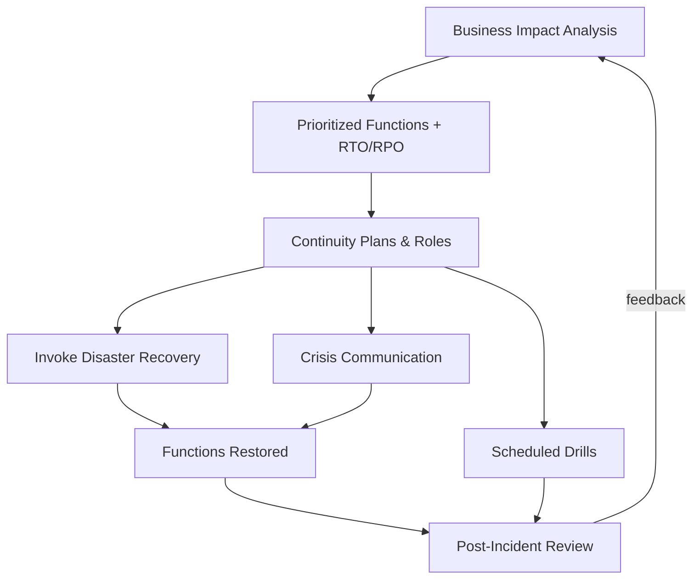

# Volume 11 - Business Continuity

| Field | Value |
|---|---|
| Document ID | WORLD-VOL11-022 |
| Title | Business Continuity |
| Version | 1.0 |
| Status | Approved |
| Classification | Internal |
| Founder | Mahesh Choudhary |

## Purpose

This chapter defines business continuity for WORLD - the organizational discipline that keeps essential business functions operating through disruption, of which technical disaster recovery is one instrument. Its purpose is to establish how WORLD identifies its critical functions, quantifies the impact of their loss, prepares plans and roles to sustain them, and proves readiness through drills, so that a crisis is met with a rehearsed response rather than confusion.

## Scope

Covered: the business continuity concept, business impact analysis (BIA), continuity plans and roles, communication, and the drill program that validates readiness. Excluded: the technical restoration of systems and data, governed by Disaster Recovery (Chapter 21), which this chapter directs and depends upon. This chapter concerns keeping the business functioning end to end - people, process, and communication - not solely restoring infrastructure.

## Concept

Business continuity begins from a question technology alone cannot answer: which business functions must survive, and in what order, for the organization to keep its promises to customers. The business impact analysis (BIA) answers this by mapping each function to the operational, financial, and reputational cost of its unavailability over time, producing a prioritized recovery order and the recovery objectives that DR must then meet. From first principles, a plan that lives only in one expert's head is a single point of failure, so continuity converts tacit knowledge into explicit, role-based plans: who declares an incident, who leads recovery, who communicates with customers and regulators, and by what channels when normal systems are down. Because untested plans fail under stress, continuity is validated through drills that rehearse the human response, exposing gaps while the stakes are simulated rather than real.

## Application in WORLD

WORLD maintains a living BIA that classifies business functions - customer transactions, billing, support, tenant provisioning - by tolerable downtime and data loss, and this classification is the authoritative source for the RTO and RPO targets that Disaster Recovery (Chapter 21) implements. For each critical function a continuity plan names the roles: an incident commander who declares and coordinates, function owners who execute recovery, and a communications lead who keeps customers, staff, and regulators informed through pre-established out-of-band channels that do not depend on the affected systems. Plans reference the specific DR runbooks they trigger, binding organizational response to technical action. A scheduled drill program - from tabletop exercises to full failover rehearsals - tests these plans, and every real or simulated incident ends in a post-incident review whose findings feed back into the BIA and the plans, so continuity improves with each cycle.

### Enterprise Example

A prolonged provider outage takes the primary region down during business hours. The on-call engineer escalates, and the incident commander formally declares a major incident, activating the continuity plan. Following the BIA priority order, the team first restores customer transactions and billing via the DR failover runbook while lower-priority reporting is deliberately deferred. The communications lead, using a pre-agreed status channel independent of WORLD's own infrastructure, issues customer updates and notifies affected enterprise accounts under their contractual timelines. Service is restored within the function's target window. Because the team had rehearsed this exact scenario in a prior drill, roles were clear and no time was lost deciding who does what. The post-incident review surfaces a gap in the regulator-notification step, which is corrected in the plan before the next cycle.

## Key Components

| Component | Role | Notes |
|---|---|---|
| Business Impact Analysis | Prioritizes functions by impact of loss | Authoritative source of RTO/RPO |
| Continuity Plans | Documented response per critical function | Reference the DR runbooks they trigger |
| Roles & Command | Incident commander, owners, comms lead | Removes single-point-of-knowledge risk |
| Crisis Communication | Out-of-band stakeholder updates | Independent of affected systems |
| Drill Program | Tabletops through full rehearsals | Validates plans before real crises |
| Post-Incident Review | Captures lessons, updates BIA/plans | Continuous improvement loop |

## Trade-offs & Considerations

A thorough BIA is effort-intensive and quickly goes stale as the business changes, so WORLD reviews it on a cadence and after major shifts rather than treating it as a one-time artifact. Detailed plans risk becoming shelfware; they earn their keep only through drills, which cost real time and can disrupt normal work - a cost WORLD accepts because untested plans are false assurance. Over-planning for implausible scenarios wastes resources, so continuity is prioritized strictly by the BIA's impact ranking. Crisis communication depends on channels that survive the very outage they report, which requires deliberate out-of-band provisioning that is easy to overlook until it is needed. Clear command structure prevents chaos but must avoid bottlenecking on one person, so deputies are named. The overarching principle is that resilience is organizational, not merely technical: WORLD invests in rehearsed human response as seriously as in redundant infrastructure.

## Relationship to Other Layers

Business continuity is the organizational layer above Disaster Recovery (Chapter 21): the BIA sets the objectives DR must meet, and continuity plans invoke DR runbooks as their technical arm. It consumes the detection signals of the observability layer (Section E) as incident triggers and coordinates the traffic and failover mechanisms of Networking (Section C) and DR during response. It extends the resilience philosophy of Volume 08 (Chapter 27 - Disaster Recovery) into the human and process dimension, ensuring that the technical ability to recover is matched by the organizational ability to act.

## Cross-References

- [Disaster Recovery](/docs/blueprint/volume-11-infrastructure/section-f-cicd-and-resilience/21-disaster-recovery.md)
- [CD Infrastructure](/docs/blueprint/volume-11-infrastructure/section-f-cicd-and-resilience/20-cd-infrastructure.md)
- [Alerting](/docs/blueprint/volume-11-infrastructure/section-e-observability/18-alerting.md)
- [Volume 08 - Disaster Recovery](/docs/blueprint/volume-08-architecture/section-f-operations-and-scale/27-disaster-recovery.md)

## References

- [Volume 01 - Vision and Philosophy](/docs/blueprint/volume-01-vision-and-philosophy/README.md)
- [Document Standards](/docs/governance/document-standards.md)

## Change Log

| Version | Date | Author | Notes |
|---|---|---|---|
| 1.0 | 2026-07-12 | Lead Software Engineer | Initial approved version. |
