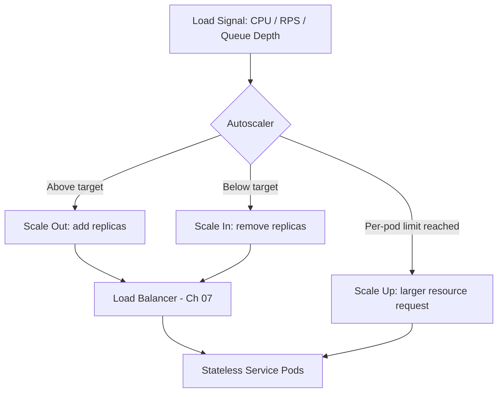

# Volume 11 - Scaling

| Field | Value |
|---|---|
| Document ID | WORLD-VOL11-023 |
| Title | Scaling |
| Version | 1.0 |
| Status | Approved |
| Classification | Internal |
| Founder | Mahesh Choudhary |

## Purpose

This chapter defines how WORLD grows its capacity to meet demand at the infrastructure layer. Its purpose is to establish the disciplines - horizontal and vertical scaling, and the autoscaling policy that governs both - so that every workload absorbs load by adding the right resource at the right time, rather than by manual firefighting or permanent over-provisioning. Scaling is treated as an engineered, policy-driven property of the platform, not an emergency response.

## Scope

Covered: the scaling concept, the two axes (horizontal and vertical), autoscaling signals and controllers, statelessness as the enabler of scale-out, and the scaling posture of WORLD's tiers. Excluded: the availability and failover mechanics of Chapter 24, the latency and throughput tuning of Chapter 25, and the cost discipline of Chapter 26 - each of which consumes the scaling primitives defined here. This chapter answers how WORLD adds capacity; the neighbouring chapters answer how it stays up, stays fast, and stays affordable.

## Concept

Scaling is the act of changing available capacity to match a changing load. From first principles there are exactly two axes. Vertical scaling (scale-up) enlarges a single instance - more CPU, memory, or IOPS - and is simple but bounded by the largest available machine and by the disruption of resizing. Horizontal scaling (scale-out) adds more instances behind a load balancer and is effectively unbounded, but only works when the workload is stateless enough that any instance can serve any request. Autoscaling closes the loop: a controller observes a signal (CPU, request rate, queue depth), compares it to a target, and adjusts instance count or size automatically. The design goal is elasticity - capacity that tracks demand closely in both directions so the platform is neither starved at peak nor wasteful at trough.

## Application in WORLD

WORLD scales horizontally by default. Its stateless application and API services (Volume 10) run as replica sets on Kubernetes (Chapter 05) and are grown or shrunk by a Horizontal Pod Autoscaler driven by CPU and request-rate metrics, with new pods entering rotation through the load balancer (Chapter 07). When per-pod resource requests prove mismatched, a Vertical Pod Autoscaler right-sizes the request so pods pack efficiently onto nodes, and a Cluster Autoscaler adds or removes nodes as the aggregate request changes. Stateful tiers - the databases of Volume 09 - scale primarily through read replicas and partitioning rather than naive replica multiplication, because their state cannot be duplicated without coordination. Every scaling decision is bounded by explicit minimum and maximum limits so a runaway signal cannot exhaust budget or capacity.

### Enterprise Example

A retail tenant runs a flash sale that drives checkout traffic to twelve times its baseline within ninety seconds. WORLD's checkout API, being stateless, is scaled out by the Horizontal Pod Autoscaler from 8 to 96 replicas as request-rate crosses its target; the Cluster Autoscaler provisions additional nodes to host them. The order database, which cannot simply be cloned, absorbs the read-heavy catalog and inventory lookups through pre-provisioned read replicas while writes funnel to the primary. When the sale ends, the autoscalers scale in over a controlled cooldown, releasing nodes and returning the tenant to baseline cost within minutes - elasticity in both directions, with no engineer paged.

## Key Components

| Component | Axis | Role | Typical WORLD Use |
|---|---|---|---|
| Horizontal Pod Autoscaler | Horizontal | Adjusts replica count from load signals | Stateless API and app services |
| Vertical Pod Autoscaler | Vertical | Right-sizes per-pod CPU/memory requests | Correcting mismatched requests |
| Cluster Autoscaler | Horizontal (nodes) | Adds/removes nodes for aggregate demand | Absorbing cluster-wide surges |
| Read Replicas & Partitioning | Horizontal (data) | Scales stateful read/write capacity | Volume 09 database tiers |
| Scaling Policy (min/max/cooldown) | Control | Bounds and paces every scaling action | Guardrails against runaway scaling |

## Trade-offs & Considerations

The two axes trade simplicity against ceiling. Vertical scaling is operationally trivial but hits a hard limit at the largest machine and usually requires disruptive restarts, so WORLD uses it mainly to right-size, not to grow indefinitely. Horizontal scaling is unbounded but demands statelessness, adds coordination and load-balancing overhead, and multiplies the surface area to observe. Autoscaling introduces its own risks: signals lag reality, aggressive policies thrash (rapid scale in/out), and a misconfigured maximum can either throttle a legitimate surge or run up unbounded cost. WORLD mitigates these with conservative cooldowns, request-rate signals that lead CPU, and hard min/max bounds tied to budget (Chapter 26). Stateful scaling is deliberately handled differently, because duplicating state without a consistency strategy corrupts data rather than adding capacity.

## Relationship to Other Layers

Scaling is the capacity engine that the rest of Section G depends on. High Availability (Chapter 24) relies on horizontal scale-out to keep redundant replicas across zones; Performance (Chapter 25) uses scaling to hold latency and throughput within budget as load rises; Cost Optimization (Chapter 26) uses scale-in and right-sizing to eliminate idle spend. It is realized through orchestration (Chapter 05) and fronted by load balancing (Chapter 07), and it inherits the platform-wide scalability principles of Volume 08 and the scaling strategy of Volume 09. Scaling supplies the elastic substrate; the neighbouring layers direct it toward availability, speed, and efficiency.

## Cross-References

- [High Availability](/docs/blueprint/volume-11-infrastructure/section-g-scale-and-performance/24-high-availability.md)
- [Performance](/docs/blueprint/volume-11-infrastructure/section-g-scale-and-performance/25-performance.md)
- [Volume 08 - Architecture (Scalability)](/docs/blueprint/volume-08-architecture/README.md)
- [Volume 09 - Database (Scaling Strategy)](/docs/blueprint/volume-09-database/README.md)

## References

- [Volume 01 - Vision and Philosophy](/docs/blueprint/volume-01-vision-and-philosophy/README.md)
- [Document Standards](/docs/governance/document-standards.md)

## Change Log

| Version | Date | Author | Notes |
|---|---|---|---|
| 1.0 | 2026-07-12 | Lead Software Engineer | Initial approved version. |
