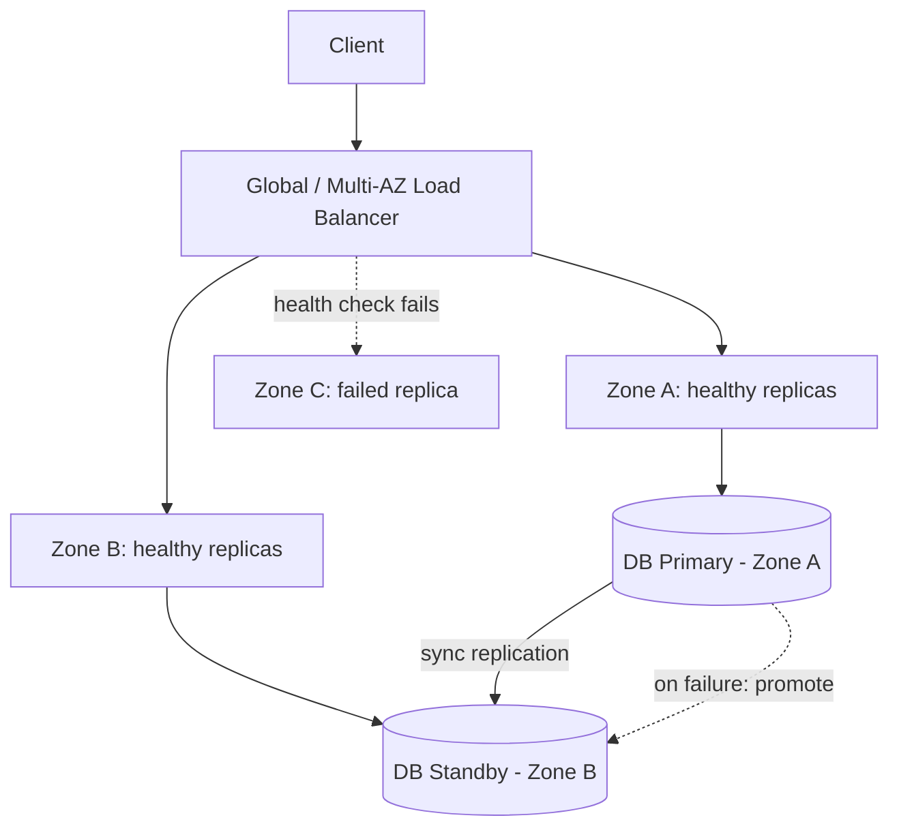

# Volume 11 - High Availability

| Field | Value |
|---|---|
| Document ID | WORLD-VOL11-024 |
| Title | High Availability |
| Version | 1.0 |
| Status | Approved |
| Classification | Internal |
| Founder | Mahesh Choudhary |

## Purpose

This chapter defines how WORLD stays available in the presence of failure. Its purpose is to establish the redundancy, failover, and multi-zone disciplines that keep the platform serving requests when individual components, nodes, or entire availability zones fail. High availability (HA) is treated as a designed property expressed in a measurable service-level objective - a target number of nines - not as an aspiration or a matter of luck.

## Scope

Covered: the availability concept and its arithmetic, redundancy and failover mechanics, multi-availability-zone (multi-AZ) topology, health checking, and the availability targets WORLD commits to. Excluded: the capacity mechanics of Chapter 23 (which HA consumes), the latency tuning of Chapter 25, and the longer-horizon disaster recovery and business continuity of Section F, which handle region-scale loss rather than the component and zone failures addressed here. This chapter is about surviving the failures that happen weekly; Section F is about surviving the ones that happen rarely and catastrophically.

## Concept

Availability is the probability that a system serves a correct response when asked, expressed as a percentage of uptime and colloquially as nines: 99.9% (three nines) permits roughly 8.8 hours of downtime a year, 99.99% (four nines) roughly 52 minutes. From first principles, availability rises by removing single points of failure. This requires redundancy - more than one instance of every critical component - and failover - the automatic redirection of traffic from a failed instance to a healthy one, gated by a health check that distinguishes live from dead. Distributing redundant instances across independent failure domains (availability zones) ensures that the loss of one domain, such as a datacentre power event, cannot take down every replica at once. The arithmetic is unforgiving: a chain of dependencies multiplies their individual availabilities, so every link in a critical path must itself be redundant.

## Application in WORLD

WORLD deploys every critical tier across at least three availability zones. Stateless services run as multiple replicas spread by anti-affinity rules so no single node or zone holds all copies; a multi-AZ load balancer (Chapter 07) continuously health-checks each replica and removes failed ones from rotation within seconds. The stateful databases of Volume 09 run a synchronous primary-standby pair across zones with automated promotion, so a primary loss triggers failover with bounded data loss. Kubernetes (Chapter 05) reschedules pods from a failed node onto surviving capacity, drawing on the elastic headroom that Chapter 23 provides. Every critical dependency is deployed as N+1 or better, and availability objectives are defined per tier and monitored (Chapter 15) as first-class SLOs.

### Enterprise Example

A financial-services tenant runs WORLD under a contractual 99.99% availability SLO. One afternoon the cloud provider loses an entire availability zone. WORLD's load balancer detects the failing health checks in Zone B and stops routing to it within seconds; the stateless API and app replicas in Zones A and C absorb the redirected traffic, and the Cluster Autoscaler adds nodes to restore N+1 headroom. The order database's synchronous standby in Zone A is automatically promoted to primary with zero committed-transaction loss. End users experience a few seconds of elevated latency on in-flight requests but no outage. The zone returns hours later, replicas rebalance, and the incident consumes a small fraction of the tenant's annual downtime budget.

## Key Components

| Component | Role | Failure Handled | Typical WORLD Use |
|---|---|---|---|
| Redundant Replicas (N+1) | Multiple live copies of a component | Instance/node loss | Stateless API and app tiers |
| Multi-AZ Topology | Spreads replicas across zones | Zone-wide outage | All critical tiers |
| Health Check & Failover | Detects failure, redirects traffic | Unresponsive instance | Load balancer, DB promotion |
| Synchronous Standby | Hot database replica for promotion | Primary database loss | Volume 09 transactional stores |
| Availability SLO & Monitoring | Targets and measures nines | SLO breach detection | Per-tier uptime objectives |

## Trade-offs & Considerations

Availability is bought with redundancy, and redundancy costs money and complexity. Running N+1 or N+2 across three zones multiplies infrastructure spend and cross-zone data-transfer cost, in direct tension with Chapter 26. Synchronous cross-zone replication guarantees zero data loss but adds write latency, trading Chapter 25's performance for durability; asynchronous replication reverses that trade. Failover automation itself is a risk: an over-eager health check can trigger a needless, disruptive failover (flapping), while a lax one delays recovery. WORLD tunes health-check thresholds conservatively, chooses synchronous replication only where the data justifies it, and sets each tier's target of nines against its business criticality rather than pursuing maximum availability everywhere, since each additional nine costs disproportionately more than the last.

## Relationship to Other Layers

High availability builds directly on scaling: it consumes the horizontal replicas and elastic headroom of Chapter 23 to keep redundant copies alive across zones. It fronts through load balancing (Chapter 07) and is orchestrated by Kubernetes (Chapter 05). It sits below Section F: HA handles component and zone failures within a region, while Disaster Recovery (Chapter 21) and Business Continuity (Chapter 22) handle region-scale loss. Its objectives are observed through monitoring and alerting (Chapters 15 and 18), and it inherits the resilience principles of Volume 08. HA keeps WORLD up through the failures of everyday operation.

## Cross-References

- [Scaling](/docs/blueprint/volume-11-infrastructure/section-g-scale-and-performance/23-scaling.md)
- [Disaster Recovery](/docs/blueprint/volume-11-infrastructure/section-f-cicd-and-resilience/21-disaster-recovery.md)
- [Business Continuity](/docs/blueprint/volume-11-infrastructure/section-f-cicd-and-resilience/22-business-continuity.md)
- [Volume 08 - Architecture (Resilience)](/docs/blueprint/volume-08-architecture/README.md)

## References

- [Volume 01 - Vision and Philosophy](/docs/blueprint/volume-01-vision-and-philosophy/README.md)
- [Document Standards](/docs/governance/document-standards.md)

## Change Log

| Version | Date | Author | Notes |
|---|---|---|---|
| 1.0 | 2026-07-12 | Lead Software Engineer | Initial approved version. |
