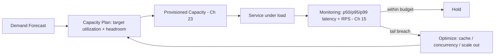

# Volume 11 - Performance

| Field | Value |
|---|---|
| Document ID | WORLD-VOL11-025 |
| Title | Performance |
| Version | 1.0 |
| Status | Approved |
| Classification | Internal |
| Founder | Mahesh Choudhary |

## Purpose

This chapter defines how WORLD delivers fast, predictable responses under load. Its purpose is to establish the performance disciplines - latency and throughput objectives, and the capacity planning that keeps them met - so that the platform stays within its response-time budget as demand grows, rather than degrading unpredictably. Performance is treated as a measured, budgeted engineering property expressed in explicit targets, not as a vague quality that is noticed only when it is gone.

## Scope

Covered: the performance concept, the core metrics of latency (including tail percentiles) and throughput, capacity planning and headroom, the primary optimization levers, and how WORLD measures and defends performance. Excluded: the raw capacity mechanics of Chapter 23 (which performance planning directs), the availability guarantees of Chapter 24, and the cost discipline of Chapter 26 with which performance is continuously balanced. This chapter is about how fast and how much; scaling is about how capacity is added, and this chapter decides how much capacity is needed and how efficiently it is used.

## Concept

Performance is characterised by two orthogonal metrics. Latency is the time to serve a single request, and because averages hide pain, it is measured at percentiles - p50, p95, p99 - since the tail (p99) governs the experience of the unlucky and of any request that fans out to many dependencies. Throughput is the volume of work per unit time - requests or transactions per second - that the system sustains. The two interact through queuing: as utilization approaches saturation, latency rises sharply and non-linearly, so a system run near 100% utilization is fast on paper and catastrophic in practice. Capacity planning is the discipline of forecasting demand and provisioning enough headroom that the operating point stays on the flat part of the latency curve. The levers to shift that curve are caching, concurrency, efficient I/O, and removing unnecessary work from the critical path.

## Application in WORLD

WORLD assigns every user-facing service a latency budget expressed as a p95 and p99 target and a sustained-throughput target, published as SLOs and continuously measured through monitoring (Chapter 15) and tracing (Chapter 17). Capacity planning uses demand forecasts and load tests to size each tier for peak with headroom, so services operate at a target utilization well below saturation; when forecasts rise, planning drives the autoscaling bounds of Chapter 23. Hot read paths are served from caches to cut latency and shed load from the databases of Volume 09; expensive or non-critical work is moved off the request path into asynchronous queues. Load balancing (Chapter 07) spreads traffic evenly so no instance saturates while others idle. Tail latency, not the average, is the metric WORLD defends, because it is what customers and dependent services actually feel.

### Enterprise Example

A logistics tenant integrates WORLD's tracking API into a partner portal that calls it on every page load, with a contractual p99 latency budget of 200 milliseconds. Capacity planning load-tests the path to twice forecast peak and sizes the tier to run at 60% utilization at peak, leaving headroom for surges. The shipment-status lookup, read-heavy and tolerant of seconds-old data, is served from a cache with a short TTL, collapsing database load and holding p99 near 40 milliseconds. When a marketing push doubles portal traffic, monitoring shows p99 climbing toward budget; the autoscaler adds replicas on the request-rate signal before the tail breaches. The partner never sees a slow page, and the database is never the bottleneck.

## Key Components

| Component | Metric Governed | Role | Typical WORLD Use |
|---|---|---|---|
| Latency SLO (p95/p99) | Tail latency | Defines and measures response-time budget | Every user-facing service |
| Throughput Target | Requests/transactions per second | Defines sustained volume commitment | API and app tiers |
| Capacity Plan | Utilization & headroom | Sizes tiers for peak with margin | Per-tier provisioning |
| Caching Layer | Latency & load | Serves hot reads, sheds DB load | Read-heavy lookup paths |
| Async Offload | Critical-path latency | Removes slow work from the request | Reporting, notifications, exports |

## Trade-offs & Considerations

Performance trades against cost, freshness, and complexity. Headroom that keeps latency flat is idle capacity that Chapter 26 wants to eliminate, so the target utilization is a negotiated point, not a maximum. Caching cuts latency but serves potentially stale data and adds invalidation complexity, so it is applied only where staleness is tolerable. Chasing the last few milliseconds of p99 can consume disproportionate engineering effort and infrastructure for marginal user benefit, so budgets are set by what the business and dependent systems actually require. Synchronous cross-zone durability from Chapter 24 adds write latency that must be accounted for in the budget. WORLD resolves these by defining explicit, business-justified targets, defending the tail rather than the average, and treating any optimization as a measured change validated against real percentiles.

## Relationship to Other Layers

Performance directs and constrains the rest of Section G. It tells Scaling (Chapter 23) how much capacity and headroom to provision and at what utilization to operate. It is in tension with Cost Optimization (Chapter 26), which pushes utilization up while performance pushes it down, and the two are balanced continuously. It shares the durability-versus-latency trade with High Availability (Chapter 24). It depends on monitoring and tracing (Chapters 15 and 17) to measure percentiles, on caching backed by storage (Section D), and on load balancing (Chapter 07) for even distribution. Performance inherits the efficiency principles of Volume 08 and turns WORLD's raw capacity into a fast, predictable experience.

## Cross-References

- [Scaling](/docs/blueprint/volume-11-infrastructure/section-g-scale-and-performance/23-scaling.md)
- [Cost Optimization](/docs/blueprint/volume-11-infrastructure/section-g-scale-and-performance/26-cost-optimization.md)
- [Monitoring](/docs/blueprint/volume-11-infrastructure/section-e-observability/15-monitoring.md)
- [Volume 08 - Architecture (Scalability)](/docs/blueprint/volume-08-architecture/README.md)

## References

- [Volume 01 - Vision and Philosophy](/docs/blueprint/volume-01-vision-and-philosophy/README.md)
- [Document Standards](/docs/governance/document-standards.md)

## Change Log

| Version | Date | Author | Notes |
|---|---|---|---|
| 1.0 | 2026-07-12 | Lead Software Engineer | Initial approved version. |
