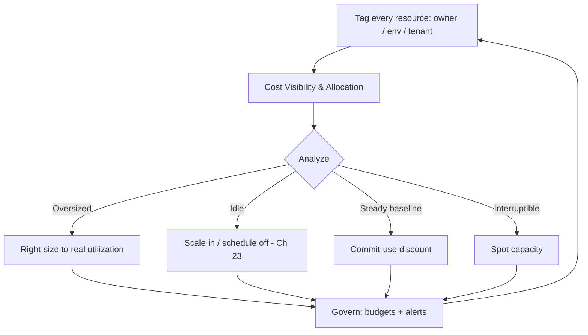

# Volume 11 - Cost Optimization

| Field | Value |
|---|---|
| Document ID | WORLD-VOL11-026 |
| Title | Cost Optimization |
| Version | 1.0 |
| Status | Approved |
| Classification | Internal |
| Founder | Mahesh Choudhary |

## Purpose

This chapter defines how WORLD keeps its infrastructure spend efficient and accountable. Its purpose is to establish the FinOps disciplines - cost visibility through tagging, right-sizing of resources, and the purchasing and scheduling levers that eliminate waste - so that every dollar of infrastructure cost maps to delivered value, and cost is managed continuously as an engineering property rather than reconciled after the fact. Cost is treated as a first-class design constraint balanced against performance and availability, not as an afterthought owned only by finance.

## Scope

Covered: the cost-optimization concept and the FinOps operating model, resource right-sizing, cost allocation through tagging, purchasing and scheduling levers, and how WORLD governs spend continuously. Excluded: the raw scaling mechanics of Chapter 23, the availability guarantees of Chapter 24, and the latency budgets of Chapter 25 - all of which this chapter balances against but does not redefine. This chapter answers how WORLD stays affordable; the neighbouring chapters answer how it stays elastic, up, and fast, and cost optimization is the discipline that keeps those three from being pursued wastefully.

## Concept

Cloud cost is a direct, near-real-time function of what is provisioned and how long it runs, which makes it engineerable. FinOps is the operating model that brings engineering, finance, and product together to manage that cost through three recurring activities: inform (make spend visible and attributable), optimize (remove waste), and operate (govern continuously). Visibility depends on tagging - labelling every resource with its owner, environment, and tenant so cost can be allocated rather than pooled into an unaccountable total. Optimization rests on right-sizing (matching resource size to actual utilization), elasticity (paying only for capacity in use, via scale-in from Chapter 23), and purchasing leverage (committed-use and spot pricing for predictable or interruptible workloads). The governing principle is that unused or oversized capacity is pure waste, and waste is found only when cost is visible and owned.

## Application in WORLD

WORLD enforces mandatory tagging at provisioning time: no resource is created without owner, environment, and tenant tags, so every cost line is attributable and per-tenant unit economics are computable. Right-sizing is driven by real utilization from monitoring (Chapter 15) - the Vertical Pod Autoscaler and periodic reviews shrink over-requested workloads, and autoscaling (Chapter 23) scales idle capacity to zero or baseline outside peak. Steady baseline capacity is purchased under committed-use discounts, while interruptible batch and CI workloads (Chapter 19) run on cheaper spot capacity. Non-production environments are scheduled off outside working hours. Budgets and anomaly alerts (Chapter 18) fire when spend deviates from forecast, and cost is reviewed per tenant and per service as a standing engineering metric, closing the FinOps loop continuously rather than at month end.

### Enterprise Example

A SaaS reseller runs dozens of WORLD tenants and needs to know the true cost to serve each. Because every resource carries a tenant tag, WORLD produces per-tenant cost reports that reveal one low-revenue tenant consuming oversized database instances at 12% utilization. Right-sizing that tier and moving its steady baseline onto a committed-use plan cuts its cost by 40% with no latency impact. The reseller's nightly analytics jobs are shifted to spot capacity, halving their compute cost, while non-production sandboxes are scheduled to shut down overnight and on weekends. An anomaly alert later catches an orphaned load balancer left by a deleted tenant, stopping a slow leak. The reseller turns a break-even account into a profitable one without touching the customer experience.

## Key Components

| Component | FinOps Phase | Role | Typical WORLD Use |
|---|---|---|---|
| Mandatory Tagging | Inform | Attributes every cost to owner/env/tenant | Per-tenant unit economics |
| Right-sizing | Optimize | Matches resource size to real utilization | Over-provisioned pods and databases |
| Elastic Scale-in / Scheduling | Optimize | Pays only for capacity in use | Idle and non-production workloads |
| Committed-use & Spot | Optimize | Discounts steady and interruptible loads | Baseline capacity, batch, CI |
| Budgets & Anomaly Alerts | Operate | Governs spend, catches leaks | Continuous cost governance |

## Trade-offs & Considerations

Cost optimization is a balance, not a race to the cheapest option. Cutting too deep starves performance (Chapter 25) and erodes availability (Chapter 24): eliminating the headroom that keeps latency flat, or the N+1 redundancy that survives a zone loss, saves money until the moment it causes an outage that costs far more. Spot capacity is cheap but can be reclaimed at any time, so it suits only interruptible work, never stateful or latency-critical paths. Committed-use discounts lower the rate but lock in spend, so they fit only genuinely steady baselines. Aggressive right-sizing can leave no buffer for spikes. WORLD resolves these by treating cost as one constraint among three - balanced explicitly against performance and availability - and by driving every optimization from real utilization data, so savings come from removing genuine waste rather than from starving the platform.

## Relationship to Other Layers

Cost optimization is the efficiency discipline that governs how the rest of Section G is provisioned. It is in direct, deliberate tension with Performance (Chapter 25), which wants headroom, and with High Availability (Chapter 24), which wants redundancy; the FinOps loop balances all three. It consumes the elastic scale-in and right-sizing primitives of Scaling (Chapter 23) as its primary optimization levers. It depends on monitoring (Chapter 15) for utilization data and alerting (Chapter 18) for governance, and it prices the CI/CD workloads of Section F. It inherits the accountability and efficiency principles of Volume 08 and ensures WORLD's elasticity, availability, and speed are delivered at a cost that maps to value.

## Cross-References

- [Scaling](/docs/blueprint/volume-11-infrastructure/section-g-scale-and-performance/23-scaling.md)
- [Performance](/docs/blueprint/volume-11-infrastructure/section-g-scale-and-performance/25-performance.md)
- [High Availability](/docs/blueprint/volume-11-infrastructure/section-g-scale-and-performance/24-high-availability.md)
- [Volume 08 - Architecture (Efficiency)](/docs/blueprint/volume-08-architecture/README.md)

## References

- [Volume 01 - Vision and Philosophy](/docs/blueprint/volume-01-vision-and-philosophy/README.md)
- [Document Standards](/docs/governance/document-standards.md)

## Change Log

| Version | Date | Author | Notes |
|---|---|---|---|
| 1.0 | 2026-07-12 | Lead Software Engineer | Initial approved version. |
