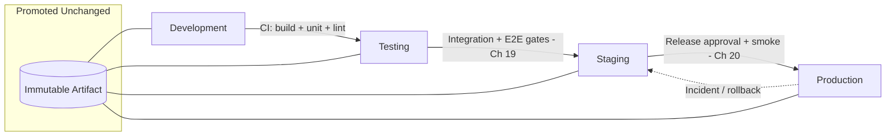

# Volume 11 - Environment Strategy

| Field | Value |
|---|---|
| Document ID | WORLD-VOL11-027 |
| Title | Environment Strategy |
| Version | 1.0 |
| Status | Approved |
| Classification | Internal |
| Founder | Mahesh Choudhary |

## Purpose

This chapter defines how WORLD organizes its running infrastructure into a sequence of distinct environments and the promotion path that moves a change through them. Its purpose is to establish the environment model - the number of tiers, what each guarantees, and the gated flow that carries an artifact from a developer's laptop to production - so that every change earns its way to customers through progressively more production-like validation, and no untested code ever reaches a live tenant. Environments are treated as a controlled pipeline of increasing fidelity and risk, not as interchangeable copies of the same machine.

## Scope

Covered: the environment-strategy concept, the four-tier model (development, testing, staging, production), the promotion flow and the gates between tiers, environment parity, and how a single immutable artifact travels the path. Excluded: the internal detail of each individual environment, which is defined in Chapters 28 through 31, and the future direction of the platform, covered in Chapter 32. This chapter answers how many environments WORLD runs and how a change flows between them; the following chapters answer what each environment is for.

## Concept

An environment is a complete, isolated instance of the running system - its compute, data, configuration, and access rules. From first principles, more than one environment exists because the confidence required to expose a change to real customers cannot be earned in the same place the change is written: writing needs fast, disposable, low-stakes infrastructure, while serving needs stable, guarded, high-stakes infrastructure. WORLD resolves this tension with a graduated ladder of four tiers, each more production-like and more tightly governed than the last. A change is promoted upward only by passing an explicit gate - automated tests, then quality checks, then release approval. Critically, the same immutable build artifact is promoted at each step; only its configuration changes. This gives environment parity: what is validated in staging is byte-for-byte what runs in production, so the promotion path measures real risk rather than the behaviour of a differently-built copy.

## Application in WORLD

WORLD runs exactly four environments, each realized as an isolated namespace or cluster on the same Kubernetes platform (Chapter 05) provisioned from identical infrastructure-as-code so parity is structural, not manual. A commit is built once by CI (Chapter 19) into a signed container image; that image is deployed into testing, then staging, then production by CD (Chapter 20), with only environment-scoped configuration and secrets (Chapters 13, 14) differing between tiers. Each gate is automated: tests must pass to reach testing, integration and end-to-end suites must pass to reach staging, and a release approval plus post-deploy smoke checks must pass to reach production. Production access is the most restricted; development the most open. Data flows the opposite way from code - synthetic in the lower tiers, masked or real only under control at the top - so promotion raises fidelity without ever leaking live customer data downward.

### Enterprise Example

A fintech tenant requires evidence that no change reaches its production ledger without review. An engineer fixes an interest-calculation bug and opens a pull request. CI builds one image, runs unit tests, and promotes it to testing, where integration suites exercise it against a synthetic ledger. It advances to staging, a production-mirror where the tenant's compliance officer runs a regression pack against masked data and signs off. Only then does CD deploy that exact image to production behind a canary. When an auditor later asks for proof, WORLD shows a single artifact hash traced through four gated environments with named approvals at each - the promotion path itself is the audit trail.

## Key Components

| Component | Role | Governs | Typical WORLD Use |
|---|---|---|---|
| Four-Tier Ladder | Defines the sequence of environments | Fidelity and risk gradient | Dev -> Test -> Stage -> Prod |
| Promotion Gates | Conditions to advance a tier | What earns promotion | CI/CD test and approval gates |
| Immutable Artifact | Single build promoted unchanged | Environment parity | Signed container image |
| Environment Config & Secrets | Per-tier values injected at deploy | Isolation and behaviour | ConfigMaps, secret stores |
| IaC-Provisioned Parity | Identical infrastructure definitions | Structural sameness | Terraform / Helm per tier |

## Trade-offs & Considerations

More environments buy more confidence but cost more money, more maintenance, and slower delivery, so the count must be deliberate. Too few tiers and risky changes reach customers under-tested; too many and the pipeline becomes slow and expensive to keep in parity. WORLD settles on four because each adds a distinct kind of validation - developer feedback, automated correctness, production-like rehearsal, live serving - and no fewer would cover them. The hardest discipline is parity: environments drift when configuration is edited by hand, so lower tiers can pass a change that production rejects. WORLD counters drift by provisioning every tier from the same IaC and promoting one artifact, accepting the constraint that a fix cannot be hot-patched into a single environment. The trade-off is deliberate rigidity in exchange for trustworthy promotion.

## Relationship to Other Layers

Environment strategy is the frame that the four environment chapters fill in: Development (Chapter 28), Testing (Chapter 29), Staging (Chapter 30), and Production (Chapter 31) are the tiers this ladder sequences. It is executed by the CI and CD infrastructure of Section F (Chapters 19, 20), which build the artifact and enforce the gates, and it depends on configuration and secrets management (Chapters 13, 14) to differentiate tiers safely. It inherits the deployment and release-management direction of Volume 08 and provides the controlled path along which every architectural, API, and database change reaches a live tenant.

## Cross-References

- [Development](/docs/blueprint/volume-11-infrastructure/section-h-environments-and-evolution/28-development.md)
- [Production](/docs/blueprint/volume-11-infrastructure/section-h-environments-and-evolution/31-production.md)
- [CD Infrastructure](/docs/blueprint/volume-11-infrastructure/section-f-cicd-and-resilience/20-cd-infrastructure.md)
- [Volume 08 - Architecture (Deployment)](/docs/blueprint/volume-08-architecture/README.md)

## References

- [Volume 01 - Vision and Philosophy](/docs/blueprint/volume-01-vision-and-philosophy/README.md)
- [Document Standards](/docs/governance/document-standards.md)

## Change Log

| Version | Date | Author | Notes |
|---|---|---|---|
| 1.0 | 2026-07-12 | Lead Software Engineer | Initial approved version. |
