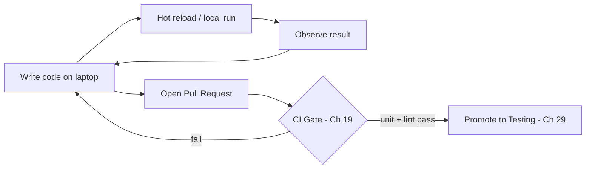

# Volume 11 - Development

| Field | Value |
|---|---|
| Document ID | WORLD-VOL11-028 |
| Title | Development |
| Version | 1.0 |
| Status | Approved |
| Classification | Internal |
| Founder | Mahesh Choudhary |

## Purpose

This chapter defines the development environment - the first and lowest tier of WORLD's environment ladder. Its purpose is to establish the infrastructure where engineers write, run, and iterate on code: how it is configured and scaled, what data it may hold, who may access it, and how a change enters and leaves it. The development environment optimizes for one property above all others - the speed of the feedback loop between writing a line of code and seeing its effect - while guaranteeing that its low stakes never endanger real customers or real data.

## Scope

Covered: the purpose of the development tier, its configuration and scale, its data policy, its access controls, and its promotion in and out. Excluded: the automated validation performed in testing (Chapter 29), the production-mirror rehearsal of staging (Chapter 30), and the overall ladder defined in Chapter 27. This chapter answers where and how WORLD code is written and first run; the neighbouring chapters answer how it is then proven.

## Concept

Development is the environment closest to the engineer, and its governing value is iteration speed. From first principles, the cost of a mistake here is near zero - nothing customer-facing depends on it - so the environment trades stability, durability, and realism for fast, disposable, permissive infrastructure. Changes are applied instantly, services reload on save, and the whole environment can be destroyed and recreated on demand. Because it is low-stakes, it is also low-fidelity: it runs at minimal scale, holds no real data, and is not expected to survive failures. Its job is not to prove that a change is correct - that is testing's job - but to let an engineer explore, break, and refine quickly. Everything about its design serves the tightness of the write-run-observe loop.

## Application in WORLD

WORLD gives each engineer an isolated development context - a local cluster or a personal namespace on a shared development cluster (Chapter 05) - provisioned from the same infrastructure-as-code as every other tier, so even the fastest environment stays structurally faithful. Services run with hot-reload enabled, verbose logging (Chapter 16), and relaxed resource limits so they start instantly. Configuration points at synthetic dependencies and sandboxed third-party endpoints. Only synthetic or generated data is permitted; no production dataset may ever be copied here. Access is broad - any engineer may create, break, and destroy their own context freely - because nothing of value is exposed. A change leaves development only by being committed and opening a pull request, at which point CI (Chapter 19) builds the immutable artifact and runs unit tests and linting; passing that gate promotes it to testing.

### Enterprise Example

An engineer building a new invoicing feature for an enterprise tenant spins up a personal namespace in seconds. They run the invoicing service with hot-reload, pointing it at a synthetic customer set generated by WORLD's data-faker rather than any real tenant records. They iterate dozens of times an hour - adjusting tax logic, watching verbose logs, tearing down and rebuilding when they corrupt local state - with no risk to anyone. When the feature feels right, they open a pull request; CI builds one signed image and runs the unit suite. The change now leaves the engineer's low-stakes sandbox and enters the automated correctness gate, having cost nothing but the engineer's time to reach that point.

## Key Components

| Component | Setting | Rationale | WORLD Detail |
|---|---|---|---|
| Purpose | Fast iteration | Optimize write-run loop | Explore and refine changes |
| Configuration | Hot-reload, verbose logs | Instant feedback | Relaxed limits, sandbox deps |
| Scale | Minimal, single-replica | Cost near zero | Personal namespace / local |
| Data Policy | Synthetic only | No real-data risk | Generated fixtures, no prod copy |
| Access Control | Broad, self-service | Low stakes | Any engineer, own context |
| Promotion | Commit -> PR -> CI | Earn entry to testing | Unit + lint gate (Ch 19) |

## Trade-offs & Considerations

The development tier deliberately sacrifices realism for speed, and that gap is its main risk: code that works against synthetic data and relaxed limits can behave differently under production-scale load, strict resource caps, and real data shapes. WORLD accepts this because chasing production fidelity in development would destroy the fast loop that is the tier's entire reason to exist - the higher tiers exist precisely to close that gap. A second risk is drift: because engineers can edit their contexts freely, a change may depend on an ad-hoc local tweak that no other environment has. Provisioning from shared IaC and rebuilding contexts frequently keeps drift bounded. The rule is firm - development is where correctness is explored, never where it is certified.

## Relationship to Other Layers

Development is the entry point of the environment ladder defined in Chapter 27 and feeds directly into Testing (Chapter 29), which certifies what development only explores. It runs on the orchestration platform of Chapter 05 and hands off through the CI infrastructure of Chapter 19, which builds the artifact promoted through every later tier. It relies on logging (Chapter 16) for its feedback loop and on configuration management (Chapter 14) to point at synthetic dependencies. It inherits the developer-experience and fast-feedback principles of Volume 08 and is where every architectural, API, and database change in WORLD first takes physical form.

## Cross-References

- [Environment Strategy](/docs/blueprint/volume-11-infrastructure/section-h-environments-and-evolution/27-environment-strategy.md)
- [Testing](/docs/blueprint/volume-11-infrastructure/section-h-environments-and-evolution/29-testing.md)
- [CI Infrastructure](/docs/blueprint/volume-11-infrastructure/section-f-cicd-and-resilience/19-ci-infrastructure.md)
- [Volume 08 - Architecture (Developer Experience)](/docs/blueprint/volume-08-architecture/README.md)

## References

- [Volume 01 - Vision and Philosophy](/docs/blueprint/volume-01-vision-and-philosophy/README.md)
- [Document Standards](/docs/governance/document-standards.md)

## Change Log

| Version | Date | Author | Notes |
|---|---|---|---|
| 1.0 | 2026-07-12 | Lead Software Engineer | Initial approved version. |
