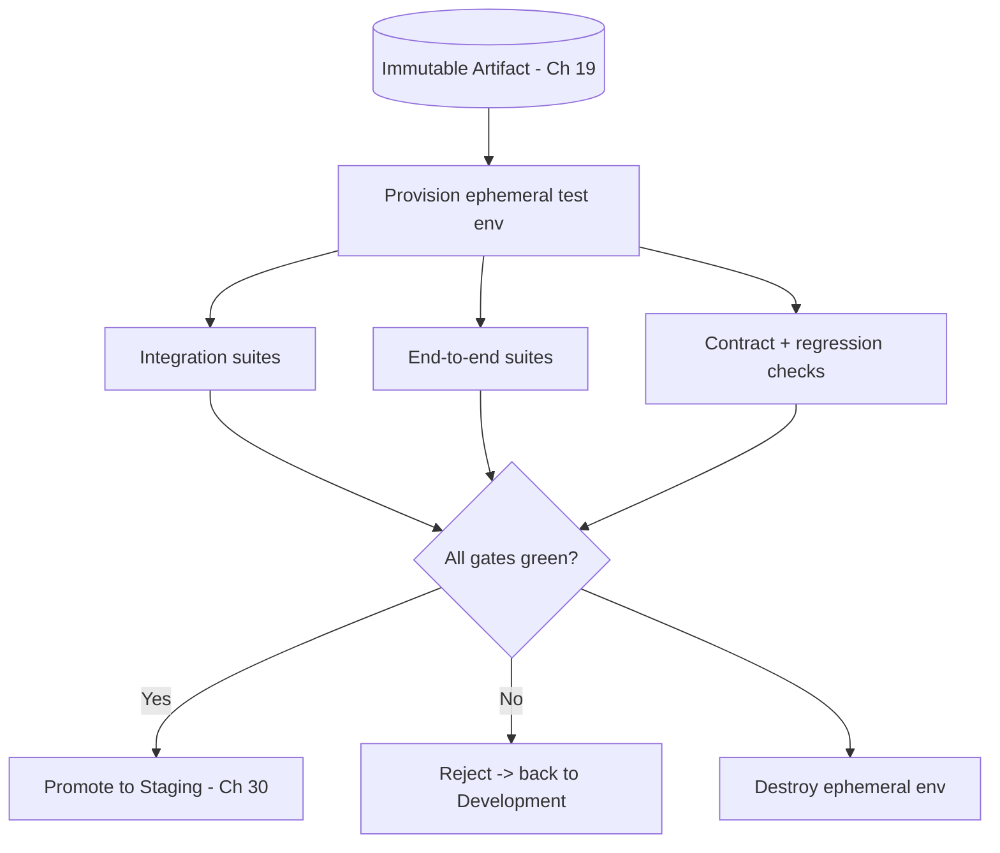

# Volume 11 - Testing

| Field | Value |
|---|---|
| Document ID | WORLD-VOL11-029 |
| Title | Testing |
| Version | 1.0 |
| Status | Approved |
| Classification | Internal |
| Founder | Mahesh Choudhary |

## Purpose

This chapter defines the testing environment - the second tier of WORLD's environment ladder, sitting between developer exploration and production-like rehearsal. Its purpose is to establish the infrastructure where a change is automatically and repeatably certified as correct: how it is configured and scaled, what data it may use, who may access it, and how a change is promoted into and out of it. The testing environment optimizes for one property - deterministic, automated validation - so that correctness is proven by machines against known inputs rather than asserted by a human eye.

## Scope

Covered: the purpose of the testing tier, its configuration and scale, its data policy, its access controls, and its promotion in and out. Excluded: the fast local iteration of development (Chapter 28), the production-parity rehearsal of staging (Chapter 30), and the ladder framing of Chapter 27. This chapter answers where WORLD proves a change is correct; the neighbouring chapters answer where it is written and where it is rehearsed for release.

## Concept

Testing is the environment where a change stops being explored and starts being certified. Its governing value is determinism: given the same artifact and the same fixtures, the environment must produce the same verdict every time, or its verdict is worthless. From first principles this demands the opposite of development's permissiveness - fixed, controlled inputs; isolated, ephemeral infrastructure created fresh per test run; and no human hands on the running system while suites execute. Fidelity rises above development because integration matters here: services must talk to real instances of their dependencies (databases, queues, neighbouring services) rather than local stubs, so that failures of contract and wiring surface before staging. But scale stays modest and data stays synthetic - the goal is correctness under controlled conditions, not performance under production load.

## Application in WORLD

WORLD provisions testing as an ephemeral namespace created on demand by CI (Chapter 19) for each pipeline run and destroyed when it finishes, guaranteeing every run starts from a clean, IaC-defined state (Chapter 05) identical to its neighbours. Into it CD deploys the exact artifact built in development, wired to real instances of its dependencies - a dedicated database (Volume 09), message brokers, and neighbouring services - so integration and end-to-end suites exercise genuine contracts. Data is strictly synthetic: deterministic fixtures loaded per run, never production records, so results are reproducible and privacy-safe. Access is machine-first - the pipeline drives the environment - and human access is read-only, chiefly to inspect a failed run's logs (Chapter 16) and traces (Chapter 17). A change is promoted out only when every integration, end-to-end, contract, and regression gate passes; any failure sends it back to development.

### Enterprise Example

A healthcare tenant mandates that appointment-booking changes never regress double-booking protections. When the invoicing artifact from development enters the pipeline, CI spins up a fresh testing namespace, deploys the image, and stands up a real database seeded with deterministic synthetic patients. End-to-end suites drive concurrent booking requests to confirm the conflict-detection contract still holds, and regression tests replay historical bug scenarios. Because the fixtures are identical on every run, a green result is trustworthy and a red result is reproducible. The suites pass, the namespace is destroyed, and the exact same image is promoted to staging - certified correct without a single production patient record ever entering the environment.

## Key Components

| Component | Setting | Rationale | WORLD Detail |
|---|---|---|---|
| Purpose | Automated certification | Prove correctness | Deterministic test verdicts |
| Configuration | Ephemeral, real dependencies | Test true integration | Fresh namespace per run |
| Scale | Modest, controlled | Correctness over load | Single-run sizing |
| Data Policy | Deterministic synthetic | Reproducible + private | Seeded fixtures, no prod data |
| Access Control | Machine-driven, human read-only | Protect determinism | Pipeline owns the env |
| Promotion | All suites green -> staging | Earn rehearsal | Integration/E2E/regression gates |

## Trade-offs & Considerations

Testing trades production realism for determinism and repeatability, and that is the right trade for correctness but not for confidence in performance: passing every suite proves the change is correct, not that it will hold under production-scale load or real data distributions - that is staging's and production's job. Ephemeral environments cost pipeline time to provision and tear down on every run, a price WORLD pays to eliminate the flakiness that shared, long-lived test environments accumulate as state leaks between runs. Over-reliance on synthetic fixtures can hide bugs that only real data shapes trigger; WORLD narrows this by making fixtures representative and by masking-based validation in staging. The discipline is absolute: no human tweaks a running test environment, because a hand on the system destroys the reproducibility that gives its verdict meaning.

## Relationship to Other Layers

Testing is the certification gate of the ladder in Chapter 27, receiving artifacts from Development (Chapter 28) and promoting them to Staging (Chapter 30). It is driven by the CI infrastructure of Chapter 19, which provisions, runs, and tears it down, and it exercises real instances of the databases of Volume 09 and neighbouring services to validate integration. It consumes logging (Chapter 16) and tracing (Chapter 17) so failed runs are diagnosable. It realizes the automated-quality and testability principles of Volume 08 and is the tier that converts WORLD's changes from plausibly-correct to provably-correct before any production-like exposure.

## Cross-References

- [Development](/docs/blueprint/volume-11-infrastructure/section-h-environments-and-evolution/28-development.md)
- [Staging](/docs/blueprint/volume-11-infrastructure/section-h-environments-and-evolution/30-staging.md)
- [CI Infrastructure](/docs/blueprint/volume-11-infrastructure/section-f-cicd-and-resilience/19-ci-infrastructure.md)
- [Volume 08 - Architecture (Testability)](/docs/blueprint/volume-08-architecture/README.md)

## References

- [Volume 01 - Vision and Philosophy](/docs/blueprint/volume-01-vision-and-philosophy/README.md)
- [Document Standards](/docs/governance/document-standards.md)

## Change Log

| Version | Date | Author | Notes |
|---|---|---|---|
| 1.0 | 2026-07-12 | Lead Software Engineer | Initial approved version. |
