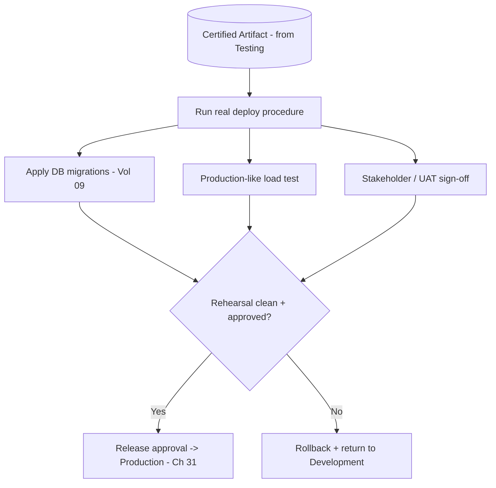

# Volume 11 - Staging

| Field | Value |
|---|---|
| Document ID | WORLD-VOL11-030 |
| Title | Staging |
| Version | 1.0 |
| Status | Approved |
| Classification | Internal |
| Founder | Mahesh Choudhary |

## Purpose

This chapter defines the staging environment - the third tier of WORLD's environment ladder and the final gate before production. Its purpose is to establish the infrastructure that mirrors production as closely as possible so a change can be rehearsed under production-like conditions: how it is configured and scaled, what data it may use, who may access it, and how a change is promoted into and out of it. Staging optimizes for one property - production fidelity - so that the last question before release, \"will this behave in production?\", is answered by a faithful rehearsal rather than a hope.

## Scope

Covered: the purpose of the staging tier, its configuration and scale, its data policy, its access controls, and its promotion in and out. Excluded: the automated correctness certification of testing (Chapter 29), the live customer-serving of production (Chapter 31), and the ladder framing of Chapter 27. This chapter answers where WORLD rehearses a release under production-like conditions; the neighbouring chapters answer where correctness is proven and where the change finally serves customers.

## Concept

Staging is the dress rehearsal. Its governing value is parity with production - the same topology, the same scale profile, the same configuration shape, the same deployment mechanics - because its purpose is to expose exactly the differences that only appear at production fidelity: performance under realistic load, behaviour against realistic data shapes, and the mechanics of the release itself. From first principles, staging exists because testing proves a change is correct but not that it is safe to release: correctness is validated against controlled inputs, whereas release safety depends on how the change behaves in an environment that looks like the real one. Staging is therefore the highest-fidelity environment that still carries no live customer traffic, which makes it the safe place to run the exact deployment procedure - migrations, canary steps, rollbacks - that will later run in production.

## Application in WORLD

WORLD provisions staging from the same infrastructure-as-code as production, on the same Kubernetes platform (Chapter 05), with the same service topology, load-balancing (Chapter 07), and autoscaling policy (Chapter 23) scaled to a representative fraction of production capacity. CD (Chapter 20) deploys the artifact certified in testing using the identical release procedure it will use for production - the same migration steps against a Volume 09 database, the same canary and rollback mechanics. Data is production-shaped but never raw: masked or anonymized copies of production datasets, or high-fidelity synthetic data, so realistic shapes and volumes are exercised without exposing customer records. Access is restricted to engineers, release managers, and designated stakeholders for user-acceptance testing. A change is promoted out only when the rehearsal is clean and a release approval is granted; a failed rehearsal rolls back and returns the change downstream.

### Enterprise Example

A logistics tenant is about to receive a routing-engine upgrade that alters a heavily-indexed shipments table. In staging - a scaled mirror of production - CD runs the exact migration against a masked copy of the tenant's real data volume, revealing that the index rebuild takes eleven minutes and would lock writes in production. The team reworks the migration to build the index online and re-rehearses; this time it completes without locking. A load test at representative traffic confirms routing latency stays within budget (Chapter 25), and the tenant's operations lead signs off via UAT. Only then is release approval granted and the exact artifact promoted to production - a costly production incident rehearsed away where it harmed no one.

## Key Components

| Component | Setting | Rationale | WORLD Detail |
|---|---|---|---|
| Purpose | Production rehearsal | Prove release safety | Dress rehearsal before go-live |
| Configuration | Production-parity topology | Expose real behaviour | Same IaC, scaled capacity |
| Scale | Representative fraction | Realistic load, bounded cost | Production-shaped autoscaling |
| Data Policy | Masked / anonymized | Real shapes, no exposure | No raw customer records |
| Access Control | Engineers + release + UAT | Controlled rehearsal | Stakeholder sign-off |
| Promotion | Clean rehearsal + approval | Earn production release | Release gate (Ch 20) |

## Trade-offs & Considerations

Staging's value scales with its fidelity, and fidelity is expensive: a true mirror of production doubles significant infrastructure, and keeping the two in parity is a continuous discipline that decays the moment production changes without staging following. WORLD manages the cost by scaling staging to a representative fraction rather than a full replica, accepting that some purely scale-driven effects only appear in production - which is why production itself uses progressive delivery (Chapter 31). The sharpest trade-off is data: staging needs realistic data shapes but must never leak live records, so WORLD invests in masking and anonymization pipelines and forbids raw production copies. The overriding principle is that staging must run the real release procedure, not a simplified one, because a rehearsal that skips the risky steps rehearses nothing.

## Relationship to Other Layers

Staging is the final gate of the ladder in Chapter 27, receiving certified artifacts from Testing (Chapter 29) and promoting approved ones to Production (Chapter 31). It is driven by the CD infrastructure of Chapter 20, whose release mechanics it rehearses, and it mirrors production's topology using the platform of Chapter 05, load balancing of Chapter 07, and scaling of Chapter 23. It exercises real migration behaviour against Volume 09 databases on masked data and validates latency against the budgets of Chapter 25. It realizes the release-safety and change-management principles of Volume 08 and is where WORLD converts a correct change into a release proven safe to serve.

## Cross-References

- [Testing](/docs/blueprint/volume-11-infrastructure/section-h-environments-and-evolution/29-testing.md)
- [Production](/docs/blueprint/volume-11-infrastructure/section-h-environments-and-evolution/31-production.md)
- [CD Infrastructure](/docs/blueprint/volume-11-infrastructure/section-f-cicd-and-resilience/20-cd-infrastructure.md)
- [Volume 08 - Architecture (Release Management)](/docs/blueprint/volume-08-architecture/README.md)

## References

- [Volume 01 - Vision and Philosophy](/docs/blueprint/volume-01-vision-and-philosophy/README.md)
- [Document Standards](/docs/governance/document-standards.md)

## Change Log

| Version | Date | Author | Notes |
|---|---|---|---|
| 1.0 | 2026-07-12 | Lead Software Engineer | Initial approved version. |
