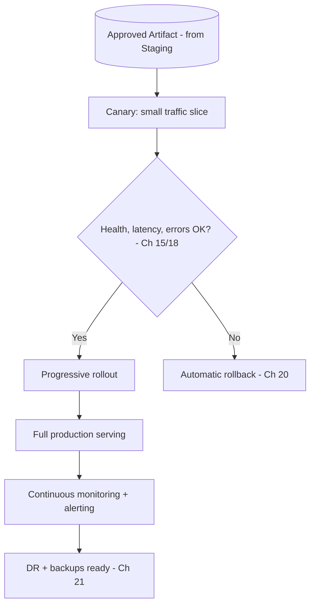

# Volume 11 - Production

| Field | Value |
|---|---|
| Document ID | WORLD-VOL11-031 |
| Title | Production |
| Version | 1.0 |
| Status | Approved |
| Classification | Internal |
| Founder | Mahesh Choudhary |

## Purpose

This chapter defines the production environment - the final and highest tier of WORLD's environment ladder, where real customers meet the system and real data lives. Its purpose is to establish the infrastructure that serves live tenants: how it is configured and scaled, what data it holds and how that data is protected, who may access it and under what controls, and how a change is admitted into it. Production optimizes for the properties customers actually experience - availability, performance, security, and correctness - and treats every one as a non-negotiable guarantee rather than a best effort.

## Scope

Covered: the purpose of the production tier, its configuration and scale, its data policy, its access controls, and its promotion in and out. Excluded: the rehearsal that qualifies a change for production (Chapter 30), the correctness certification that precedes it (Chapter 29), and the ladder framing of Chapter 27. This chapter answers where and how WORLD serves live customers; the neighbouring chapters answer how a change earns the right to be there.

## Concept

Production is the only environment that matters to customers, and every property the lower tiers traded away is reclaimed here in full: maximum stability, maximum scale, real data, and the tightest access controls in the platform. Its governing value is the inversion of development's - where development minimized the cost of a mistake, production minimizes the probability of one and the blast radius when it occurs. From first principles this means change is admitted slowly and reversibly: a change that passed every prior gate is still exposed gradually, because staging is a rehearsal at a fraction of scale and production is the only place full production reality exists. Production is therefore not just where WORLD runs, but where it is watched, defended, and made recoverable - the environment engineered so that the rare failure is caught early, contained, and rolled back before most customers ever notice.

## Application in WORLD

Production runs at full scale on WORLD's primary Kubernetes clusters (Chapter 05), fronted by load balancing (Chapter 07) and governed by autoscaling (Chapter 23) and high-availability topology across zones (Chapter 24). CD (Chapter 20) admits the staging-approved artifact through a canary that receives a small traffic slice; monitoring and alerting (Chapters 15, 18) watch health, latency, and error rate, and any breach triggers automatic rollback before the change progresses. Data is live customer data, encrypted, backed up, and protected under disaster recovery (Chapter 21). Access is the most restricted in the platform: no standing human access, least-privilege break-glass only, every action audited, and configuration and secrets (Chapters 13, 14) scoped exclusively to this tier. A change is admitted only via the gated promotion from staging with release approval; it \"leaves\" only by rollback to a prior known-good version.

### Enterprise Example

A payments tenant processes millions of live transactions daily and cannot tolerate a bad deploy. WORLD admits the routing-engine upgrade - already rehearsed in staging - to production behind a canary serving 1% of traffic. Within minutes, monitoring detects that the canary's p99 latency has risen above budget for one card network. Alerting fires, CD halts the rollout, and the automatic rollback restores the prior version; 99% of traffic never touched the new code and no transaction failed. The team diagnoses the regression from production traces (Chapter 17), fixes it, and re-runs the entire ladder. The tenant experiences no incident because production was engineered to expose the change slowly and reverse it instantly.

## Key Components

| Component | Setting | Rationale | WORLD Detail |
|---|---|---|---|
| Purpose | Serve live customers | Deliver the product | Real users, real value |
| Configuration | Full HA, multi-zone | Maximum stability | Redundant, resilient topology |
| Scale | Full production capacity | Meet real demand | Autoscaled at peak load |
| Data Policy | Live, encrypted, backed up | Protect real records | DR + backups (Ch 21) |
| Access Control | Least-privilege break-glass | Minimize risk surface | No standing access, audited |
| Promotion | Canary + progressive rollout | Bound blast radius | Auto-rollback on breach |

## Trade-offs & Considerations

Production trades speed of change for safety of change, the exact inverse of development, and the tension is permanent: every safeguard - canaries, progressive rollout, approval gates, restricted access - slows delivery, while every shortcut raises the chance and cost of a customer-facing failure. WORLD resolves this by making the safe path the fast path: automation drives the canary and rollback so caution costs minutes, not days, and no human is asked to babysit a deploy. Restricted access protects data and stability but can slow incident response, so WORLD provides audited break-glass rather than blocking access outright. The one line never crossed is direct change: nothing is edited in production by hand, because an unrehearsed, unreviewed change to the environment customers depend on reintroduces exactly the risk the entire ladder exists to remove.

## Relationship to Other Layers

Production is the destination of the ladder in Chapter 27, admitting only artifacts approved in Staging (Chapter 30) through the CD mechanics of Chapter 20. It is built on the orchestration of Chapter 05, load balancing of Chapter 07, scaling of Chapter 23, and high availability of Chapter 24, and it is defended by monitoring and alerting (Chapters 15, 18), disaster recovery (Chapter 21), and business continuity (Chapter 22). It holds the live databases of Volume 09 and serves the APIs of Volume 10 to real tenants. It realizes the reliability, security, and operability principles of Volume 08 and is the environment every other layer in WORLD ultimately exists to keep available, fast, and safe.

## Cross-References

- [Staging](/docs/blueprint/volume-11-infrastructure/section-h-environments-and-evolution/30-staging.md)
- [High Availability](/docs/blueprint/volume-11-infrastructure/section-g-scale-and-performance/24-high-availability.md)
- [Disaster Recovery](/docs/blueprint/volume-11-infrastructure/section-f-cicd-and-resilience/21-disaster-recovery.md)
- [Volume 08 - Architecture (Reliability)](/docs/blueprint/volume-08-architecture/README.md)

## References

- [Volume 01 - Vision and Philosophy](/docs/blueprint/volume-01-vision-and-philosophy/README.md)
- [Document Standards](/docs/governance/document-standards.md)

## Change Log

| Version | Date | Author | Notes |
|---|---|---|---|
| 1.0 | 2026-07-12 | Lead Software Engineer | Initial approved version. |
