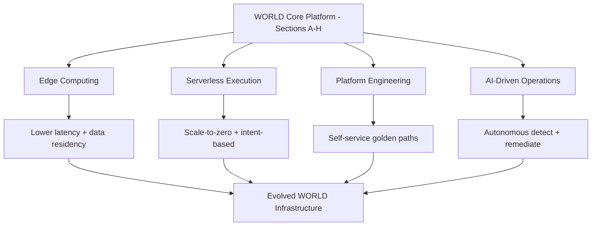

# Volume 11 - Future Infrastructure Evolution

| Field | Value |
|---|---|
| Document ID | WORLD-VOL11-032 |
| Title | Future Infrastructure Evolution |
| Version | 1.0 |
| Status | Approved |
| Classification | Internal |
| Founder | Mahesh Choudhary |

## Purpose

This chapter defines the direction in which WORLD's infrastructure is expected to evolve. Its purpose is to establish the guiding vectors - edge computing, serverless execution, platform engineering, and AI-driven operations - so that today's decisions are made with tomorrow's shape in mind, and the infrastructure grows along deliberate lines rather than accreting by accident. It sets direction, not a schedule: it names where the platform is heading and why, while leaving when to the operating cadence, so the architecture stays coherent as capabilities mature.

## Scope

Covered: the concept of directional infrastructure evolution and four vectors - edge, serverless, platform engineering, and AI-ops - and how each extends WORLD's existing foundations. Excluded: the current-state environments of Chapters 28 through 31 and the promotion ladder of Chapter 27, which this chapter builds upon rather than redefines, and any dated roadmap or delivery commitment. This chapter answers where WORLD's infrastructure is going; the rest of Volume 11 answers where it is today.

## Concept

Infrastructure that stops evolving becomes a liability, because the workloads, costs, and expectations it serves never stop moving. From first principles, an operating system for business must anticipate its own next form so that each incremental decision compounds toward a coherent whole instead of a pile of one-off choices. WORLD frames its future along four vectors that extend rather than replace its foundations. Edge computing pushes execution closer to users and data for lower latency and data-residency control. Serverless raises the abstraction so teams express intent and consume capacity that scales to zero. Platform engineering turns infrastructure into a self-service internal product with golden paths. AI-ops closes operational loops - detection, diagnosis, and remediation - with machine intelligence. Each vector is a direction of travel, adopted where it earns its complexity, not a mandate to rebuild.

## Application in WORLD

WORLD adopts each vector as an extension of what already exists. Edge computing builds on the networking and DNS foundations (Chapters 06, 09) to run latency-sensitive and residency-constrained workloads near tenants, while the core clusters (Chapter 05) remain the system of record. Serverless extends the container model (Chapter 04) so event-driven and spiky workloads run as functions that scale to zero, sharpening the cost discipline of Chapter 26. Platform engineering formalizes WORLD's infrastructure-as-code and CI/CD (Chapters 19, 20) into a paved internal developer platform, turning the environment ladder (Chapter 27) into self-service golden paths that engineers consume without bespoke setup. AI-ops layers onto observability (Chapters 15 to 18), using its telemetry to detect anomalies, correlate incidents, and drive automated remediation - the natural evolution of alerting from notifying humans toward assisting and eventually pre-empting them. Every step is gated by the same promotion rigor WORLD applies to any change.

### Enterprise Example

A multinational tenant needs sub-50ms response times in three regions and strict data residency in one of them. WORLD serves their read-heavy catalog from edge locations near each region while keeping the authoritative ledger in the core cluster, satisfying latency and residency together. Their bursty end-of-quarter reporting runs as serverless functions that scale from zero to thousands of concurrent invocations and back, so they pay only for the burst. Their platform team consumes a golden path to provision new tenant environments in minutes rather than filing tickets. And when a regional dependency degrades at 03:00, an AI-ops loop correlates the telemetry, identifies the failing component, and executes a pre-approved remediation - restoring service before an engineer is even paged. Each capability extended WORLD's existing foundations rather than replacing them.

## Key Components

| Vector | Extends | Primary Gain | Adoption Principle |
|---|---|---|---|
| Edge Computing | Networking, DNS (Ch 06, 09) | Latency + data residency | Push out latency-sensitive work only |
| Serverless Execution | Containers, cost (Ch 04, 26) | Scale-to-zero, intent-based | Use for event-driven, spiky loads |
| Platform Engineering | IaC, CI/CD (Ch 19, 20) | Self-service golden paths | Pave the common path, allow escape |
| AI-Driven Operations | Observability (Ch 15-18) | Autonomous detect + remediate | Assist first, automate the proven |

## Trade-offs & Considerations

Every vector adds capability by adding complexity, so each must earn its place rather than be adopted for novelty. Edge multiplies the number of places state and code live, complicating consistency and observability, so WORLD pushes out only work that genuinely benefits from proximity and keeps the core authoritative. Serverless removes capacity management but introduces cold starts, execution limits, and platform lock-in, so it suits bursty and event-driven workloads, not steady latency-critical paths. Platform engineering pays off only at sufficient scale; built too early, a golden path is overhead serving no one, so WORLD paves paths only once the common case is clear and always leaves an escape hatch. AI-ops must earn trust before it earns autonomy - acting on false signals is worse than not acting - so it assists humans first and automates only the remediations proven safe. The discipline throughout is that direction is not destiny: WORLD moves along each vector only as far as value justifies.

## Relationship to Other Layers

This chapter is the forward projection of all of Volume 11: edge extends Section C networking, serverless extends the containers of Section B and the cost discipline of Section G, platform engineering extends the CI/CD of Section F and the environment ladder of Section H, and AI-ops extends the observability of Section E. It closes Section H by pointing from the environments that exist today toward the platform they are becoming, and it inherits the long-horizon, evolutionary vision of Volume 01 and the architectural direction of Volume 08. It ensures WORLD's infrastructure remains an appreciating asset - one whose every present decision is made in the light of where the platform is deliberately headed.

## Cross-References

- [Environment Strategy](/docs/blueprint/volume-11-infrastructure/section-h-environments-and-evolution/27-environment-strategy.md)
- [Cost Optimization](/docs/blueprint/volume-11-infrastructure/section-g-scale-and-performance/26-cost-optimization.md)
- [Monitoring](/docs/blueprint/volume-11-infrastructure/section-e-observability/15-monitoring.md)
- [Volume 08 - Architecture (Future Direction)](/docs/blueprint/volume-08-architecture/README.md)

## References

- [Volume 01 - Vision and Philosophy](/docs/blueprint/volume-01-vision-and-philosophy/README.md)
- [Document Standards](/docs/governance/document-standards.md)

## Change Log

| Version | Date | Author | Notes |
|---|---|---|---|
| 1.0 | 2026-07-12 | Lead Software Engineer | Initial approved version. |
