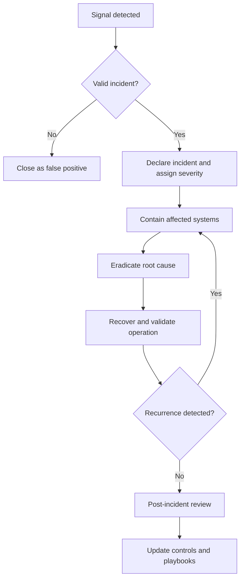

# Volume 12 - Incident Response Playbook

| Field | Value |
|---|---|
| Document ID | WORLD-VOL12-A5 |
| Title | Incident Response Playbook |
| Version | 1.0 |
| Status | Approved |
| Classification | Internal |
| Founder | Mahesh Choudhary |

## Purpose

This appendix provides the incident response playbook for Project WORLD. Its purpose is to ensure that when a security incident occurs, the response is fast, coordinated, and repeatable rather than improvised. It defines the phases of response, the roles and their responsibilities, the severity levels that govern urgency and escalation, and the end-to-end response flow. Under the pressure of a live incident, a prepared playbook is the difference between contained damage and a spreading crisis; it lets responders act on decisions already made calmly in advance.

## Scope

The playbook covers the full incident lifecycle from detection through post-incident review, the RACI assignment of response roles, a four-level severity scheme, and a response flow diagram. It applies to all confirmed and suspected security incidents affecting WORLD systems and data. It does not replace the detailed technical runbooks for specific attack types, which it references, nor does it govern non-security operational incidents, which are handled under the infrastructure tier. Legal, regulatory, and customer-notification obligations are triggered from this playbook but defined in the compliance and governance chapters.

## Response Phases

| Phase | Objective | Key Activities |
|---|---|---|
| 1. Preparation | Be ready before an incident occurs. | Maintain playbooks, tooling, contacts, and training; run exercises. |
| 2. Detection and Analysis | Confirm and understand the incident. | Triage alerts, validate, scope impact, assign severity, declare the incident. |
| 3. Containment | Stop the incident from spreading. | Isolate affected systems, revoke credentials, block indicators, preserve evidence. |
| 4. Eradication | Remove the root cause. | Eliminate malware, close the exploited vulnerability, rotate compromised secrets. |
| 5. Recovery | Restore normal, verified operation. | Rebuild or restore systems, validate integrity, monitor for recurrence. |
| 6. Post-Incident Review | Learn and improve. | Document timeline, identify root cause, capture actions, update controls. |

## Roles and Responsibilities (RACI)

R = Responsible, A = Accountable, C = Consulted, I = Informed.

| Activity | Incident Commander | Security Analyst | Engineering Lead | Communications Lead | Executive Sponsor |
|---|---|---|---|---|---|
| Declare incident and severity | A | R | C | I | I |
| Technical investigation | C | R | R | I | I |
| Containment and eradication | A | R | R | I | I |
| Internal and external communication | C | I | I | R | A |
| Recovery and validation | A | C | R | I | I |
| Regulatory and legal notification | C | I | I | R | A |
| Post-incident review | A | R | C | C | I |

## Severity Levels

| Severity | Definition | Target Response | Escalation |
|---|---|---|---|
| SEV-1 Critical | Confirmed breach or major outage affecting sensitive data or core availability. | Immediate, 24/7 | Executive Sponsor and Incident Commander engaged at once. |
| SEV-2 High | Significant incident with contained but serious impact or high potential to spread. | Within 1 hour | Incident Commander engaged; Executive Sponsor informed. |
| SEV-3 Medium | Limited-impact incident affecting a single system or a small scope. | Within 4 hours | Security Analyst leads; Incident Commander informed. |
| SEV-4 Low | Minor policy violation or low-risk anomaly requiring tracked follow-up. | Next business day | Handled by on-call analyst; logged for review. |

## Response Flow

## Escalation and Communication

| Trigger | Action |
|---|---|
| Severity raised to SEV-1 or SEV-2 | Incident Commander convenes the response team and opens a dedicated channel. |
| Confirmed data breach | Communications Lead initiates the notification process with legal and compliance. |
| Containment exceeds target time | Incident Commander escalates to the Executive Sponsor for additional resources. |
| Incident resolved | Communications Lead issues closure notice; review is scheduled within five business days. |

## Cross-References

- [Security Controls Catalog](/docs/blueprint/volume-12-security/appendices/security-controls-catalog.md)
- [Threat Model Template](/docs/blueprint/volume-12-security/appendices/threat-model-template.md)
- [Zero Trust Architecture](/docs/blueprint/volume-12-security/section-a-security-foundations/02-zero-trust-architecture.md)

## References

- [Volume 01 - Vision and Philosophy](/docs/blueprint/volume-01-vision-and-philosophy/README.md)
- [Document Standards](/docs/governance/document-standards.md)

## Change Log

| Version | Date | Author | Notes |
|---|---|---|---|
| 1.0 | 2026-07-12 | Lead Software Engineer | Initial approved version. |
