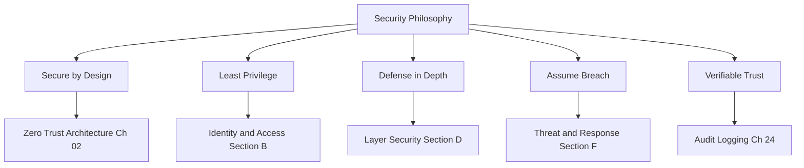

# Volume 12 - Security Philosophy

| Field | Value |
|---|---|
| Document ID | WORLD-VOL12-001 |
| Title | Security Philosophy |
| Version | 1.0 |
| Status | Approved |
| Classification | Internal |
| Founder | Mahesh Choudhary |

## Purpose

This chapter fixes the first principles from which every other security decision in Project WORLD is derived. Before a single firewall rule, token format, or encryption algorithm is chosen, the enterprise must agree on what security is for, what it assumes about the world, and how it reasons about risk. WORLD is an AI-Native Business Operating System that acts on real money, real contracts, and real customer data through an autonomous AI Business Partner (Volume 03); the cost of a security failure is therefore not an inconvenience but a direct injury to the businesses that run on the platform. This chapter establishes the durable convictions that make security a property of the system by construction rather than a layer bolted on afterward.

## Scope

The chapter defines WORLD's security philosophy: the threat posture, the guiding principles, and the mental model that governs Volumes 12 in full. It is deliberately principle-based and technology-neutral. It sets the direction that Zero Trust Architecture (Chapter 02), Identity and Access (Section B), Cryptography and Secrets (Section C), and every downstream control implement. It does not specify individual mechanisms; those are the subject of the chapters that follow.

## Architecture

WORLD's security philosophy rests on five convictions: **secure by design** (controls are built into architecture, not appended to it), **least privilege** (every identity holds the minimum authority required and no more), **defense in depth** (no single control is trusted to stand alone), **assume breach** (the system is engineered to contain and detect compromise, not merely to prevent it), and **verifiable trust** (every access decision is explicit, logged, and auditable). These convictions are aligned with recognized frameworks - the NIST Cybersecurity Framework, ISO/IEC 27001, and the OWASP application security guidance - without inheriting any single one wholesale.

Each principle maps to a concrete downstream discipline, so philosophy is never abstract: it is traceable to an implemented control.

## Implementation Strategy

The philosophy is operationalized by making every principle testable. Secure-by-design is enforced through mandatory threat modeling at architecture review and secure defaults in every service template. Least privilege is enforced by the Permission Engine (Chapter 08) and reviewed through periodic access recertification. Defense in depth is validated by ensuring no asset is protected by only one control. Assume-breach is exercised through incident response drills (Chapter 26) and continuous monitoring (Chapter 27). Verifiable trust is guaranteed by an immutable audit log (Chapter 24) that records every consequential decision.

| Principle | Enforced By | Verified By |
|---|---|---|
| Secure by Design | Threat modeling, secure defaults | Architecture review gates |
| Least Privilege | Permission Engine, RBAC/ABAC | Access recertification |
| Defense in Depth | Layered controls (Section D) | Control coverage audit |
| Assume Breach | Segmentation, detection | Red-team and IR drills |
| Verifiable Trust | Immutable audit logging | Independent audit |

**Enterprise example:** A mid-market manufacturer runs its finance operations on WORLD. An attacker phishes an accounts-payable clerk and obtains a valid session. Because least privilege confines the clerk to payment drafting - not approval - the stolen session cannot release funds. Because assume-breach segmentation isolates the finance module, the intruder cannot pivot to HR or customer data. Because verifiable trust logs every action, the anomalous drafting pattern is flagged within minutes and the session revoked. No single control stopped the attack; the philosophy did.

## Business Value

Security philosophy is the cheapest control the enterprise will ever buy, because it prevents entire classes of failure before they are designed in. A coherent posture reduces breach probability, shortens audits by making evidence intrinsic, and lets WORLD credibly serve regulated industries. For the businesses that run on WORLD, it converts security from a source of anxiety into a differentiator they can present to their own customers and auditors.

## Relationship to AI

The AI Business Partner (Volume 03) is a first-class actor with its own identity and its own least-privilege authority. Every principle here applies to it as rigorously as to a human: the AI operates under scoped permissions, its actions are logged for verifiable trust, and assume-breach containment limits the damage a compromised or misdirected agent could cause. Security philosophy is what makes autonomous AI action safe enough to trust with the business.

## Relationship to ERP

The ERP (Volumes 05-06) holds the enterprise's system of record - ledgers, inventory, payroll, contracts. The philosophy treats these as the crown jewels: least privilege and defense in depth concentrate the strongest controls around ERP data, and the permission model here is the same one that governs ERP module permissions (Volume 05, Chapter 27), ensuring a single coherent authority model across the platform.

## Relationship to Infrastructure

The technology stack (Volumes 08-11) supplies the substrate the philosophy governs. Secure-by-design shapes the architecture of Volume 08; defense in depth is realized across the network, database, API, and cloud layers of Volumes 09-11; and verifiable trust depends on the observability infrastructure of Volume 11. This chapter consolidates and elevates the security concerns those volumes introduced into one governing posture.

## Future Expansion

The philosophy is stable but not static. As WORLD adopts post-quantum cryptography, confidential computing, and increasingly autonomous AI, the five convictions provide the frame within which new mechanisms are evaluated. Any future control must demonstrably serve one of these principles or it does not enter the platform. Chapter 33 governs how the security architecture evolves without abandoning these foundations.

## Cross-References

- [Zero Trust Architecture](/docs/blueprint/volume-12-security/section-a-security-foundations/02-zero-trust-architecture.md)
- [Permission Engine](/docs/blueprint/volume-12-security/section-b-identity-and-access/08-permission-engine.md)
- [Volume 03 - AI Business Partner](/docs/blueprint/volume-03-ai-business-partner/README.md)
- [Volume 08 - Architecture](/docs/blueprint/volume-08-architecture/README.md)

## References

- [Volume 01 - Vision and Philosophy](/docs/blueprint/volume-01-vision-and-philosophy/README.md)
- [Document Standards](/docs/governance/document-standards.md)

## Change Log

| Version | Date | Author | Notes |
|---|---|---|---|
| 1.0 | 2026-07-12 | Lead Software Engineer | Initial approved version. |
