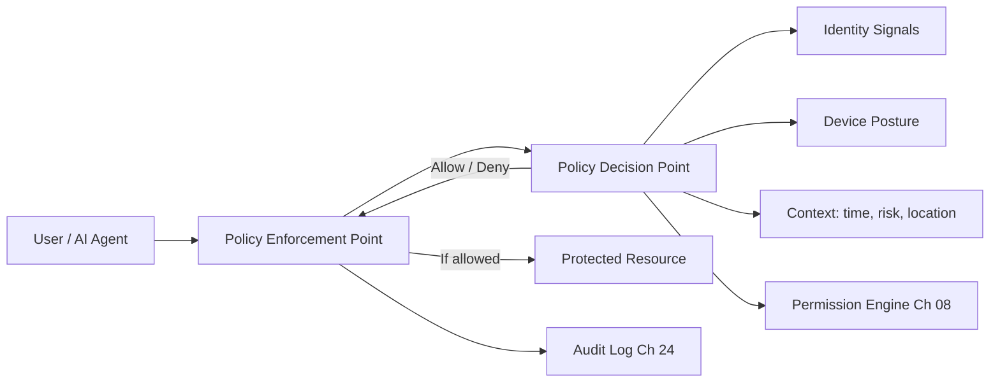

# Volume 12 - Zero Trust Architecture

| Field | Value |
|---|---|
| Document ID | WORLD-VOL12-002 |
| Title | Zero Trust Architecture |
| Version | 1.0 |
| Status | Approved |
| Classification | Internal |
| Founder | Mahesh Choudhary |

## Purpose

This chapter translates the security philosophy (Chapter 01) into an operating architecture. Zero Trust is the structural answer to the assume-breach conviction: it removes the notion of a trusted internal network and replaces it with continuous, explicit verification of every request. For Project WORLD - a multi-tenant platform where an autonomous AI Business Partner and thousands of human users act on shared infrastructure - implicit trust based on network location is not merely weak, it is incoherent. This chapter defines how WORLD makes trust an earned, per-request property.

## Scope

The chapter defines WORLD's Zero Trust model: its tenets, its control plane, and the policy decision and enforcement points that mediate access. It governs how identity, device posture, and context combine into an access decision for every request across the platform. It builds directly on the philosophy of Chapter 01 and sets the frame that Identity and Access (Section B) implements in detail. It does not define the identity or permission mechanisms themselves; those follow in Chapters 03-08.

## Architecture

Zero Trust in WORLD follows three tenets aligned with the NIST guidance on Zero Trust Architecture: **never trust, always verify** (no request is trusted by origin), **verify explicitly** (every decision uses identity, device, and context signals), and **assume a hostile network** (the same scrutiny applies inside and outside the perimeter). Architecturally this is realized by separating a Policy Decision Point (PDP) - which evaluates whether a request is allowed - from Policy Enforcement Points (PEP) distributed at every gateway, service mesh sidecar, and data boundary.

Every request traverses a PEP, which consults the PDP; the PDP combines identity, device posture, and context with the Permission Engine's authorization decision, and the outcome is logged unconditionally.

## Implementation Strategy

WORLD deploys Zero Trust incrementally by wrapping every service behind a mesh in which the sidecar acts as a PEP. Mutual TLS authenticates service-to-service traffic; user and agent traffic is authenticated at the edge and re-verified at each hop. Sessions are short-lived and continuously evaluated, so a change in risk posture - a new device, an impossible-travel event, an anomalous action - triggers re-authentication or revocation mid-session.

| Component | Function | WORLD Standard |
|---|---|---|
| Policy Decision Point | Evaluates access requests | Centralized, highly available, logged |
| Policy Enforcement Point | Enforces decisions at boundaries | Mesh sidecar, API gateway, data proxy |
| Identity Provider | Establishes who is asking | Federated, MFA-backed (Chapter 04) |
| Device Trust | Establishes device posture | Signals from Chapter 22 |
| Continuous Evaluation | Re-checks trust mid-session | Risk-driven re-authentication |

**Enterprise example:** A regional bank uses WORLD for treasury operations. A treasury analyst authenticated this morning from a managed laptop now issues a wire-approval request from an unrecognized device. The PEP forwards the request to the PDP, which sees a valid identity but a failed device-posture signal and an elevated context risk. Rather than trusting the existing session, the PDP demands step-up MFA and, until satisfied, denies the wire approval. The perimeter was already breached in the classic model - the analyst was inside the network - yet Zero Trust stopped the action.

## Business Value

Zero Trust converts security from a brittle perimeter into a resilient fabric. It contains breaches by denying lateral movement, reduces the blast radius of stolen credentials, and provides the continuous verification regulators increasingly expect. For customers, it means a compromise of one tenant, one service, or one device does not cascade, which is the foundation of WORLD's multi-tenant trust guarantee.

## Relationship to AI

The AI Business Partner (Volume 03) is subject to the same PDP as any human. Its every action - reading a ledger, drafting a payment, calling an external API - passes through a PEP and is authorized explicitly. Because the AI can act rapidly and at scale, continuous evaluation is essential: an agent exhibiting anomalous behavior is throttled or revoked in-flight, ensuring autonomy never outruns verification.

## Relationship to ERP

Every ERP transaction (Volumes 05-06) is a protected resource behind a PEP. Zero Trust ensures that access to financial and operational records is authorized per request using the same permission model as Volume 05, Chapter 27, so a valid session never implies standing access to sensitive ERP data. Sensitive operations such as posting to the ledger require step-up verification regardless of network origin.

## Relationship to Infrastructure

Zero Trust is implemented on the service mesh, API gateway, and network fabric of Volumes 08-11. It consolidates the perimeter-oriented controls those volumes described - network segmentation (Volume 11), API gateways (Volume 10) - into a single identity-centric model where the network is assumed hostile and the enforcement point, not the firewall, is the unit of trust.

## Future Expansion

Zero Trust will deepen as WORLD adds richer telemetry: behavioral biometrics, hardware-attested device identity, and machine-learning risk scoring feeding the PDP. The PDP/PEP separation is designed to absorb these signals without re-architecting enforcement. Chapter 33 governs how new signals are admitted into the decision plane.

## Cross-References

- [Security Philosophy](/docs/blueprint/volume-12-security/section-a-security-foundations/01-security-philosophy.md)
- [Authorization](/docs/blueprint/volume-12-security/section-b-identity-and-access/05-authorization.md)
- [Permission Engine](/docs/blueprint/volume-12-security/section-b-identity-and-access/08-permission-engine.md)
- [Volume 08 - Architecture](/docs/blueprint/volume-08-architecture/README.md)

## References

- [Volume 01 - Vision and Philosophy](/docs/blueprint/volume-01-vision-and-philosophy/README.md)
- [Document Standards](/docs/governance/document-standards.md)

## Change Log

| Version | Date | Author | Notes |
|---|---|---|---|
| 1.0 | 2026-07-12 | Lead Software Engineer | Initial approved version. |
