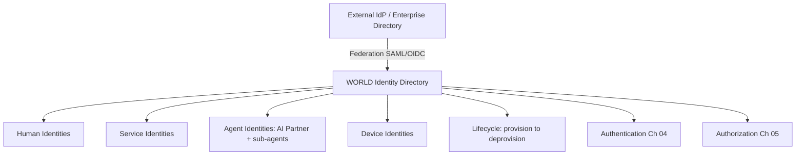

# Volume 12 - Identity Management

| Field | Value |
|---|---|
| Document ID | WORLD-VOL12-003 |
| Title | Identity Management |
| Version | 1.0 |
| Status | Approved |
| Classification | Internal |
| Founder | Mahesh Choudhary |

## Purpose

Identity is the foundation of every access decision. Before WORLD can authenticate a request (Chapter 04) or authorize it (Chapter 05), it must know precisely who or what is asking. This chapter defines how Project WORLD establishes, represents, and governs the lifecycle of every identity on the platform - human users, the AI Business Partner and its sub-agents, services, and devices. In a Zero Trust architecture (Chapter 02) where trust is verified per request, the integrity of the identity system is the integrity of the whole security model.

## Scope

The chapter defines WORLD's identity model: the identity types, the identity provider and directory, federation, and the full lifecycle from provisioning to deprovisioning. It governs identity for humans, machines, and AI agents uniformly. It provides the subject on which Authentication (Chapter 04), Authorization (Chapter 05), and the Permission Engine (Chapter 08) operate. It does not define credential verification or permission evaluation; those are the subjects of the following chapters.

## Architecture

WORLD maintains a single authoritative identity directory in which every principal has a unique, immutable identifier and a typed identity record. Four identity classes exist: **human identities**, **service identities** (workloads and microservices), **agent identities** (the AI Business Partner and each delegated sub-agent), and **device identities**. External identity providers are federated in, so an enterprise customer's existing directory can be trusted without duplicating credentials.

Every identity flows through a governed lifecycle and feeds both authentication and authorization; no principal exists on the platform without a record here.

## Implementation Strategy

Identities are provisioned through automated joiner-mover-leaver workflows tied to the customer's HR or directory system where available. Each identity carries attributes - organization, department, role, clearance, tenant - that later drive attribute-based access (Chapter 07). Agent identities are minted when the AI Business Partner spawns a task-scoped sub-agent and are automatically revoked when the task completes, ensuring no orphaned authority. All identity changes are logged to the immutable audit trail (Chapter 24).

| Lifecycle Stage | Trigger | Control |
|---|---|---|
| Provisioning | Hire, service deploy, agent spawn | Automated, approved, attribute-tagged |
| Modification | Role or attribute change | Recorded, recertified |
| Suspension | Risk event, leave of absence | Immediate, reversible |
| Deprovisioning | Departure, task completion | Automated, credentials revoked |
| Recertification | Periodic review | Owner attestation |

**Enterprise example:** A logistics enterprise onboards WORLD and federates its corporate directory via OIDC. When a warehouse supervisor is hired, the HR event provisions a WORLD human identity tagged with organization, site, and role attributes - no manual account creation. When that supervisor asks the AI Business Partner to reconcile a shipment, the AI spawns a sub-agent with its own agent identity scoped to that single task; the sub-agent's identity is destroyed on completion. When the supervisor later leaves, the leaver event deprovisions the human identity within minutes, and every credential is revoked platform-wide.

## Business Value

A rigorous identity system eliminates orphaned accounts, the most common root cause of breaches, and makes access reviews tractable. Federation lets enterprises adopt WORLD without re-creating their user base, accelerating onboarding. Uniform treatment of human, service, and agent identities means one governance model covers the entire platform, reducing operational cost and audit complexity.

## Relationship to AI

The AI Business Partner (Volume 03) is a full identity with the same lifecycle rigor as a human. Critically, every sub-agent it delegates to receives a distinct, task-scoped, ephemeral identity, so the authority of AI action is always attributable to a specific principal and bounded in time. This makes autonomous AI action auditable and revocable at the granularity of a single task.

## Relationship to ERP

ERP records (Volumes 05-06) are owned and touched by identities defined here. The organization, department, and tenant attributes on each identity align with the ERP's organizational model, so identity is the bridge between the security model and the ERP permission model of Volume 05, Chapter 27. A user's ERP data scope is a direct function of their identity attributes.

## Relationship to Infrastructure

Service and device identities secure the infrastructure of Volumes 08-11. Every microservice authenticates with a service identity for mutual-TLS mesh communication (Chapter 02), and device identities feed the device-trust signals of Chapter 22. The identity directory is itself deployed as a highly available service following the infrastructure standards of Volume 11.

## Future Expansion

Identity will extend toward decentralized and verifiable credentials, allowing customers to present cryptographically attested claims without central storage, and toward richer machine-identity attestation for confidential computing. The typed-identity model is designed to admit new principal classes without disrupting the lifecycle machinery.

## Cross-References

- [Authentication](/docs/blueprint/volume-12-security/section-b-identity-and-access/04-authentication.md)
- [Attribute Based Access Control](/docs/blueprint/volume-12-security/section-b-identity-and-access/07-attribute-based-access-control.md)
- [Volume 03 - AI Business Partner](/docs/blueprint/volume-03-ai-business-partner/README.md)
- [Volume 05 - ERP Foundation](/docs/blueprint/volume-05-erp-foundation/README.md)

## References

- [Volume 01 - Vision and Philosophy](/docs/blueprint/volume-01-vision-and-philosophy/README.md)
- [Document Standards](/docs/governance/document-standards.md)

## Change Log

| Version | Date | Author | Notes |
|---|---|---|---|
| 1.0 | 2026-07-12 | Lead Software Engineer | Initial approved version. |
