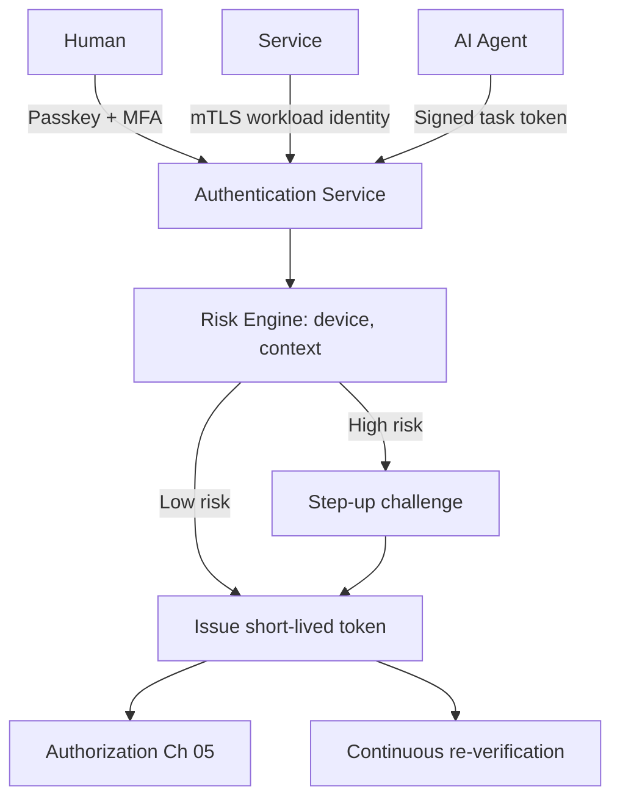

# Volume 12 - Authentication

| Field | Value |
|---|---|
| Document ID | WORLD-VOL12-004 |
| Title | Authentication |
| Version | 1.0 |
| Status | Approved |
| Classification | Internal |
| Founder | Mahesh Choudhary |

## Purpose

Authentication is the act of proving that a principal is who it claims to be. Given the identities established in Chapter 03, this chapter defines how Project WORLD verifies those claims for humans, services, and AI agents. Under Zero Trust (Chapter 02), authentication is not a one-time gate at login but a continuous, risk-aware process re-evaluated throughout a session. Because WORLD acts on money and records, weak authentication is an existential risk; this chapter fixes the standards that make impersonation impractical.

## Scope

The chapter defines WORLD's authentication model: credential types, multi-factor and step-up authentication, token issuance, service and agent authentication, and continuous verification. It consolidates the authentication concerns introduced in Volume 08 (Chapters 19-20). It operates on the identities of Chapter 03 and feeds verified principals into Authorization (Chapter 05). It does not decide what a principal may do once authenticated; that is authorization.

## Architecture

WORLD authenticates every principal class through appropriate factors and issues short-lived, signed tokens that carry verified identity and are re-validated at each Policy Enforcement Point. Humans authenticate with multi-factor credentials, ideally phishing-resistant passkeys aligned with the FIDO2/WebAuthn standard. Services authenticate with mutual TLS and workload identity. Agents authenticate with cryptographically signed, task-scoped tokens minted at delegation.

Authentication is mediated by a risk engine, so the strength of proof demanded scales with the sensitivity and risk of the request.

## Implementation Strategy

WORLD standardizes on OpenID Connect for human federation and OAuth 2.0 for delegated authorization tokens, with passkeys as the preferred first factor and time-based one-time passwords or hardware keys as second factors. Tokens are short-lived and bound to the requesting client to resist replay. High-risk actions trigger step-up authentication regardless of session age. Failed-attempt throttling, credential rotation, and compromised-credential detection run continuously.

| Principal | Primary Factor | Additional Factor | Token |
|---|---|---|---|
| Human user | Passkey (WebAuthn) | TOTP or hardware key | Short-lived OIDC/OAuth |
| Privileged human | Passkey | Hardware key + step-up | Short-lived, narrow scope |
| Service | Mutual TLS | Workload attestation | Mesh-issued, rotated |
| AI agent | Signed task token | Delegation proof | Task-scoped, ephemeral |

**Enterprise example:** A CFO at a WORLD customer logs in with a passkey from her registered laptop; the risk engine sees a known device and low risk and issues a standard session. Later she instructs the AI Business Partner to approve a large vendor payment. Because the action is high-value, the risk engine demands step-up authentication: a hardware-key tap. Only after that fresh proof does the authorization layer evaluate the request. A stolen session alone could never have released the payment.

## Business Value

Strong, phishing-resistant authentication eliminates the single largest cause of enterprise breaches - credential theft. Passkeys reduce password-reset support costs and user friction simultaneously. Risk-based step-up applies strong controls only where they matter, preserving usability. For customers in regulated sectors, WORLD's authentication standards directly satisfy access-control requirements of frameworks such as ISO/IEC 27001 and SOC 2.

## Relationship to AI

The AI Business Partner (Volume 03) authenticates with signed, task-scoped tokens rather than long-lived secrets, so its authority is always bounded and revocable. When the AI performs a sensitive action on a user's behalf, WORLD can require the human to complete step-up authentication, keeping a human proof in the loop for consequential decisions while preserving AI autonomy for routine ones.

## Relationship to ERP

Access to ERP modules (Volumes 05-06) is gated by authentication strength proportional to the operation. Reading a report needs a standard session; posting to the general ledger or approving payroll triggers step-up. This aligns authentication with the sensitivity tiers of the ERP permission model in Volume 05, Chapter 27.

## Relationship to Infrastructure

Service authentication via mutual TLS secures the microservice mesh of Volumes 08 and 11, and token validation occurs at the API gateway of Volume 10. The authentication service is deployed with the high-availability and secrets-management standards of Volume 11, drawing signing keys from the key management of Chapter 10.

## Future Expansion

Authentication will move fully passwordless, adopt continuous behavioral verification, and prepare for post-quantum-safe token signatures. The risk-engine architecture allows new signals and factors to be introduced without changing how services consume verified tokens.

## Cross-References

- [Identity Management](/docs/blueprint/volume-12-security/section-b-identity-and-access/03-identity-management.md)
- [Authorization](/docs/blueprint/volume-12-security/section-b-identity-and-access/05-authorization.md)
- [Volume 08 - Architecture](/docs/blueprint/volume-08-architecture/README.md)
- [Volume 11 - Infrastructure](/docs/blueprint/volume-11-infrastructure/README.md)

## References

- [Volume 01 - Vision and Philosophy](/docs/blueprint/volume-01-vision-and-philosophy/README.md)
- [Document Standards](/docs/governance/document-standards.md)

## Change Log

| Version | Date | Author | Notes |
|---|---|---|---|
| 1.0 | 2026-07-12 | Lead Software Engineer | Initial approved version. |
