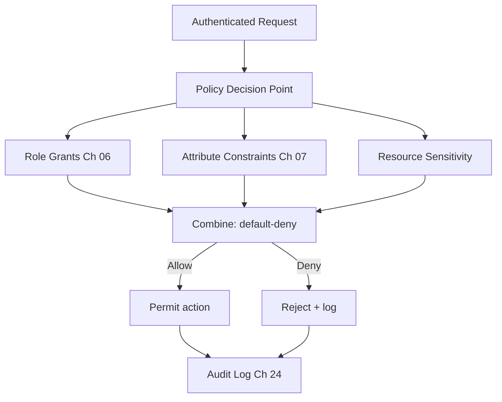

# Volume 12 - Authorization

| Field | Value |
|---|---|
| Document ID | WORLD-VOL12-005 |
| Title | Authorization |
| Version | 1.0 |
| Status | Approved |
| Classification | Internal |
| Founder | Mahesh Choudhary |

## Purpose

Authentication proves who is asking; authorization decides what they may do. This chapter defines how Project WORLD determines, for every authenticated request, whether the principal is permitted to perform the requested action on the requested resource. Authorization is where least privilege (Chapter 01) becomes concrete and where the Zero Trust promise of explicit, per-request verification (Chapter 02) is kept. It consolidates and elevates the authorization design introduced in Volume 08, Chapter 20.

## Scope

The chapter defines WORLD's authorization model: the decision flow, the combination of role-based and attribute-based policy, the default-deny stance, and the relationship to the Permission Engine (Chapter 08). It operates on authenticated principals from Chapter 04 and sets the frame that RBAC (Chapter 06), ABAC (Chapter 07), and the Permission Engine (Chapter 08) implement in detail. It does not define credential verification.

## Architecture

WORLD authorization is default-deny: no action is permitted unless an explicit policy grants it. Every request is resolved by combining **role-based** grants (what the principal's roles allow) with **attribute-based** constraints (contextual conditions that must hold), producing a single allow-or-deny decision at the Policy Decision Point (Chapter 02). This hybrid model gives the coarse manageability of roles and the fine precision of attributes.

Roles establish a baseline of capability; attributes tighten or condition it; the resource's sensitivity sets the bar; and the absence of an explicit grant is a denial.

## Implementation Strategy

Authorization is externalized from application code into a central Permission Engine (Chapter 08) so policy is consistent, testable, and auditable rather than scattered through services. Applications ask the engine "may this principal do this?" and receive a decision; they never encode their own rules. Policies are versioned, reviewed, and simulated against real requests before rollout. Every decision - allow or deny - is logged with its reason.

| Model | Answers | Strength | Chapter |
|---|---|---|---|
| RBAC | What role am I in? | Manageable, auditable | 06 |
| ABAC | Do the conditions hold? | Fine-grained, contextual | 07 |
| Hybrid | Both, combined | Balance of scale and precision | 08 |
| Default-deny | Is there an explicit grant? | Safe by construction | 05 |

**Enterprise example:** A sales manager at a WORLD customer requests to view a customer account. Her role, Regional Sales Manager, grants read access to customer accounts - the RBAC layer allows it in principle. But an ABAC constraint restricts her to accounts in her assigned region and only during her working hours. The requested account belongs to another region, so the attribute constraint fails and, under default-deny, the request is rejected and logged. The same role permits access to in-region accounts without friction.

## Business Value

Externalized, hybrid authorization is what lets WORLD serve many tenants and many roles without a combinatorial explosion of hand-written rules. Default-deny eliminates the accidental over-permission that drives most privilege-escalation incidents. Because every decision is logged with its rationale, access audits become a query rather than an investigation, cutting compliance cost dramatically.

## Relationship to AI

The AI Business Partner (Volume 03) is authorized through the same engine as humans. Every action it takes is checked against role and attribute policy, so the AI can never exceed the authority delegated to it. Because policy is external, the boundaries of AI autonomy can be tightened or loosened centrally without redeploying the agent, giving the enterprise precise, real-time control over what the AI may do.

## Relationship to ERP

Authorization here is the same model that governs ERP module permissions in Volume 05, Chapter 27. When a user acts on an ERP object - a purchase order, a journal entry - the ERP delegates the decision to the Permission Engine, ensuring one coherent authority model spans the security volume and the ERP rather than two divergent systems.

## Relationship to Infrastructure

Authorization decisions are enforced at the Policy Enforcement Points of the service mesh and API gateway (Volumes 10-11) established under Zero Trust. The Permission Engine is deployed as a low-latency, highly available service per Volume 11 standards, since every request in the platform depends on it.

## Future Expansion

Authorization will incorporate relationship-based access control for graph-structured resources and risk-adaptive policies that tighten automatically under elevated threat. The externalized-policy architecture ensures these models can be added behind the same decision interface applications already use.

## Cross-References

- [Role Based Access Control](/docs/blueprint/volume-12-security/section-b-identity-and-access/06-role-based-access-control.md)
- [Attribute Based Access Control](/docs/blueprint/volume-12-security/section-b-identity-and-access/07-attribute-based-access-control.md)
- [Permission Engine](/docs/blueprint/volume-12-security/section-b-identity-and-access/08-permission-engine.md)
- [Volume 05 - ERP Foundation](/docs/blueprint/volume-05-erp-foundation/README.md)

## References

- [Volume 01 - Vision and Philosophy](/docs/blueprint/volume-01-vision-and-philosophy/README.md)
- [Document Standards](/docs/governance/document-standards.md)

## Change Log

| Version | Date | Author | Notes |
|---|---|---|---|
| 1.0 | 2026-07-12 | Lead Software Engineer | Initial approved version. |
