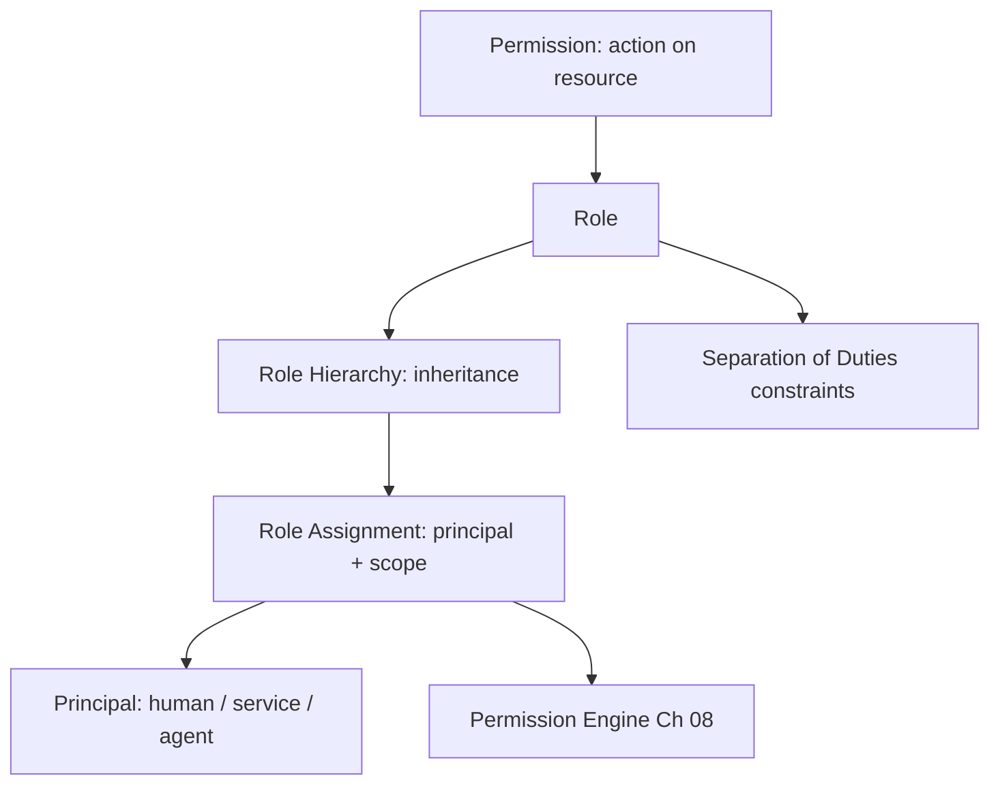

# Volume 12 - Role Based Access Control

| Field | Value |
|---|---|
| Document ID | WORLD-VOL12-006 |
| Title | Role Based Access Control |
| Version | 1.0 |
| Status | Approved |
| Classification | Internal |
| Founder | Mahesh Choudhary |

## Purpose

Role-Based Access Control (RBAC) is the manageable backbone of WORLD's authorization model (Chapter 05). Rather than granting permissions to individuals one by one - which is unmanageable at enterprise scale - RBAC groups permissions into roles and assigns roles to principals. This chapter defines how Project WORLD models roles, permissions, and role hierarchies so that access is granted at the speed of business while remaining auditable and least-privileged.

## Scope

The chapter defines WORLD's RBAC model: permissions, roles, role hierarchies, role assignment, and separation of duties. It provides the coarse-grained grant layer that the Permission Engine (Chapter 08) combines with attribute constraints (Chapter 07). It aligns directly with the ERP permission model of Volume 05, Chapter 27, and the authorization design of Volume 08, Chapter 20. It does not cover contextual, condition-based access, which is the subject of ABAC (Chapter 07).

## Architecture

In WORLD, a **permission** is an allowed action on a resource type; a **role** is a named bundle of permissions; and a **role assignment** binds a principal to a role, optionally scoped to an organization or tenant. Roles are arranged in a hierarchy so that senior roles inherit the permissions of the roles beneath them, avoiding duplication. Separation-of-duties constraints prevent a principal from holding conflicting roles.

Permissions roll up into roles, roles inherit through the hierarchy, and assignments bind principals within a scope, all consumed by the Permission Engine.

## Implementation Strategy

WORLD ships a curated catalog of standard roles per domain - finance, sales, HR, operations - each least-privileged by default, and lets customers compose custom roles from the permission catalog without inventing raw permissions. Role assignments are time-boundable and subject to periodic recertification. Separation-of-duties rules are enforced at assignment time, so a principal cannot simultaneously hold, for example, both payment-creation and payment-approval roles.

| Element | Definition | WORLD Standard |
|---|---|---|
| Permission | Action on a resource type | Fine-grained, catalog-defined |
| Role | Bundle of permissions | Least-privilege, domain-scoped |
| Hierarchy | Inheritance among roles | Senior inherits junior |
| Assignment | Principal-to-role binding | Scoped, time-boundable, recertified |
| Separation of Duties | Conflicting-role prevention | Enforced at assignment |

**Enterprise example:** A WORLD retail customer defines an Accounts Payable Clerk role granting create and edit on vendor invoices, and an AP Manager role that inherits those permissions and adds approve. A separation-of-duties rule forbids one person from holding both create and approve authority on the same invoice, so even the AP Manager, who can approve, cannot approve an invoice they personally created. This enforces the four-eyes principle structurally, not by policy memo.

## Business Value

RBAC makes access administration scale: onboarding a new finance hire is a single role assignment, not dozens of permission grants. Standard role catalogs accelerate customer onboarding and encode best-practice least privilege by default. Separation-of-duties enforcement satisfies a core control demanded by financial-audit frameworks, reducing fraud risk and audit findings simultaneously.

## Relationship to AI

The AI Business Partner and its sub-agents (Volume 03) are assigned roles exactly as humans are, so the AI's baseline authority is defined by a named, auditable role rather than by opaque code. A task-scoped sub-agent receives a narrow role for the duration of its task, ensuring AI capability is always expressed in the same reviewable vocabulary the enterprise uses for people.

## Relationship to ERP

RBAC is the shared foundation between this volume and the ERP permission model of Volume 05, Chapter 27. ERP module permissions are expressed as roles in this catalog, so a user's ERP capabilities and their platform security roles are one and the same, eliminating drift between the security layer and the business layer.

## Relationship to Infrastructure

Role definitions and assignments are stored in the identity directory (Chapter 03) and evaluated by the Permission Engine deployed on the Volume 11 infrastructure. Administrative roles also govern access to infrastructure controls - who may deploy, who may read secrets - unifying application and operational access under one model.

## Future Expansion

RBAC will gain automated role mining, which analyzes actual access patterns to suggest tighter roles and flag over-permissioned assignments, and just-in-time role elevation that grants a privileged role only for a bounded window. These refine, rather than replace, the role model defined here.

## Cross-References

- [Authorization](/docs/blueprint/volume-12-security/section-b-identity-and-access/05-authorization.md)
- [Attribute Based Access Control](/docs/blueprint/volume-12-security/section-b-identity-and-access/07-attribute-based-access-control.md)
- [Permission Engine](/docs/blueprint/volume-12-security/section-b-identity-and-access/08-permission-engine.md)
- [Volume 05 - ERP Foundation](/docs/blueprint/volume-05-erp-foundation/README.md)

## References

- [Volume 01 - Vision and Philosophy](/docs/blueprint/volume-01-vision-and-philosophy/README.md)
- [Document Standards](/docs/governance/document-standards.md)

## Change Log

| Version | Date | Author | Notes |
|---|---|---|---|
| 1.0 | 2026-07-12 | Lead Software Engineer | Initial approved version. |
