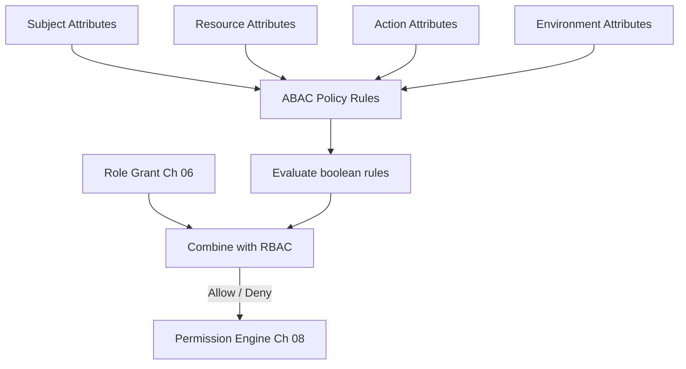

# Volume 12 - Attribute Based Access Control

| Field | Value |
|---|---|
| Document ID | WORLD-VOL12-007 |
| Title | Attribute Based Access Control |
| Version | 1.0 |
| Status | Approved |
| Classification | Internal |
| Founder | Mahesh Choudhary |

## Purpose

Roles answer who someone is in the organization; attributes answer whether the specific conditions of a request are acceptable. Attribute-Based Access Control (ABAC) gives WORLD the fine-grained, contextual precision that roles alone cannot express - constraints on data scope, time, location, device, and risk. This chapter defines how Project WORLD models attributes and policies so that authorization (Chapter 05) can enforce conditions such as "only your region," "only during business hours," or "only from a trusted device."

## Scope

The chapter defines WORLD's ABAC model: subject, resource, action, and environment attributes; policy expression; and how attribute constraints combine with RBAC grants (Chapter 06) in the Permission Engine (Chapter 08). It aligns with the ERP permission model of Volume 05, Chapter 27, and the authorization design of Volume 08, Chapter 20. It does not define the coarse role grants that ABAC refines; those belong to Chapter 06.

## Architecture

ABAC decisions are computed from four attribute categories: **subject** attributes (department, clearance, tenant), **resource** attributes (owner, classification, region), **action** attributes (read, approve, delete), and **environment** attributes (time, location, device posture, risk). Policies are boolean rules over these attributes, evaluated at the Policy Decision Point alongside role grants. Where RBAC decides the default, ABAC conditions it.

Attributes from all four categories feed policy rules whose result is combined with the role grant to reach a final decision.

## Implementation Strategy

Attributes are sourced authoritatively: subject attributes from the identity directory (Chapter 03), resource attributes from the data itself, and environment attributes from the request context and device-trust signals (Chapter 22). Policies are written in a declarative, human-readable form, versioned, and simulated against historical requests before deployment. ABAC is applied as a tightening layer - it can only further restrict what RBAC allows, never widen it, preserving default-deny.

| Attribute Category | Example | Source |
|---|---|---|
| Subject | Department, clearance, tenant | Identity directory (Ch 03) |
| Resource | Classification, owner, region | Resource metadata |
| Action | Read, write, approve | Request |
| Environment | Time, location, device, risk | Context + device trust (Ch 22) |

**Enterprise example:** A healthcare enterprise on WORLD must ensure clinicians see only records for patients in their own facility. Every clinician identity carries a facility attribute; every patient record carries a facility classification. An ABAC policy states that a clinician may read a record only when subject.facility equals resource.facility and the request originates from a managed device during a shift window. A physician covering two hospitals automatically sees the right records at each site without any role change - the attributes, not a new role, govern the boundary.

## Business Value

ABAC collapses what would otherwise be an unmanageable proliferation of narrow roles into a handful of expressive policies. It enforces data-residency, need-to-know, and time-of-day constraints that regulators demand but roles cannot capture. Because policies are declarative and simulated before rollout, the enterprise can change access rules confidently and instantly across the whole platform.

## Relationship to AI

ABAC is the primary means of bounding the AI Business Partner (Volume 03). Environment and risk attributes let the enterprise constrain the AI to act only within defined data scopes, value thresholds, and risk conditions - for example, permitting autonomous payment approval only below a threshold and only during business hours. Because these are attributes, the guardrails on AI autonomy are adjustable centrally and in real time.

## Relationship to ERP

ERP data scoping (Volumes 05-06) is fundamentally an ABAC problem: which organizational unit, region, or cost center a user may act within. This chapter provides the mechanism that the ERP permission model of Volume 05, Chapter 27 uses to enforce record-level scope, ensuring a single attribute-driven boundary rather than duplicated logic in each module.

## Relationship to Infrastructure

Environment attributes depend on the infrastructure of Volumes 08-11: device posture from endpoint signals (Chapter 22), network context from the mesh, and risk scores from monitoring (Chapter 27). The attribute evaluation runs inside the Permission Engine on Volume 11 infrastructure, held to strict latency budgets because it sits on every request path.

## Future Expansion

ABAC will incorporate continuously computed, ML-derived risk attributes and relationship attributes for graph-based data, enabling policies that reason over connections between principals and resources. The declarative policy model is designed to admit new attribute sources without rewriting existing rules.

## Cross-References

- [Role Based Access Control](/docs/blueprint/volume-12-security/section-b-identity-and-access/06-role-based-access-control.md)
- [Authorization](/docs/blueprint/volume-12-security/section-b-identity-and-access/05-authorization.md)
- [Permission Engine](/docs/blueprint/volume-12-security/section-b-identity-and-access/08-permission-engine.md)
- [Volume 03 - AI Business Partner](/docs/blueprint/volume-03-ai-business-partner/README.md)

## References

- [Volume 01 - Vision and Philosophy](/docs/blueprint/volume-01-vision-and-philosophy/README.md)
- [Document Standards](/docs/governance/document-standards.md)

## Change Log

| Version | Date | Author | Notes |
|---|---|---|---|
| 1.0 | 2026-07-12 | Lead Software Engineer | Initial approved version. |
