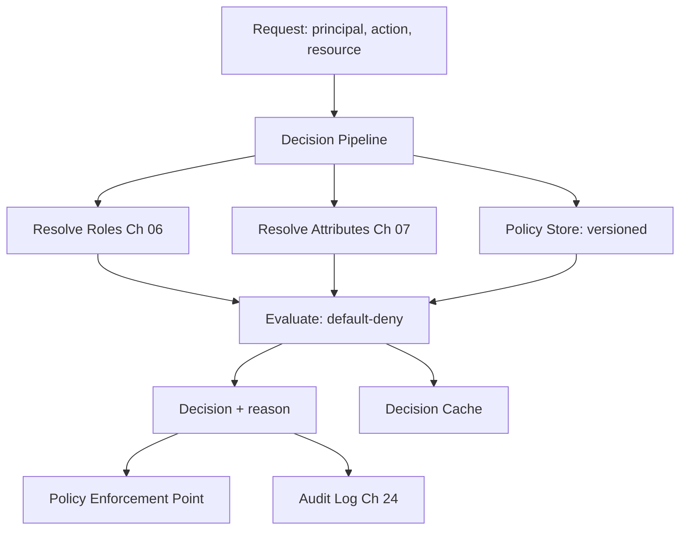

# Volume 12 - Permission Engine

| Field | Value |
|---|---|
| Document ID | WORLD-VOL12-008 |
| Title | Permission Engine |
| Version | 1.0 |
| Status | Approved |
| Classification | Internal |
| Founder | Mahesh Choudhary |

## Purpose

The Permission Engine is the single service that answers every authorization question in Project WORLD. Chapters 05-07 defined the model - default-deny authorization combining roles and attributes; this chapter defines the engine that computes those decisions consistently, quickly, and auditably for the entire platform. Centralizing authorization in one engine is what prevents the drift, duplication, and gaps that arise when each service invents its own access logic. It is the operational heart of least privilege (Chapter 01) and Zero Trust (Chapter 02).

## Scope

The chapter defines WORLD's Permission Engine: its decision pipeline, policy store, evaluation of combined RBAC (Chapter 06) and ABAC (Chapter 07), caching, and audit output. It is the concrete realization of the authorization design in Volume 08, Chapter 20, and the enforcement mechanism for the ERP permission model in Volume 05, Chapter 27. It does not redefine the role or attribute models; it executes them.

## Architecture

The engine is a Policy Decision Point exposed as a low-latency service. A request carrying principal, action, and resource enters the decision pipeline: it gathers the principal's roles, resolves relevant attributes, retrieves matching policies from the versioned policy store, evaluates them under default-deny, and returns an allow-or-deny decision with a reason. Every decision is emitted to the immutable audit log (Chapter 24).

The pipeline fuses roles, attributes, and versioned policy into one reasoned decision, cached for performance and logged for accountability.

## Implementation Strategy

Applications never embed access logic; they call the engine and honor its verdict. The engine is deployed as a horizontally scaled, highly available service with a local decision cache to meet strict latency budgets, since it sits on every request path. Policies are managed as code - versioned, peer-reviewed, tested, and simulated against real traffic before promotion. A policy change takes effect platform-wide at once, and a bad policy can be rolled back instantly.

| Capability | Description | Standard |
|---|---|---|
| Decision API | Answers allow/deny with reason | Sub-millisecond target, cached |
| Policy Store | Versioned RBAC + ABAC policies | Policy-as-code, peer-reviewed |
| Evaluation | Combine roles, attributes, default-deny | Deterministic, testable |
| Simulation | Dry-run policy against real requests | Mandatory before rollout |
| Audit Output | Log every decision | Immutable (Chapter 24) |

**Enterprise example:** A WORLD customer tightens policy so that refunds above a threshold now require a senior approver. The security team edits one policy, simulates it against the last quarter of refund requests to confirm no legitimate flow breaks, and promotes it. Instantly, across the web app, the mobile app, the public API, and the AI Business Partner, every over-threshold refund is routed for senior approval - with zero code changes in any of those surfaces, because they all ask the same engine.

## Business Value

One engine means one place to define, test, audit, and change access - eliminating the inconsistent, hard-to-audit authorization sprawl that plagues most enterprises. Policy-as-code with simulation makes access changes safe and instantaneous. A complete, reasoned decision log turns compliance evidence into a byproduct of normal operation, and central control means a discovered over-permission is fixed everywhere in one edit.

## Relationship to AI

The Permission Engine is the guardrail that makes autonomous AI safe. Every action the AI Business Partner (Volume 03) attempts is submitted to the engine and permitted only if policy allows, so the boundaries of AI autonomy are defined in reviewable policy, not model behavior. The enterprise can widen or narrow what the AI may do by editing policy, giving real-time, verifiable control over an autonomous actor.

## Relationship to ERP

The engine is the enforcement point for the ERP permission model of Volume 05, Chapter 27. Every ERP module delegates its access checks to the engine, so a purchase approval, a ledger posting, or a payroll run is governed by the same policies as the rest of the platform. This unifies business-layer and security-layer authority into one auditable system of record for access.

## Relationship to Infrastructure

The engine is deployed as a critical, highly available microservice per Volume 11 standards, its enforcement points embedded in the API gateway (Volume 10) and service mesh (Chapter 02). Its policy store and audit stream rely on the database and observability infrastructure of Volumes 09 and 11, and its latency budget is treated as a platform-wide reliability concern.

## Future Expansion

The engine will add relationship-based and risk-adaptive evaluation, formal verification of policy sets to prove absence of conflicts, and AI-assisted policy authoring that translates plain-language intent into reviewed policy. Its clean decision interface ensures these advances arrive without changing how the platform's thousands of call sites consume authorization.

## Cross-References

- [Authorization](/docs/blueprint/volume-12-security/section-b-identity-and-access/05-authorization.md)
- [Role Based Access Control](/docs/blueprint/volume-12-security/section-b-identity-and-access/06-role-based-access-control.md)
- [Attribute Based Access Control](/docs/blueprint/volume-12-security/section-b-identity-and-access/07-attribute-based-access-control.md)
- [Volume 05 - ERP Foundation](/docs/blueprint/volume-05-erp-foundation/README.md)

## References

- [Volume 01 - Vision and Philosophy](/docs/blueprint/volume-01-vision-and-philosophy/README.md)
- [Document Standards](/docs/governance/document-standards.md)

## Change Log

| Version | Date | Author | Notes |
|---|---|---|---|
| 1.0 | 2026-07-12 | Lead Software Engineer | Initial approved version. |
