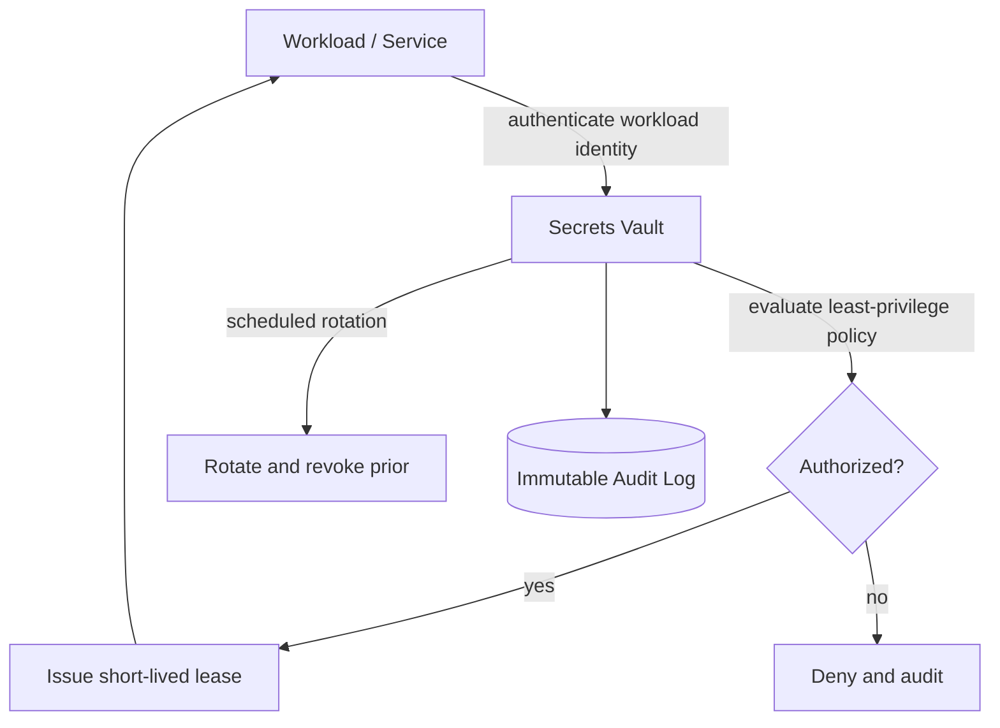

# Volume 12 - Secrets Management

| Field | Value |
|---|---|
| Document ID | WORLD-VOL12-009 |
| Title | Secrets Management |
| Version | 1.0 |
| Status | Approved |
| Classification | Internal |
| Founder | Mahesh Choudhary |

## Purpose

This chapter defines how WORLD governs secrets - the passwords, API tokens, private keys, and connection strings that grant privileged access to systems and data - as a first-class security concern. Its purpose is to guarantee that no secret is ever hard-coded, committed to source control, or baked into a container image; that every secret is held in a hardened vault, released to workloads just in time under least privilege, and rotated on a defined schedule; and that every access is authenticated, authorized, and audited. It elevates the infrastructure-level practice of Volume 11 (Chapter 13) into the enterprise security posture of Volume 12.

## Scope

Covered: the secrets-management model, the central vault, dynamic and static secrets, injection into workloads, rotation, revocation, least-privilege policy, and audit. Excluded: the cryptographic keys that protect the vault and application data, which belong to Chapter 10 (Key Management); the encryption algorithms themselves, covered in Chapter 11; and end-user identity and authentication, covered in Section B. This chapter concerns machine and service secrets and the control plane that governs their entire lifecycle.

## Architecture

A secret is any datum whose disclosure grants unauthorized access. The failure mode of naive practice is scatter: values pasted into config files, embedded in images, committed to Git, or shared over chat, where they persist indefinitely and cannot be revoked cleanly. WORLD corrects this by centralizing every secret in a hardened vault that is the single source of truth, encrypting it at rest under a key hierarchy managed per Chapter 10, and releasing it only to authenticated, authorized callers for a bounded lifetime. Two principles make the model robust: least privilege, so each identity reads only the specific secrets it needs, and short lifetime, so a leaked value expires quickly. The design goal is to shrink both the blast radius and the lifetime of any exposure.

| Component | Role | Notes |
|---|---|---|
| Central Vault | Single encrypted source of truth | All secrets stored and served here |
| Workload Identity | Authenticates callers | Service-account based, no shared passwords |
| Access Policy | Enforces least privilege | Each identity reads only its own secrets |
| Dynamic Secrets Engine | Generates short-lived credentials | Per-workload database and cloud credentials |
| Rotation Scheduler | Re-issues and revokes secrets | Bounds secret lifetime |
| Audit Log | Immutable record of all access | Detection and forensic reconstruction |

## Implementation Strategy

In WORLD every secret lives in the central vault and nowhere else. Workloads authenticate to the vault using their orchestration identity rather than a pre-shared password, and receive only the secrets their policy permits, leased for a short lifetime. Database credentials are dynamic: the vault generates a unique username and password per workload on demand and revokes them when the lease ends, so no long-lived database password exists to leak. Static secrets that cannot be made dynamic, such as third-party API keys, are stored encrypted and rotated on schedule. Secrets are injected into pods at runtime as in-memory files or environment values, never written into images or Git. Continuous scanning of repositories and images blocks accidental commits, and every read, write, and rotation is recorded in an append-only audit log. The vault is deployed highly available and replicated, with strong root-key protection and documented break-glass procedures.

## Business Value

Centralized secrets management converts an unbounded, unauditable risk into a governed, measurable control. Leaked credentials are among the most common root causes of enterprise breach; by ensuring secrets are short-lived, scoped, and revocable, WORLD shrinks the window and reach of any exposure from months to minutes. Consider a tenant whose ERP integrates with an external tax-filing service issuing a long-lived API key: the key is stored once under a path readable only by the tax-integration identity, leased into memory at pod start, and rotated every ninety days. When a developer later logs a request object by accident, security rotates the key through the vault immediately and confirms from the audit trail exactly which identities ever read it, closing the incident the same hour. This directly supports the compliance evidence and continuity guarantees the platform sells to regulated customers.

## Relationship to AI

The AI Business Partner (Volume 03) is a first-class consumer of secrets. When an autonomous agent calls an ERP module, a database, or an external service, it obtains scoped, short-lived credentials from the vault under its own workload identity, never from static configuration. This gives every AI action a least-privilege credential and a complete audit trail, so an agent can be granted exactly the access a task requires and no more, and its credential use is fully reconstructable after the fact. Secrets management is therefore a core guardrail of safe AI autonomy.

## Relationship to ERP

The ERP (Volumes 05-06) depends on many privileged connections: to its own databases, to messaging and payment gateways, and to industry integrations. Every one of these credentials is issued and rotated through the vault rather than embedded in ERP configuration. Multi-tenant isolation is reinforced because each tenant's integrations authenticate with distinct scoped identities, ensuring one tenant's leaked secret can never reach another tenant's systems.

## Relationship to Infrastructure

This chapter is the security-governed elevation of Volume 11 (Chapter 13). It authenticates workloads through the orchestration layer's identity, issues the scoped credentials that databases (Volume 09) and object storage require, and relies on Key Management (Chapter 10) to protect the vault's own root and encryption keys. It is bound to configuration management: secrets are the strict subset of configuration that must never live in plain config or Git.

## Future Expansion

WORLD will extend secrets management toward fully dynamic, zero-static-secret operation, workload attestation so that only cryptographically verified workloads can obtain leases, and cross-region vault federation for global tenants. Rotation will move toward event-driven revocation triggered by anomaly detection from Section F, and secret-access policy will increasingly be authored and reviewed with AI assistance under human approval.

## Cross-References

- [Key Management](/docs/blueprint/volume-12-security/section-c-cryptography-and-secrets/10-key-management.md)
- [Encryption Standards](/docs/blueprint/volume-12-security/section-c-cryptography-and-secrets/11-encryption-standards.md)
- [Volume 11 - Secrets Management](/docs/blueprint/volume-11-infrastructure/section-d-storage-and-configuration/13-secrets-management.md)
- [Volume 09 - Encryption](/docs/blueprint/volume-09-database/README.md)

## References

- [Volume 01 - Vision and Philosophy](/docs/blueprint/volume-01-vision-and-philosophy/README.md)
- [Document Standards](/docs/governance/document-standards.md)

## Change Log

| Version | Date | Author | Notes |
|---|---|---|---|
| 1.0 | 2026-07-12 | Lead Software Engineer | Initial approved version. |
