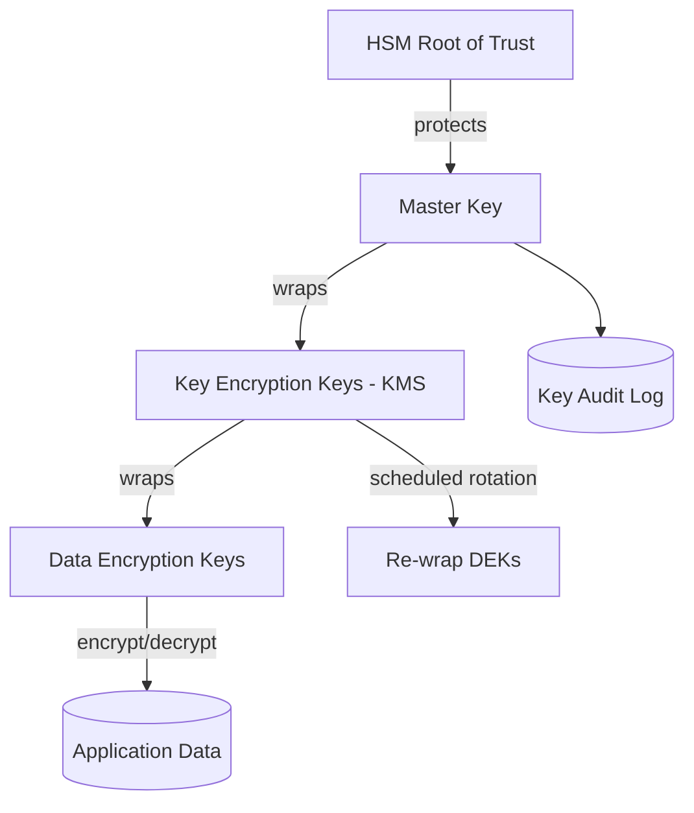

# Volume 12 - Key Management

| Field | Value |
|---|---|
| Document ID | WORLD-VOL12-010 |
| Title | Key Management |
| Version | 1.0 |
| Status | Approved |
| Classification | Internal |
| Founder | Mahesh Choudhary |

## Purpose

This chapter defines how WORLD generates, stores, distributes, rotates, and destroys the cryptographic keys on which all confidentiality and integrity ultimately rest. Encryption is only as strong as the protection of its keys; a leaked key nullifies the algorithm behind it. The purpose of this chapter is to establish a disciplined key hierarchy anchored in a hardware root of trust, to make key rotation routine and non-disruptive, and to ensure that no human ever handles a raw data-encryption key. It provides the cryptographic foundation on which Secrets Management (Chapter 9) and Encryption Standards (Chapter 11) depend.

## Scope

Covered: the key hierarchy, key management service (KMS) and hardware security module (HSM), envelope encryption, key generation, rotation, revocation, destruction, and access policy. Excluded: the secrets that keys protect, covered in Chapter 9; the specific ciphers and modes, covered in Chapter 11; and certificate and public-key infrastructure lifecycle, covered in Chapter 12. This chapter concerns symmetric and asymmetric key material and the control plane that governs it.

## Architecture

WORLD adopts a layered key hierarchy so that no single key is both widely used and long-lived. At the root sits a master key held inside an HSM certified to a recognized standard, whose private material never leaves the hardware boundary. The master key encrypts key-encryption keys (KEKs) managed by the KMS, and KEKs in turn encrypt the data-encryption keys (DEKs) that actually encrypt data. This is envelope encryption: data is encrypted with a local DEK, and only the wrapped DEK is stored alongside the ciphertext. To decrypt, a workload asks the KMS to unwrap the DEK under the KEK, an operation authorized by policy and recorded in audit. This design means rotating a KEK re-wraps DEKs without re-encrypting terabytes of data, and compromise of a DEK exposes only the narrow data it protected.

| Key Tier | Location | Lifetime | Rotation |
|---|---|---|---|
| Master Key | HSM, non-exportable | Long | Rare, ceremony-controlled |
| Key Encryption Key | KMS | Medium | Scheduled, re-wraps DEKs |
| Data Encryption Key | With ciphertext, wrapped | Short | Frequent, per dataset |

## Implementation Strategy

All key material in WORLD is generated inside the KMS or HSM using validated random sources; keys are never generated in application code. Workloads never see a KEK and never persist an unwrapped DEK - they call the KMS to wrap and unwrap under identities authorized by least-privilege policy, exactly as they authenticate to the vault in Chapter 9. Rotation is automated: KEKs rotate on a defined interval, re-wrapping their DEKs transparently, and DEKs rotate per dataset. Key destruction is achieved by crypto-shredding - deleting the wrapping key so the data beneath becomes permanently unrecoverable, a powerful and auditable tenant-offboarding mechanism. Every generate, wrap, unwrap, rotate, and destroy operation is logged immutably, and master-key operations require multi-person control.

## Business Value

Envelope encryption with a hardware root of trust gives WORLD both strong assurance and operational efficiency. Consider a tenant exercising their right to erasure: rather than scrubbing every backup and replica, WORLD destroys that tenant's KEK, and all of their at-rest data becomes cryptographically inaccessible within minutes, with an audit record proving it. The same architecture lets the platform rotate keys continuously with no downtime, satisfy regulator questions about key custody with HSM attestation, and offer tenant-managed keys as a premium control. Disciplined key management is thus not overhead but a direct enabler of compliance revenue and customer trust.

## Relationship to AI

The AI Business Partner never handles raw keys. When an agent needs to read encrypted records or sign a payload, it invokes the KMS under its own scoped identity, and the platform authorizes and audits that call. This ensures autonomous AI actions inherit the same cryptographic guarantees and accountability as human-initiated ones, and that an agent's cryptographic reach can be bounded and revoked centrally.

## Relationship to ERP

The ERP's data-at-rest across Volumes 05-06 is encrypted with DEKs wrapped by tenant-scoped KEKs, giving each tenant a distinct cryptographic boundary. Financial signing, document sealing, and integration credentials all draw on the same KMS. Because KEKs are per-tenant, crypto-shredding cleanly enforces tenant offboarding and data-residency commitments without disturbing other tenants.

## Relationship to Infrastructure

Key Management provides the root keys that protect the secrets vault of Chapter 9 and Volume 11, the encryption of databases (Volume 09) and object storage, and the private keys behind the certificates of Chapter 12. The KMS and HSM are themselves high-availability infrastructure services, replicated across zones with strict network and identity controls.

## Future Expansion

WORLD will expand toward bring-your-own-key and hold-your-own-key models for sovereign tenants, deeper HSM-backed attestation, and automated key-usage anomaly detection feeding Section F. In step with Chapter 11, the key hierarchy will incorporate crypto-agility so that keys and algorithms - including post-quantum key-encapsulation mechanisms - can be introduced and rotated without re-architecting the data plane.

## Cross-References

- [Secrets Management](/docs/blueprint/volume-12-security/section-c-cryptography-and-secrets/09-secrets-management.md)
- [Encryption Standards](/docs/blueprint/volume-12-security/section-c-cryptography-and-secrets/11-encryption-standards.md)
- [Certificate Management](/docs/blueprint/volume-12-security/section-c-cryptography-and-secrets/12-certificate-management.md)
- [Volume 09 - Encryption](/docs/blueprint/volume-09-database/README.md)

## References

- [Volume 01 - Vision and Philosophy](/docs/blueprint/volume-01-vision-and-philosophy/README.md)
- [Document Standards](/docs/governance/document-standards.md)

## Change Log

| Version | Date | Author | Notes |
|---|---|---|---|
| 1.0 | 2026-07-12 | Lead Software Engineer | Initial approved version. |
