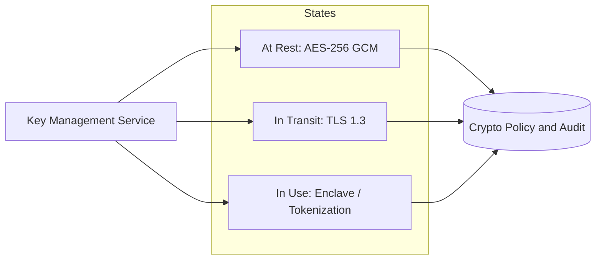

# Volume 12 - Encryption Standards

| Field | Value |
|---|---|
| Document ID | WORLD-VOL12-011 |
| Title | Encryption Standards |
| Version | 1.0 |
| Status | Approved |
| Classification | Internal |
| Founder | Mahesh Choudhary |

## Purpose

This chapter establishes the encryption standards that WORLD applies uniformly across the platform: which algorithms, key lengths, and modes are approved, and how data is protected at rest, in transit, and in use. Its purpose is to remove ambiguity and cryptographic drift by defining a single approved cryptographic baseline, so that every service, tenant, and integration is protected by strong, modern, well-understood primitives rather than ad-hoc choices. It builds directly on Key Management (Chapter 10) and consolidates the encryption posture introduced in Volume 09 (Chapter 21).

## Scope

Covered: approved symmetric and asymmetric algorithms, hashing and message authentication, the three states of data - at rest, in transit, and in use - and the platform policy binding them. Excluded: key lifecycle mechanics, covered in Chapter 10; certificate and PKI operations, covered in Chapter 12; and transport and protocol configuration, covered in Chapter 13. This chapter is the authoritative reference for what cryptography is permitted and where it must be applied.

## Architecture

WORLD protects data in three states, each with a defined default. Data at rest - databases, object storage, backups - is encrypted with AES-256 in an authenticated mode, using DEKs managed under the envelope hierarchy of Chapter 10. Data in transit - between clients, services, and integrations - is protected with TLS 1.3 using strong ephemeral key exchange for forward secrecy. Data in use - the most advanced frontier - is protected through techniques such as confidential-computing enclaves and, where applicable, tokenization, so that sensitive fields are shielded even while being processed. All three states draw their keys from the same KMS, giving one coherent cryptographic control plane.

| Purpose | Approved Standard | Notes |
|---|---|---|
| Symmetric encryption | AES-256 (GCM) | Authenticated encryption, at rest and bulk |
| Key exchange | ECDHE | Ephemeral, forward secrecy in transit |
| Asymmetric / signatures | RSA-3072+ or ECDSA P-256+ | Certificates and signing |
| Hashing | SHA-256 / SHA-384 | Integrity and fingerprints |
| Message authentication | HMAC-SHA-256 | Token and message integrity |
| Password storage | Argon2 / bcrypt | Memory-hard, salted |

## Implementation Strategy

The approved-algorithm list is enforced centrally, not left to individual teams. Deprecated primitives - such as MD5, SHA-1, DES, RC4, and TLS versions below 1.2 - are prohibited and blocked at gateways and libraries. Services consume cryptography through shared, vetted platform libraries so that the correct modes, key lengths, and random sources are used by default and misuse is hard. Encryption at rest is on by default for every datastore; TLS is mandatory for every network hop, including internal service-to-service traffic under the zero-trust model of Section A. Cryptographic configuration is treated as code, reviewed and versioned, and the baseline is re-evaluated on a fixed schedule against evolving standards guidance.

## Business Value

A single, strong, enforced cryptographic baseline turns encryption from a per-team gamble into a platform guarantee. Consider a healthcare tenant subject to strict data-protection regulation: because every field is encrypted at rest with AES-256, every connection uses TLS 1.3, and the most sensitive records are processed inside enclaves, WORLD can present a coherent, auditable encryption story that satisfies auditors without bespoke engineering per customer. This lowers the cost of entering regulated markets, shortens security reviews in enterprise sales, and reduces breach liability, since encrypted, key-shredded data is far less damaging if exposed.

## Relationship to AI

All data the AI Business Partner reads, reasons over, and writes is subject to the same encryption baseline. Model prompts and outputs traverse TLS-protected channels, sensitive context can be processed in confidential-computing environments, and any AI-generated artifacts persisted to storage inherit at-rest encryption automatically. This ensures that expanding AI capability never quietly weakens the platform's cryptographic guarantees.

## Relationship to ERP

The ERP's financial, HR, and customer data across Volumes 05-06 is among the most sensitive on the platform and is protected end to end by these standards. Field-level encryption and tokenization apply to the highest-sensitivity attributes, while tenant-scoped keys ensure each organization's ciphertext is cryptographically distinct, reinforcing multi-tenant isolation.

## Relationship to Infrastructure

These standards are realized on the infrastructure of Volumes 09-11: database and object-storage encryption, TLS termination and service mesh transport, and enclave-capable compute. The baseline depends on Chapter 10 for keys and on Chapter 12 for the certificates that anchor TLS trust, making this chapter the policy that the surrounding infrastructure implements.

## Future Expansion

WORLD will advance encryption-in-use through broader confidential computing and selective use of privacy-preserving techniques such as homomorphic encryption for specific analytics. Critically, the platform is committed to post-quantum readiness: it will adopt standardized post-quantum algorithms - such as ML-KEM for key establishment and ML-DSA for signatures - through crypto-agile libraries and hybrid modes, so that WORLD can migrate ahead of the quantum threat without re-architecting applications. The approved-algorithm baseline is designed to evolve continuously against emerging cryptanalysis.

## Cross-References

- [Key Management](/docs/blueprint/volume-12-security/section-c-cryptography-and-secrets/10-key-management.md)
- [Certificate Management](/docs/blueprint/volume-12-security/section-c-cryptography-and-secrets/12-certificate-management.md)
- [Secure Communication](/docs/blueprint/volume-12-security/section-c-cryptography-and-secrets/13-secure-communication.md)
- [Volume 09 - Encryption](/docs/blueprint/volume-09-database/README.md)

## References

- [Volume 01 - Vision and Philosophy](/docs/blueprint/volume-01-vision-and-philosophy/README.md)
- [Document Standards](/docs/governance/document-standards.md)

## Change Log

| Version | Date | Author | Notes |
|---|---|---|---|
| 1.0 | 2026-07-12 | Lead Software Engineer | Initial approved version. |
