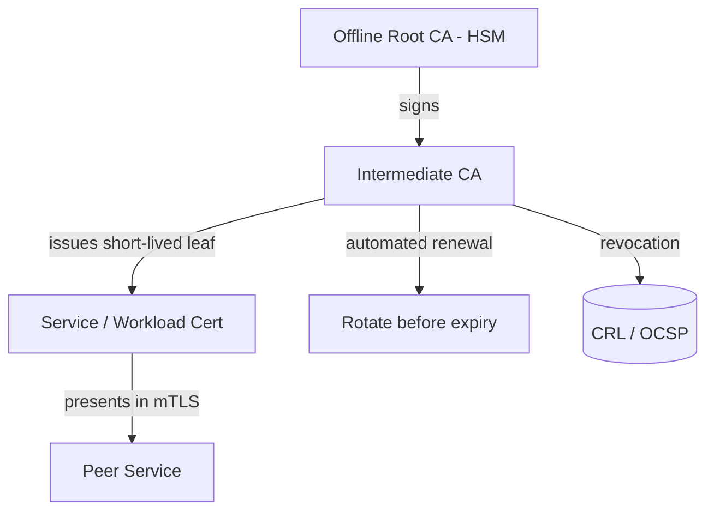

# Volume 12 - Certificate Management

| Field | Value |
|---|---|
| Document ID | WORLD-VOL12-012 |
| Title | Certificate Management |
| Version | 1.0 |
| Status | Approved |
| Classification | Internal |
| Founder | Mahesh Choudhary |

## Purpose

This chapter defines how WORLD issues, distributes, renews, and revokes the digital certificates that establish trusted identity across the platform. Certificates bind a public key to an identity - a service, a domain, a workload - and are the foundation of authenticated, encrypted communication. The purpose of this chapter is to make certificate handling fully automated and short-lived, eliminating the classic failure of expired or unmanaged certificates causing outages or, worse, silent trust of impostors. It supplies the identity anchors that Encryption Standards (Chapter 11) and Secure Communication (Chapter 13) rely upon.

## Scope

Covered: public-key infrastructure (PKI), certificate authorities, the certificate lifecycle from issuance to revocation, automated renewal and rotation, trust stores, and mutual TLS identity. Excluded: the key hierarchy protecting CA private keys, covered in Chapter 10; the cipher suites negotiated during handshakes, covered in Chapter 11; and protocol-level transport configuration, covered in Chapter 13. This chapter governs certificate identity and its lifecycle.

## Architecture

WORLD operates a private PKI for internal workload identity alongside publicly trusted certificates for external endpoints. A root certificate authority, whose private key is held in an HSM under Chapter 10 and kept offline, signs a small number of intermediate CAs; those intermediates issue the short-lived leaf certificates that services actually present. This chain means the precious root is rarely used and can anchor trust for years, while leaf certificates live for hours or days and rotate automatically. Every workload receives a certificate tied to its identity, enabling mutual TLS in which both parties authenticate. Revocation is published so that a compromised certificate can be distrusted quickly.

| Lifecycle Stage | Action | Control |
|---|---|---|
| Issuance | CA signs CSR for verified identity | Automated, policy-bound |
| Distribution | Cert and key delivered to workload | Via vault, in memory |
| Renewal | Re-issue before expiry | Automated, no human step |
| Rotation | Replace leaf on short interval | Zero-downtime reload |
| Revocation | Publish distrust | CRL / OCSP |
| Expiry | Certificate ceases validity | Enforced by peers |

## Implementation Strategy

Certificate handling in WORLD is automated end to end. Workloads generate a key pair and request a certificate from the internal CA using their orchestration identity; the CA verifies the identity against policy and issues a short-lived leaf, delivered as an in-memory secret through the mechanisms of Chapter 9. Renewal happens automatically well before expiry, and services reload certificates without downtime. Public-facing certificates are obtained and renewed through automated issuance protocols, so no engineer manually copies a certificate file. Expiry monitoring alerts long before deadlines, and revocation is a one-command operation propagated through CRL and OCSP. Root and intermediate CA operations are governed by multi-person ceremonies.

## Business Value

Automated, short-lived certificates eliminate one of the most common and embarrassing sources of enterprise outage - the expired certificate - while simultaneously strengthening security. Consider a payment integration that historically failed at 2 a.m. when a manually installed certificate lapsed: under WORLD the certificate is short-lived and auto-renewed, so the failure class simply cannot occur, and if the private key is ever suspected compromised, security revokes and re-issues within minutes across every service. This reliability and rapid-response capability is a tangible differentiator in enterprise sales and a direct reducer of operational risk and on-call burden.

## Relationship to AI

When the AI Business Partner communicates with ERP modules, tools, and external services, those channels are authenticated with certificates, and increasingly with mutual TLS so both the agent's workload and its counterpart prove identity. This prevents an agent from being tricked into talking to an impostor endpoint and ensures every autonomous interaction rides on a cryptographically verified channel.

## Relationship to ERP

The ERP's internal service mesh and its external integration endpoints across Volumes 05-06 all present certificates issued by the platform PKI. Mutual TLS between ERP microservices enforces that only verified workloads participate in sensitive financial and operational flows, and tenant-facing endpoints present publicly trusted certificates that reassure customers and partners.

## Relationship to Infrastructure

Certificate management integrates with the service mesh, ingress, and load balancers of Volume 11, which terminate and originate TLS using platform-issued certificates. It depends on Chapter 10 to protect CA private keys and on Chapter 9 to deliver leaf keys securely to workloads, and it underpins the transport security detailed in Chapter 13.

## Future Expansion

WORLD will drive certificate lifetimes ever shorter toward continuous rotation, expand mutual TLS to every internal hop by default, and adopt workload-identity standards for federated trust across clusters and clouds. In coordination with Chapters 10 and 11, the PKI will become crypto-agile, ready to issue certificates using post-quantum signature algorithms and hybrid chains as those standards mature, so trust anchors can migrate without disruption.

## Cross-References

- [Key Management](/docs/blueprint/volume-12-security/section-c-cryptography-and-secrets/10-key-management.md)
- [Encryption Standards](/docs/blueprint/volume-12-security/section-c-cryptography-and-secrets/11-encryption-standards.md)
- [Secure Communication](/docs/blueprint/volume-12-security/section-c-cryptography-and-secrets/13-secure-communication.md)
- [Volume 11 - Infrastructure](/docs/blueprint/volume-11-infrastructure/README.md)

## References

- [Volume 01 - Vision and Philosophy](/docs/blueprint/volume-01-vision-and-philosophy/README.md)
- [Document Standards](/docs/governance/document-standards.md)

## Change Log

| Version | Date | Author | Notes |
|---|---|---|---|
| 1.0 | 2026-07-12 | Lead Software Engineer | Initial approved version. |
