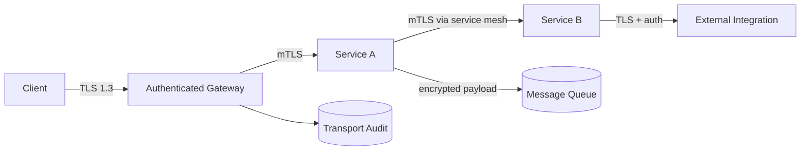

# Volume 12 - Secure Communication

| Field | Value |
|---|---|
| Document ID | WORLD-VOL12-013 |
| Title | Secure Communication |
| Version | 1.0 |
| Status | Approved |
| Classification | Internal |
| Founder | Mahesh Choudhary |

## Purpose

This chapter defines how WORLD secures data in motion across every channel: client-to-platform, service-to-service, and platform-to-external-integration. It brings together the algorithms of Chapter 11 and the certificates of Chapter 12 into a coherent transport-security posture in which no traffic is trusted merely because of its origin, and every connection is encrypted, authenticated, and integrity-protected. Its purpose is to ensure confidentiality and authenticity of communication consistent with the zero-trust model of Section A, closing the gap that unprotected network paths would otherwise open.

## Scope

Covered: transport encryption, mutual TLS, the zero-trust network stance for communication, API and message-channel protection, forward secrecy, and end-to-end integrity. Excluded: the cipher and key-length policy itself, covered in Chapter 11; certificate lifecycle, covered in Chapter 12; and the broader network-segmentation controls of Section D (Chapter 14). This chapter concerns how sessions between parties are established and protected.

## Architecture

Every hop in WORLD is encrypted. External clients reach the platform over TLS 1.3 with forward secrecy, terminating at an authenticated gateway. Internally, services communicate through a service mesh that enforces mutual TLS, so both the caller and the callee present certificates issued by the PKI of Chapter 12 and prove their identity before any application data flows. Asynchronous channels - message queues and event streams - carry encrypted payloads, and external integrations are reached only over authenticated, encrypted connections. Because trust is never granted by network location, an attacker who gains a foothold on the internal network still cannot read or inject traffic without valid credentials and certificates.

| Channel | Protection | Identity |
|---|---|---|
| Client to platform | TLS 1.3, forward secrecy | Server cert, user auth |
| Service to service | Mutual TLS via mesh | Both peers present certs |
| Async messaging | Encrypted payloads | Signed and authenticated |
| Platform to external | TLS with pinned trust | Verified endpoint identity |

## Implementation Strategy

Transport security is enforced by infrastructure rather than left to application code. The service mesh injects mutual TLS transparently, so developers get authenticated, encrypted service-to-service communication without writing cryptographic logic. Gateways enforce minimum TLS versions and strong cipher suites drawn from the Chapter 11 baseline, reject deprecated protocols, and apply strict transport security headers. Certificate rotation from Chapter 12 keeps identities fresh with zero downtime. Where WORLD calls external systems, connections validate the peer's certificate and, for the most sensitive integrations, pin trust to expected authorities. All connection metadata is logged for the audit and monitoring functions of Section F.

## Business Value

Uniform, infrastructure-enforced secure communication means confidentiality and authenticity are guaranteed by default rather than dependent on each team remembering to implement them. Consider a tenant transmitting payroll data from a browser through the platform to a banking partner: the browser session, every internal hop, and the outbound bank connection are each independently encrypted and mutually authenticated, so the data is never exposed in clear text and never delivered to an unverified endpoint. This end-to-end assurance is precisely what enterprise security questionnaires and regulators demand, shortening sales cycles and reducing the risk and cost of interception-based attacks.

## Relationship to AI

Every channel the AI Business Partner uses - receiving instructions, calling tools and ERP services, and reaching external APIs - is protected by mutual TLS and the transport baseline. This ensures an agent's instructions cannot be tampered with in flight and that it can only exchange data with cryptographically verified counterparts, a core safeguard against manipulation of autonomous behavior over the network.

## Relationship to ERP

The ERP's microservices across Volumes 05-06 communicate exclusively over the mutually authenticated service mesh, and its customer- and partner-facing endpoints use strong client-facing TLS. This protects high-value financial and operational transactions in transit and enforces that only verified services participate in tenant workflows, reinforcing multi-tenant isolation at the network layer.

## Relationship to Infrastructure

Secure communication is realized by the service mesh, gateways, ingress, and load balancers of Volume 11, configured with the certificates of Chapter 12 and the algorithms of Chapter 11. It complements the network-segmentation and API-security controls of Section D, together forming defense in depth for data in motion.

## Future Expansion

WORLD will extend mutual TLS to universal coverage of every internal and external hop, adopt emerging authenticated-transport and workload-identity standards, and integrate transport telemetry more tightly with real-time threat detection. In line with Chapters 11 and 12, transport will move to post-quantum-ready handshakes using hybrid key exchange, so that sessions remain confidential against future quantum adversaries without disrupting existing clients.

## Cross-References

- [Encryption Standards](/docs/blueprint/volume-12-security/section-c-cryptography-and-secrets/11-encryption-standards.md)
- [Certificate Management](/docs/blueprint/volume-12-security/section-c-cryptography-and-secrets/12-certificate-management.md)
- [Secrets Management](/docs/blueprint/volume-12-security/section-c-cryptography-and-secrets/09-secrets-management.md)
- [Volume 11 - Infrastructure](/docs/blueprint/volume-11-infrastructure/README.md)

## References

- [Volume 01 - Vision and Philosophy](/docs/blueprint/volume-01-vision-and-philosophy/README.md)
- [Document Standards](/docs/governance/document-standards.md)

## Change Log

| Version | Date | Author | Notes |
|---|---|---|---|
| 1.0 | 2026-07-12 | Lead Software Engineer | Initial approved version. |
