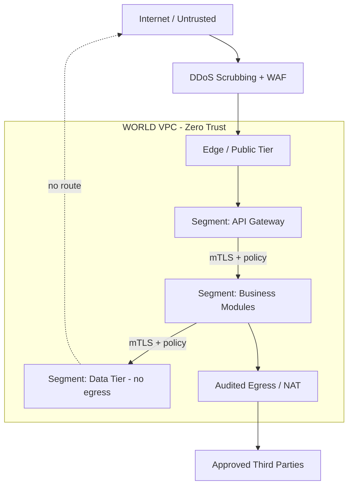

# Volume 12 - Network Security

| Field | Value |
|---|---|
| Document ID | WORLD-VOL12-014 |
| Title | Network Security |
| Version | 1.0 |
| Status | Approved |
| Classification | Internal |
| Founder | Mahesh Choudhary |

## Purpose

This chapter defines how Project WORLD secures its network layer - the first physical and logical boundary an adversary must cross to reach any workload. Where Volume 11 (Networking) defines the network *fabric*, this chapter defines the *defenses* layered onto that fabric: segmentation as a control, encrypted transit, ingress and egress governance, and the zero-trust posture that refuses to trust a packet merely because of where it originated. The network is the outermost band of WORLD's defense-in-depth model, and this chapter fixes the controls every inner layer assumes are already in place.

## Scope

The chapter covers network-level threat controls: perimeter defense, micro-segmentation, distributed denial-of-service (DDoS) mitigation, mutual TLS for service-to-service traffic, egress filtering, and network intrusion detection. It is cloud-provider-independent. Application authorization is covered in Chapter 15 (API Security) and Chapter 16 (Application Security); the underlying topology is owned by Volume 11. Physical data-center security is out of scope.

## Architecture

WORLD applies security in concentric rings. Public traffic terminates at an inspected edge, passes a web application firewall, and is admitted only to the public tier. From there, every hop inward crosses a segmentation boundary enforced by network policy, and every service-to-service call is authenticated and encrypted by the service mesh.

Each segment is a trust boundary. A compromise in one segment cannot laterally reach another without presenting a valid, authorized identity, which limits blast radius by design.

| Threat | Control | Layer |
|---|---|---|
| DDoS / volumetric flood | Edge scrubbing, rate limiting, autoscaling | Perimeter |
| Lateral movement | Micro-segmentation, per-service network policy | Internal |
| Traffic interception | Mutual TLS on all east-west traffic | Transit |
| Data exfiltration | Egress allow-lists, audited NAT | Egress |
| Reconnaissance / port scanning | Default-deny, intrusion detection | Perimeter + Internal |

**Enterprise example:** A compromised reporting service in the business-module segment attempts to open a connection to the payroll database. Because the data tier permits inbound connections only from the payroll service identity over mutual TLS, the mesh rejects the handshake, the intrusion-detection system raises an alert, and the reporting service never reaches sensitive data despite sharing the same VPC.

## Implementation Strategy

WORLD implements network security as declarative policy, not manual firewall edits. Segmentation rules, mesh authorization, and egress allow-lists are expressed as version-controlled configuration and applied through the same pipeline that deploys workloads, so every change is reviewed and auditable. The default posture is deny-all; a path exists only when an explicit policy opens it. Mutual TLS is issued and rotated automatically by the certificate authority defined in Volume 12 Chapter 12. Edge protection - WAF rules aligned to common web-attack patterns and DDoS scrubbing - is applied before traffic enters the VPC. Network telemetry (flow logs, mesh access logs, IDS events) streams to the security monitoring pipeline for detection and forensic replay.

## Business Value

Network security converts an abstract risk into a bounded, insurable one. By confining a breach to a single segment, WORLD reduces the cost and scope of any incident, shortens breach-notification obligations, and preserves customer trust. Auditable egress and encrypted transit satisfy contractual and regulatory data-handling requirements, shortening enterprise sales cycles where security review is a gate. For the business, the value is continuity: the platform stays available under attack and confidential data stays confined.

## Relationship to AI

WORLD's AI agents (Volume 13) are first-class network citizens and are governed by the same zero-trust rules as any service. An agent that calls an external model provider or a partner API does so only through the audited egress path, with its destination on an approved allow-list, preventing data leakage through model prompts. Network telemetry also feeds anomaly-detection models that flag unusual traffic patterns - a sudden egress spike or an unexpected peer connection - faster than static rules alone.

## Relationship to ERP

The ERP business modules - finance, payroll, inventory, procurement - are the crown-jewel workloads network segmentation exists to protect. Each module family runs in its own segment so that a fault or breach in one cannot traverse to another; the finance ledger is unreachable from a compromised marketing service. This isolation directly underpins the segregation-of-duties and data-confidentiality guarantees the ERP tier must uphold.

## Relationship to Infrastructure

This chapter is the security overlay on Volume 11's network fabric. The VPC, subnet tiers, and NAT gateways are provisioned by infrastructure; the policies, mesh, and inspection points that make them *secure* are defined here. Kubernetes network policies implement micro-segmentation, and the service mesh sidecars enforce mutual TLS, tying network security tightly to the container platform of Chapter 20.

## Future Expansion

Future iterations will extend toward fully identity-defined networking where every flow is authorized against a live policy engine with no static IP allow-lists, deeper integration of encrypted-traffic analytics that detect threats without decryption, and adaptive segmentation that tightens automatically in response to threat intelligence. Post-quantum key exchange for mutual TLS is on the roadmap in step with Chapter 11.

## Cross-References

- [API Security](/docs/blueprint/volume-12-security/section-d-layer-security/15-api-security.md)
- [Infrastructure Security](/docs/blueprint/volume-12-security/section-d-layer-security/18-infrastructure-security.md)
- [Volume 11 - Infrastructure](/docs/blueprint/volume-11-infrastructure/README.md)

## References

- [Volume 01 - Vision and Philosophy](/docs/blueprint/volume-01-vision-and-philosophy/README.md)
- [Document Standards](/docs/governance/document-standards.md)

## Change Log

| Version | Date | Author | Notes |
|---|---|---|---|
| 1.0 | 2026-07-12 | Lead Software Engineer | Initial approved version. |
