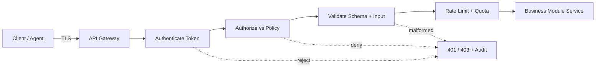

# Volume 12 - API Security

| Field | Value |
|---|---|
| Document ID | WORLD-VOL12-015 |
| Title | API Security |
| Version | 1.0 |
| Status | Approved |
| Classification | Internal |
| Founder | Mahesh Choudhary |

## Purpose

This chapter defines how Project WORLD secures its API layer - the primary, intentional door through which every client, integration, and AI agent interacts with the platform. Volume 10 defines the API *design*; this chapter defines the *defenses* that protect it: authentication, authorization, input validation, rate limiting, and abuse prevention. Because virtually all business logic in WORLD is reached through APIs, the API is the highest-value target and the layer where identity is first proven and consistently enforced.

## Scope

The chapter covers controls for both external and internal APIs: token-based authentication, fine-grained authorization, schema and input validation, rate limiting and quota enforcement, and defenses mapped to the OWASP API Security Top 10. It builds on the network controls of Chapter 14 and hands off to application-level controls in Chapter 16. API contract design and versioning remain the province of Volume 10.

## Architecture

Every request passes a consistent gauntlet at the API gateway before it can reach a business module: transport is already encrypted (Chapter 14), the caller's token is verified, authorization is evaluated against policy, the payload is validated against a schema, and rate limits are applied. Only then is the request forwarded.

The gateway is the single, consistent choke point where these controls are guaranteed, so no individual service can accidentally skip them.

| OWASP API Top 10 Risk | WORLD Control |
|---|---|
| Broken Object Level Authorization | Per-object ownership checks in the permission engine |
| Broken Authentication | Short-lived signed tokens, rotation, mTLS internally |
| Broken Object Property Level Authorization | Response field filtering by role/attribute |
| Unrestricted Resource Consumption | Rate limits, quotas, payload-size caps |
| Broken Function Level Authorization | Policy-checked endpoints, deny-by-default |
| Server-Side Request Forgery | Egress allow-lists, URL validation |
| Security Misconfiguration | Hardened gateway baseline, CIS-aligned config |
| Improper Inventory Management | Central API registry, deprecation governance |

**Enterprise example:** A partner integration calls the invoices API requesting invoice ID 8842, which belongs to a different tenant. Authentication succeeds, but the object-level authorization check in the permission engine detects the invoice is not owned by the partner's tenant and returns 403 with an audit event - closing the most common API breach class (broken object level authorization) rather than trusting the client-supplied identifier.

## Implementation Strategy

WORLD centralizes enforcement at the gateway and the permission engine so that security is not reimplemented per service. Tokens are validated against the identity provider (Volume 12 Section B); authorization delegates to the attribute- and role-based policy engine. Every endpoint publishes a machine-readable schema, and requests failing validation are rejected before reaching business logic. Rate limits are tiered by caller identity and endpoint sensitivity. Internal service-to-service APIs use mutual TLS and short-lived credentials rather than static keys. All allow/deny decisions are logged for audit and anomaly detection, and gateway configuration is version-controlled and reviewed.

## Business Value

APIs are how WORLD monetizes integration and extensibility; securing them protects both revenue and reputation. Consistent gateway enforcement means new business modules inherit strong security by default, accelerating delivery. Preventing the OWASP API risk classes avoids the breaches that most often expose customer data, reducing regulatory exposure and preserving enterprise trust. Quotas and rate limits also protect availability and make usage-based commercial models enforceable.

## Relationship to AI

AI agents are among the most active API consumers in WORLD, and every agent action flows through the same authenticated, authorized, rate-limited gateway as a human user - agents hold scoped identities and cannot exceed their granted permissions. This uniform mediation is what makes autonomous agents safe to deploy: their reach is bounded by policy, their calls are fully audited, and anomaly detection can flag an agent behaving outside its normal pattern.

## Relationship to ERP

The ERP modules expose their operations - posting a journal entry, approving a purchase order, running payroll - exclusively through APIs. Object- and function-level authorization at this layer enforces segregation of duties directly: the same person cannot both create and approve a payment because the policy engine denies it at the API boundary, independent of any UI. This makes financial controls provable and consistent across every channel.

## Relationship to Infrastructure

The gateway runs on the container platform (Chapter 20) behind the network controls of Chapter 14 and Volume 11's load balancers and reverse proxies. It depends on the certificate and secrets management of Section C for its tokens and mutual-TLS material. API telemetry feeds the observability and security-monitoring pipelines of Volume 11 and Section F.

## Future Expansion

Planned enhancements include continuous, risk-adaptive authorization that re-evaluates trust mid-session, automated schema-drift detection that blocks undocumented shadow APIs, and machine-learning-based abuse detection tuned to distinguish legitimate agent bursts from credential-stuffing. GraphQL-aware depth and cost limiting will extend consumption controls as the API surface grows.

## Cross-References

- [Network Security](/docs/blueprint/volume-12-security/section-d-layer-security/14-network-security.md)
- [Application Security](/docs/blueprint/volume-12-security/section-d-layer-security/16-application-security.md)
- [Volume 10 - API](/docs/blueprint/volume-10-api/README.md)

## References

- [Volume 01 - Vision and Philosophy](/docs/blueprint/volume-01-vision-and-philosophy/README.md)
- [Document Standards](/docs/governance/document-standards.md)

## Change Log

| Version | Date | Author | Notes |
|---|---|---|---|
| 1.0 | 2026-07-12 | Lead Software Engineer | Initial approved version. |
