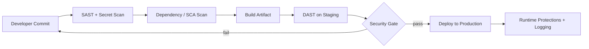

# Volume 12 - Application Security

| Field | Value |
|---|---|
| Document ID | WORLD-VOL12-016 |
| Title | Application Security |
| Version | 1.0 |
| Status | Approved |
| Classification | Internal |
| Founder | Mahesh Choudhary |

## Purpose

This chapter defines how Project WORLD builds security into the application itself - the business logic that runs behind the API. Network and API controls stop external attackers at the boundary; application security addresses the vulnerabilities that live inside the code: injection, broken access logic, insecure deserialization, and unsafe handling of data. It establishes a secure software development lifecycle (SDLC) so that security is engineered in from the first commit rather than bolted on before release.

## Scope

The chapter covers secure coding standards, the secure SDLC, static and dynamic testing (SAST and DAST), dependency and supply-chain scanning, secret hygiene, and defenses mapped to the OWASP Top 10. It applies to all WORLD application code and its build pipeline. It builds on API controls (Chapter 15) and complements database controls (Chapter 17). Runtime platform hardening is covered in Chapters 18 and 20.

## Architecture

Application security is expressed as gates in the delivery pipeline. Code cannot reach production without passing automated security checks, and runtime protections defend what does ship.

Each gate is blocking: a critical finding stops the release, aligning delivery speed with an enforced security floor.

| OWASP Top 10 Risk | WORLD Control |
|---|---|
| Broken Access Control | Centralized permission engine, deny-by-default |
| Cryptographic Failures | Standard libraries, managed keys (Section C) |
| Injection | Parameterized queries, input validation, output encoding |
| Insecure Design | Threat modeling in design reviews |
| Security Misconfiguration | Hardened baselines, config as code |
| Vulnerable Components | SCA scanning, dependency pinning and patching |
| Identification / Auth Failures | Federated identity (Section B) |
| Software / Data Integrity Failures | Signed artifacts, verified pipeline |
| Logging / Monitoring Failures | Structured audit logging to Section F |
| Server-Side Request Forgery | Egress allow-lists, URL validation |

**Enterprise example:** A developer adds a customer-search feature that builds a database query from user input. The SAST gate flags a potential injection where the input is concatenated into the query, blocks the merge, and the developer refactors to a parameterized query. The vulnerability never reaches staging, let alone production - the cost of remediation is minutes instead of a post-breach investigation.

## Implementation Strategy

WORLD embeds security throughout the SDLC. Design reviews include lightweight threat modeling for new modules. Developers work against secure-coding standards and reusable hardened components - a single validated authorization library rather than per-feature checks. The pipeline runs SAST and secret scanning on every commit, software-composition analysis on dependencies, and DAST against a staging deployment. Artifacts are signed and their provenance verified before deployment. Findings are triaged by severity, with critical and high issues blocking release. Security training and a documented vulnerability-disclosure process close the human loop.

## Business Value

Fixing a vulnerability at commit time is orders of magnitude cheaper than fixing it after a breach. Application security protects WORLD from the exploit classes that cause most real-world compromises, safeguarding customer data and brand. A demonstrable secure SDLC is increasingly a contractual and compliance requirement, so this capability directly enables enterprise deals and reduces audit friction. Reusable hardened components also raise engineering velocity by removing per-feature security reinvention.

## Relationship to AI

AI agents and AI-assisted development are integral to WORLD, and both are governed by this SDLC. Code generated with AI assistance passes the same SAST, SCA, and review gates as hand-written code, preventing the introduction of subtly insecure patterns. Conversely, AI augments application security itself: models triage findings, suggest remediations, and detect anomalous code changes, raising both speed and coverage of review.

## Relationship to ERP

The ERP business modules encode the rules that move money and record obligations, so an application flaw here is a financial-control flaw. Enforcing access control through the central permission engine and validating every input protects the integrity of ledgers, approvals, and audit trails. Threat modeling during module design ensures segregation-of-duties requirements are built into the logic, not merely documented.

## Relationship to Infrastructure

The secure pipeline runs on the CI/CD and container infrastructure of Volume 11 and Chapter 20; signed artifacts and image scanning connect application security to container security. Runtime protections and structured logs depend on the observability stack of Volume 11 and the monitoring of Section F. Secrets consumed by the application are supplied by Section C, never hard-coded.

## Future Expansion

Future work includes interactive application security testing that combines static and runtime insight, automated remediation pull requests for known vulnerability patterns, and a continuously verified software bill of materials for full supply-chain transparency. Deeper AI-driven threat modeling will make design-time security review faster and more consistent across modules.

## Cross-References

- [API Security](/docs/blueprint/volume-12-security/section-d-layer-security/15-api-security.md)
- [Database Security](/docs/blueprint/volume-12-security/section-d-layer-security/17-database-security.md)
- [Container Security](/docs/blueprint/volume-12-security/section-d-layer-security/20-container-security.md)

## References

- [Volume 01 - Vision and Philosophy](/docs/blueprint/volume-01-vision-and-philosophy/README.md)
- [Document Standards](/docs/governance/document-standards.md)

## Change Log

| Version | Date | Author | Notes |
|---|---|---|---|
| 1.0 | 2026-07-12 | Lead Software Engineer | Initial approved version. |
