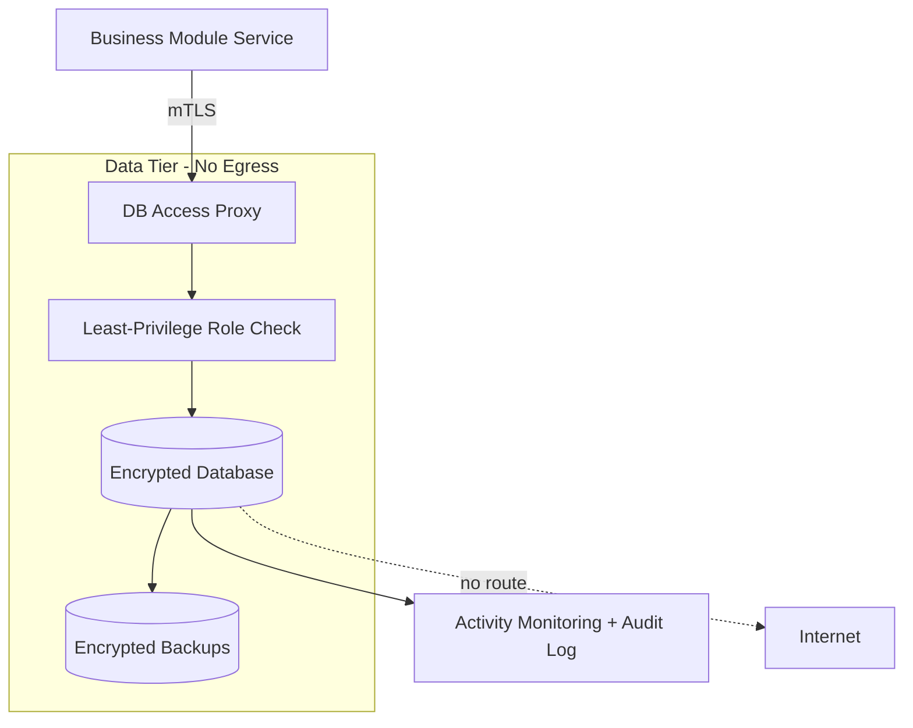

# Volume 12 - Database Security

| Field | Value |
|---|---|
| Document ID | WORLD-VOL12-017 |
| Title | Database Security |
| Version | 1.0 |
| Status | Approved |
| Classification | Internal |
| Founder | Mahesh Choudhary |

## Purpose

This chapter defines how Project WORLD protects its data at rest and in the database tier - the innermost, highest-value layer of the defense-in-depth model. Volume 09 defines the data *model and storage*; this chapter defines the *controls* that keep that data confidential, integral, and available: encryption, access control, tenant isolation, auditing, and protection against exfiltration. Because the database holds the record of the business itself, it is the layer where a breach is most costly and where the strongest guarantees must hold.

## Scope

The chapter covers encryption at rest and in transit for data stores, database access control and least privilege, multi-tenant isolation, sensitive-data classification and masking, database activity monitoring, and secure backup handling. It builds on network isolation (Chapter 14) and application controls (Chapter 16). Physical storage media security is delegated to the cloud provider under Chapter 19; schema design belongs to Volume 09.

## Architecture

The database tier sits behind network segmentation with no internet route. Access is mediated, encrypted, least-privileged, and fully logged. Sensitive fields are classified and protected even from otherwise authorized readers.

Every access path is authenticated, authorized to a narrowly scoped role, and recorded, so that even a legitimate connection cannot exceed its purpose unobserved.

| Threat | Control |
|---|---|
| Data theft at rest | Transparent encryption, managed keys (Section C) |
| Interception in transit | Mutual TLS between services and database |
| Over-broad access | Least-privilege roles, no shared superuser accounts |
| Cross-tenant leakage | Row-level isolation, tenant-scoped queries |
| Insider misuse | Database activity monitoring, field masking |
| Backup compromise | Encrypted, access-controlled, tested backups |

**Enterprise example:** A support engineer runs an approved query to help a customer. The database returns the customer's records, but the national-ID and bank-account fields are masked because the engineer's role lacks the sensitive-data attribute. The full values remain encrypted and unread, the query is logged to the audit trail, and the customer's most sensitive data is never exposed even during legitimate support work.

## Implementation Strategy

WORLD enforces encryption at rest for all data stores using keys managed by Section C, with rotation and separation of duties between key custodians and database administrators. Connections require mutual TLS. Application services connect through narrowly scoped roles - never a shared administrative account - and privileged access is just-in-time and approved. Sensitive columns are classified and subject to masking or tokenization based on the caller's attributes. Database activity monitoring streams to the security-monitoring pipeline, flagging bulk reads and anomalous access. Backups are encrypted, access-controlled, and restore-tested on a schedule.

## Business Value

The database is where a breach becomes a headline; strong controls here directly limit financial, legal, and reputational loss. Encryption and masking reduce the scope of breach-notification obligations and support data-residency and privacy regulations, enabling WORLD to serve regulated industries. Reliable, tested, encrypted backups underwrite business continuity. Together these controls turn the platform's most sensitive asset into a defensible, auditable one.

## Relationship to AI

AI agents and analytics query business data, and this layer ensures they see only what their identity permits - masking and row-level isolation apply to an agent exactly as to a human. This prevents sensitive values from leaking into model prompts or generated outputs. Database activity monitoring also feeds anomaly-detection models that spot unusual query volumes or patterns, catching both compromised credentials and misbehaving automation.

## Relationship to ERP

The ERP ledgers, payroll records, and customer master data live in this tier and are the definitive record of the enterprise. Encryption protects their confidentiality, immutable audit logging protects their integrity for financial-audit purposes, and least-privilege access enforces segregation of duties at the data layer. Multi-tenant isolation guarantees one organization's financial data can never surface in another's.

## Relationship to Infrastructure

The database tier is provisioned by Volume 11 within the no-egress data subnet and secured by the network controls of Chapter 14. It relies on Section C for key management and on cloud-provider storage encryption governed by Chapter 19. Its telemetry integrates with the observability and monitoring stacks of Volume 11 and Section F.

## Future Expansion

Planned advances include broader use of application-layer and field-level encryption so that plaintext never leaves the owning service, exploration of confidential-computing and encrypted-query techniques that allow processing without exposing data, and automated data-classification that keeps masking policies current as schemas evolve. Post-quantum-ready encryption for data at rest tracks Chapter 11.

## Cross-References

- [Application Security](/docs/blueprint/volume-12-security/section-d-layer-security/16-application-security.md)
- [Network Security](/docs/blueprint/volume-12-security/section-d-layer-security/14-network-security.md)
- [Volume 09 - Database](/docs/blueprint/volume-09-database/README.md)

## References

- [Volume 01 - Vision and Philosophy](/docs/blueprint/volume-01-vision-and-philosophy/README.md)
- [Document Standards](/docs/governance/document-standards.md)

## Change Log

| Version | Date | Author | Notes |
|---|---|---|---|
| 1.0 | 2026-07-12 | Lead Software Engineer | Initial approved version. |
