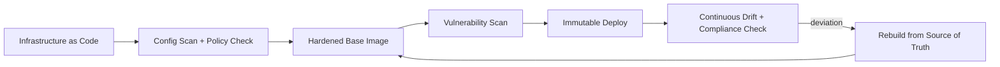

# Volume 12 - Infrastructure Security

| Field | Value |
|---|---|
| Document ID | WORLD-VOL12-018 |
| Title | Infrastructure Security |
| Version | 1.0 |
| Status | Approved |
| Classification | Internal |
| Founder | Mahesh Choudhary |

## Purpose

This chapter defines how Project WORLD secures the infrastructure that hosts every workload: the compute hosts, the operating systems, the provisioning pipeline, and the machine identities that bind them together. Volume 11 defines *how infrastructure is built*; this chapter defines *how it is hardened and kept trustworthy*. Infrastructure is the ground everything else stands on, so a weakness here undermines every layer above it. This chapter establishes hardening baselines, immutable and reproducible provisioning, and continuous verification.

## Scope

The chapter covers host and operating-system hardening, secure infrastructure-as-code, image and machine baselines, patch and vulnerability management, privileged-access control for operators, and infrastructure configuration auditing aligned to recognized benchmarks such as the CIS Benchmarks. It builds on network security (Chapter 14) and underpins cloud (Chapter 19) and container (Chapter 20) security. Application code security is covered in Chapter 16.

## Architecture

WORLD treats infrastructure as immutable and declarative. Servers are not patched in place by hand; a hardened image is built, scanned, and deployed, and drift is detected and corrected automatically.

Because the running fleet is reproducible from version-controlled definitions, unauthorized change is detectable as drift and remediated by redeployment rather than manual repair.

| Threat | Control |
|---|---|
| Vulnerable OS / packages | Hardened baselines, automated patching |
| Configuration drift | Immutable infrastructure, drift detection |
| Insecure provisioning | Policy-checked infrastructure as code |
| Privileged-access abuse | Just-in-time access, no standing admin, MFA |
| Weak machine identity | Managed instance identities, short-lived credentials |
| Unknown exposure | Continuous vulnerability scanning, CIS-aligned audit |

**Enterprise example:** A newly disclosed operating-system vulnerability affects the base image. Rather than logging into hundreds of live servers, the team updates the base image definition, the pipeline scans and validates it, and a rolling immutable redeploy replaces the fleet within hours. No host is patched by hand, no configuration drifts, and an audit trail proves exactly when every node was remediated.

## Implementation Strategy

WORLD provisions all infrastructure through version-controlled infrastructure-as-code that is policy-checked before apply, so insecure configurations are rejected pre-deployment. Base images are hardened to benchmark-aligned baselines, minimized to remove unnecessary packages, and vulnerability-scanned before use. Operator access follows least privilege with no standing administrative credentials: access is just-in-time, multi-factor, time-bound, and fully logged. Machines authenticate with managed, short-lived identities rather than static keys. Continuous compliance scanning compares the running fleet to the desired state and to benchmark controls, raising findings into the security-monitoring pipeline.

## Business Value

Hardened, reproducible infrastructure reduces both the likelihood and the cost of compromise, and it makes recovery fast and predictable - a rebuild from source of truth rather than forensic guesswork. Benchmark-aligned configuration and provable patch cadence satisfy auditors and regulated customers directly. Eliminating standing privileged access closes one of the most common breach vectors, lowering insurance risk and operational anxiety while keeping change velocity high.

## Relationship to AI

AI-driven operations increasingly manage WORLD's infrastructure, and this chapter ensures such automation acts through the same scoped, audited, just-in-time access as human operators - an agent cannot hold standing root. AI also strengthens infrastructure security by correlating configuration, patch, and telemetry data to predict risk, prioritize patching, and detect anomalous host behavior faster than manual review.

## Relationship to ERP

The ERP workloads depend on the availability and integrity of the infrastructure beneath them; a compromised host could tamper with financial processing undetected. Immutable infrastructure and drift detection guarantee that the servers running payroll or the ledger match a known-good, reviewed definition, extending the integrity guarantees the ERP tier requires down to the machine level.

## Relationship to Infrastructure

This chapter is the hardening layer over Volume 11's provisioning, CI/CD, and environment management. It shares the infrastructure-as-code pipeline with Volume 11 and supplies the trusted host substrate that cloud security (Chapter 19) and container security (Chapter 20) build upon. Secrets and machine credentials are drawn from Section C, and telemetry flows to Volume 11 observability and Section F monitoring.

## Future Expansion

Future direction includes hardware-rooted trust and remote attestation so a host can prove its integrity before joining the fleet, confidential computing for sensitive workloads, and fully autonomous patch-and-rebuild loops driven by threat intelligence. Policy-as-code coverage will expand until every infrastructure control is continuously and automatically verified.

## Cross-References

- [Network Security](/docs/blueprint/volume-12-security/section-d-layer-security/14-network-security.md)
- [Cloud Security](/docs/blueprint/volume-12-security/section-d-layer-security/19-cloud-security.md)
- [Volume 11 - Infrastructure](/docs/blueprint/volume-11-infrastructure/README.md)

## References

- [Volume 01 - Vision and Philosophy](/docs/blueprint/volume-01-vision-and-philosophy/README.md)
- [Document Standards](/docs/governance/document-standards.md)

## Change Log

| Version | Date | Author | Notes |
|---|---|---|---|
| 1.0 | 2026-07-12 | Lead Software Engineer | Initial approved version. |
