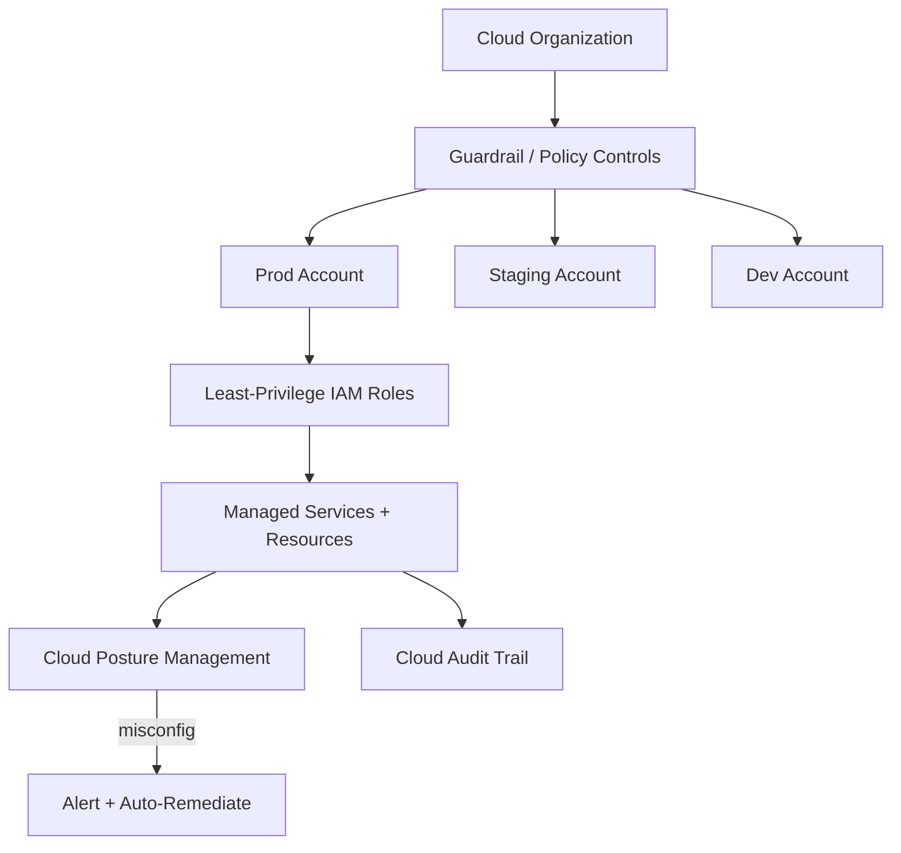

# Volume 12 - Cloud Security

| Field | Value |
|---|---|
| Document ID | WORLD-VOL12-019 |
| Title | Cloud Security |
| Version | 1.0 |
| Status | Approved |
| Classification | Internal |
| Founder | Mahesh Choudhary |

## Purpose

This chapter defines how Project WORLD secures its use of the public cloud - the provider account, its identity and access management, and its managed services. Volume 11 defines *how WORLD deploys to the cloud*; this chapter defines *how that cloud footprint is governed and defended*. Cloud breaches rarely exploit exotic flaws; they exploit misconfiguration and over-broad permissions. This chapter establishes the shared-responsibility model, least-privilege cloud identity, and continuous posture management that keep the cloud account trustworthy.

## Scope

The chapter covers cloud identity and access management (IAM), account and organization structure, cloud posture and configuration management, managed-service hardening, key and secret integration, and cloud audit logging. It aligns conceptually with cloud provider benchmarks and the CIS Benchmarks. It builds on infrastructure security (Chapter 18) and complements container security (Chapter 20). Provider physical security falls under the shared-responsibility model and is the provider's obligation.

## Architecture

WORLD organizes the cloud into separated accounts by environment and blast-radius, governs them with least-privilege IAM and guardrail policies, and continuously scans the resulting posture against a secure baseline.

Separation by account limits blast radius, guardrails prevent whole classes of unsafe configuration, and posture management continuously catches the drift that causes most cloud breaches.

| Shared Responsibility | Provider | WORLD |
|---|---|---|
| Physical data centers | Yes | No |
| Hypervisor / managed-service internals | Yes | No |
| IAM configuration and least privilege | No | Yes |
| Network and resource configuration | No | Yes |
| Data classification and encryption keys | No | Yes |
| Posture, logging, and monitoring | No | Yes |

**Enterprise example:** A developer accidentally provisions an object-storage bucket and leaves it open to public read. Cloud posture management detects the misconfiguration within minutes, an automated guardrail reverts the bucket to private, and an alert is raised with the responsible identity and change recorded - closing the single most common cloud data-exposure scenario before any data leaks.

## Implementation Strategy

WORLD structures the cloud into isolated accounts per environment under an organization with enforced guardrail policies that forbid unsafe actions globally. Human and machine access uses least-privilege, role-based IAM with no long-lived root or broad administrative keys; access is federated to the identity provider of Section B and elevated just-in-time. Encryption keys are customer-managed through Section C. Cloud posture management continuously evaluates configuration against a secure, benchmark-aligned baseline and auto-remediates or alerts on drift. All control-plane activity is captured in an immutable audit trail streamed to Section F.

## Business Value

Disciplined cloud governance prevents the misconfiguration breaches that dominate cloud-incident statistics, protecting data and reputation at their most common point of failure. Account separation and guardrails contain incidents and cost overruns alike. Continuous posture evidence and immutable audit trails streamline certifications such as regulatory and industry attestations, directly enabling enterprise and public-sector customers who mandate them. Least-privilege IAM reduces the standing risk that insurers and auditors scrutinize most.

## Relationship to AI

AI agents that provision or operate cloud resources are bound by the same least-privilege IAM roles and guardrails as any principal, so autonomous cloud automation cannot exceed policy or open a public resource. AI also enhances cloud security by analyzing posture findings and audit logs at scale to prioritize real risk over noise and to detect anomalous control-plane activity, such as unexpected key usage or resource creation.

## Relationship to ERP

The ERP platform and its data reside in the production cloud account, whose isolation and guardrails protect the business's financial system of record from cross-environment and cross-tenant risk. Customer-managed keys and enforced encryption give the enterprise provable control over its most sensitive financial data, supporting data-residency commitments the ERP tier must honor.

## Relationship to Infrastructure

Cloud security governs the account and identity layer within which Volume 11 provisions infrastructure and within which Chapter 18's hardened hosts and Chapter 20's container platform run. It consumes Section C key management and Section B identity, and its guardrails constrain the infrastructure-as-code pipeline so that even valid deployments cannot violate cloud policy.

## Future Expansion

Planned evolution includes tighter cloud-native application protection that unifies posture, workload, and identity signals, expanded automated remediation so drift self-corrects by default, and cloud-infrastructure-entitlement management that continuously right-sizes permissions toward true least privilege. Multi-cloud posture normalization is on the roadmap as WORLD's footprint diversifies.

## Cross-References

- [Infrastructure Security](/docs/blueprint/volume-12-security/section-d-layer-security/18-infrastructure-security.md)
- [Container Security](/docs/blueprint/volume-12-security/section-d-layer-security/20-container-security.md)
- [Volume 11 - Infrastructure](/docs/blueprint/volume-11-infrastructure/README.md)

## References

- [Volume 01 - Vision and Philosophy](/docs/blueprint/volume-01-vision-and-philosophy/README.md)
- [Document Standards](/docs/governance/document-standards.md)

## Change Log

| Version | Date | Author | Notes |
|---|---|---|---|
| 1.0 | 2026-07-12 | Lead Software Engineer | Initial approved version. |
