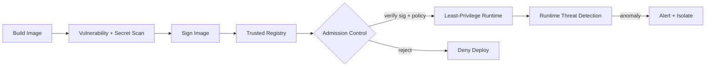

# Volume 12 - Container Security

| Field | Value |
|---|---|
| Document ID | WORLD-VOL12-020 |
| Title | Container Security |
| Version | 1.0 |
| Status | Approved |
| Classification | Internal |
| Founder | Mahesh Choudhary |

## Purpose

This chapter defines how Project WORLD secures its containers and orchestration platform - the unit in which every workload is packaged and run. Volume 11 defines *how containers and Kubernetes operate*; this chapter defines *how they are secured across their lifecycle*: from the image built in the pipeline, through admission to the cluster, to runtime behavior in production. Containers concentrate both convenience and risk, so their security spans build-time scanning, least-privilege configuration, and runtime detection.

## Scope

The chapter covers container image security and scanning, image provenance and signing, registry controls, admission policy, least-privilege runtime configuration, Kubernetes and orchestration hardening, and runtime threat detection. It aligns conceptually with the CIS Benchmarks for containers and Kubernetes. It builds on application security (Chapter 16), infrastructure security (Chapter 18), and cloud security (Chapter 19).

## Architecture

WORLD secures containers along their lifecycle. Images are scanned and signed before they reach the registry, admission control rejects anything untrusted or misconfigured, and runtime monitoring watches live containers for anomalous behavior.

Each stage is a gate: an unsigned, vulnerable, or over-privileged container is stopped before it runs, and one that misbehaves at runtime is detected and contained.

| Lifecycle Stage | Threat | Control |
|---|---|---|
| Build | Vulnerable base image, embedded secret | Image scanning, secret scanning, minimal base |
| Distribute | Tampered or unknown image | Signing, provenance, trusted registry only |
| Admit | Misconfigured or untrusted deploy | Admission policy, signature verification |
| Run | Excess privilege, escape attempt | Non-root, dropped capabilities, read-only FS |
| Run | Malicious runtime behavior | Runtime detection, network policy, isolation |

**Enterprise example:** A build pulls a base image containing a critical vulnerability and, by mistake, a hard-coded API key. Image scanning flags the vulnerability and the secret scanner catches the key, failing the build. Even had it passed, admission control would reject an unsigned image, and the runtime policy would deny the container root privileges - three independent gates ensuring the flawed workload never runs in production.

## Implementation Strategy

WORLD builds containers from minimal, hardened base images and scans every image for vulnerabilities and embedded secrets in the pipeline. Images are cryptographically signed with verifiable provenance and stored only in trusted registries. The cluster enforces admission control that verifies signatures and rejects deployments violating policy - no privileged containers, no host mounts, no untrusted registries. Runtime configuration applies least privilege by default: containers run as non-root with dropped Linux capabilities, read-only filesystems, and per-workload network policies. Runtime threat detection observes process, file, and network behavior against expected baselines, isolating and alerting on anomalies. The Kubernetes control plane and nodes are hardened to benchmark-aligned baselines.

## Business Value

Containers are the delivery mechanism for the entire platform, so securing them protects every workload at once and prevents supply-chain compromise from propagating. Build-time gates catch issues cheaply, while runtime detection limits the damage of anything that slips through. Signed provenance and benchmark-aligned hardening provide the supply-chain assurance that enterprise customers and auditors increasingly demand, turning a common attack surface into a controlled, demonstrable one and enabling faster, safer releases.

## Relationship to AI

AI agents in WORLD are themselves packaged and run as containers, so this chapter's least-privilege runtime, network policy, and admission controls bound what an agent workload can do - an agent container cannot escalate privilege or reach services outside its policy. AI also improves container security by learning normal runtime behavior per workload and flagging deviations, sharpening runtime threat detection beyond static signatures.

## Relationship to ERP

Each ERP module runs as its own set of containers with least-privilege configuration and network policy, extending segmentation and segregation of duties down to the workload. A compromised container in one module cannot escalate to the host or pivot to another module, so the isolation the ERP tier requires is enforced by the runtime itself, not merely by network boundaries above it.

## Relationship to Infrastructure

Container security runs on the orchestration platform of Volume 11 and the hardened hosts of Chapter 18, within the cloud account governed by Chapter 19. It shares the CI/CD pipeline and image-signing chain with application security (Chapter 16), consumes secrets from Section C rather than baking them into images, and streams runtime telemetry to Volume 11 observability and Section F monitoring.

## Future Expansion

Future work includes wider adoption of distroless and minimal images to shrink the attack surface, hardware-isolated or sandboxed runtimes for the most sensitive workloads, and a continuously attested software bill of materials for every image. Deeper eBPF-based runtime visibility and AI-driven behavioral baselining will further raise detection fidelity as the workload count grows.

## Cross-References

- [Application Security](/docs/blueprint/volume-12-security/section-d-layer-security/16-application-security.md)
- [Infrastructure Security](/docs/blueprint/volume-12-security/section-d-layer-security/18-infrastructure-security.md)
- [Cloud Security](/docs/blueprint/volume-12-security/section-d-layer-security/19-cloud-security.md)
- [Volume 11 - Infrastructure](/docs/blueprint/volume-11-infrastructure/README.md)

## References

- [Volume 01 - Vision and Philosophy](/docs/blueprint/volume-01-vision-and-philosophy/README.md)
- [Document Standards](/docs/governance/document-standards.md)

## Change Log

| Version | Date | Author | Notes |
|---|---|---|---|
| 1.0 | 2026-07-12 | Lead Software Engineer | Initial approved version. |
