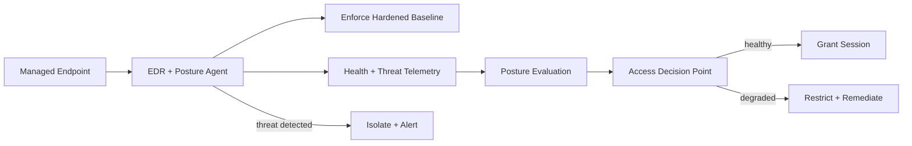

# Volume 12 - Endpoint Security

| Field | Value |
|---|---|
| Document ID | WORLD-VOL12-021 |
| Title | Endpoint Security |
| Version | 1.0 |
| Status | Approved |
| Classification | Internal |
| Founder | Mahesh Choudhary |

## Purpose

This chapter defines how Project WORLD secures the endpoints from which people and machines access the platform: laptops, mobile devices, virtual workstations, and administrative jump hosts. Every session begins on an endpoint, and an endpoint is the closest attack surface to the human, so its compromise can defeat controls that assume a trusted origin. This chapter establishes how endpoints are hardened, monitored, and continuously evaluated so that access decisions can rest on the real state of the device rather than an assumption of trust.

## Scope

The chapter covers endpoint hardening baselines, endpoint detection and response (EDR), disk and data protection, application and browser controls, patch posture, and the telemetry endpoints emit into the access decision. It is the human-facing counterpart to infrastructure security (Chapter 18) and the input to device trust (Chapter 22) and session management (Chapter 23). It aligns with the Zero Trust model of Chapter 02, in which no endpoint is trusted by location. Server host hardening is covered in Chapter 18; identity is covered in Section B.

## Architecture

WORLD treats every endpoint as untrusted until it proves otherwise. Each device runs a managed agent that enforces a hardened baseline, streams health and threat telemetry, and feeds a continuously evaluated posture signal into every access request.

Because posture is evaluated on every request rather than once at enrollment, a device that falls out of compliance loses access until it is remediated, and an active threat isolates the endpoint from the platform.

| Threat | Control |
|---|---|
| Malware / ransomware on device | EDR with behavioral detection and isolation |
| Lost or stolen device | Full-disk encryption, remote wipe |
| Unpatched or outdated endpoint | Enforced patch baseline, posture gating |
| Data exfiltration to endpoint | DLP controls, managed browser, download policy |
| Compromised admin workstation | Dedicated hardened jump hosts, no local admin |
| Untrusted personal device | Managed-device requirement for sensitive access |

**Enterprise example:** A finance analyst's laptop misses a critical operating-system patch and silently drifts out of compliance. On her next attempt to open the ERP ledger, the access decision point reads the degraded posture signal, denies the sensitive session, and routes her to a self-service remediation flow that applies the patch. Minutes later her posture is healthy and access is restored - no help-desk ticket, no standing exposure, and a full audit trail of why access was briefly withheld.

## Implementation Strategy

WORLD enrolls every endpoint into centralized management and installs an EDR and posture agent as a condition of access. Devices are hardened to a benchmark-aligned baseline: full-disk encryption, host firewall, screen lock, disabled local administrator rights, and a managed application and browser configuration. The agent continuously reports patch level, encryption state, EDR health, and threat findings. This telemetry becomes a posture signal consumed by the access decision point on every request, so gating is dynamic rather than one-time. Administrative work is performed only from dedicated, hardened jump hosts. On detection of malware or anomalous behavior, the endpoint is automatically isolated and escalated into Section F monitoring.

## Business Value

Endpoints are where most breaches begin, so hardening and continuously evaluating them removes the single most common entry path into the platform. Posture-based gating lets WORLD support flexible, remote, and mixed-device work without loosening security, protecting productivity and trust at once. Encryption and remote wipe convert a lost laptop from a reportable data breach into a non-event. Demonstrable endpoint control and audit evidence satisfy regulated customers and cyber-insurance requirements while lowering incident frequency and cost.

## Relationship to AI

AI agents that act on a user's behalf inherit the trust of the endpoint and session they originate from, so this chapter ensures that origin is verified and healthy before an agent is empowered to act. AI also strengthens endpoint security itself: behavioral models baseline normal device activity, detect novel malware and insider anomalies faster than static signatures, and prioritize which endpoint risks to remediate first, feeding the same posture signal that governs access.

## Relationship to ERP

ERP transactions - payroll runs, ledger postings, approvals - are initiated from endpoints, so a compromised device could submit fraudulent entries under a legitimate identity. Requiring a managed, healthy endpoint for sensitive ERP actions extends segregation-of-duties and integrity guarantees to the point of origin, ensuring that the human entering a financial transaction is doing so from a trustworthy, uncompromised device.

## Relationship to Infrastructure

Endpoint security is the human-facing analogue of the host hardening in Chapter 18, applying the same immutable-baseline and continuous-verification philosophy to user devices. It draws certificates and credentials from Section C, feeds posture into the Zero Trust decision point of Chapter 02, and streams telemetry into Volume 11 observability and Section F monitoring. Its posture output is the primary input to device trust (Chapter 22) and session management (Chapter 23).

## Future Expansion

Future direction includes hardware-backed device attestation so an endpoint can cryptographically prove its integrity, richer risk scoring that blends posture with user behavior for adaptive step-up authentication, and fully autonomous detect-isolate-remediate loops. Coverage will extend to ephemeral cloud workstations and to AI-agent runtime endpoints as the platform's access surface continues to diversify.

## Cross-References

- [Zero Trust Architecture](/docs/blueprint/volume-12-security/section-a-security-foundations/02-zero-trust-architecture.md)
- [Device Trust](/docs/blueprint/volume-12-security/section-e-endpoint-and-session/22-device-trust.md)
- [Session Management](/docs/blueprint/volume-12-security/section-e-endpoint-and-session/23-session-management.md)
- [Volume 10 - API](/docs/blueprint/volume-10-api/README.md)

## References

- [Volume 01 - Vision and Philosophy](/docs/blueprint/volume-01-vision-and-philosophy/README.md)
- [Document Standards](/docs/governance/document-standards.md)

## Change Log

| Version | Date | Author | Notes |
|---|---|---|---|
| 1.0 | 2026-07-12 | Lead Software Engineer | Initial approved version. |
