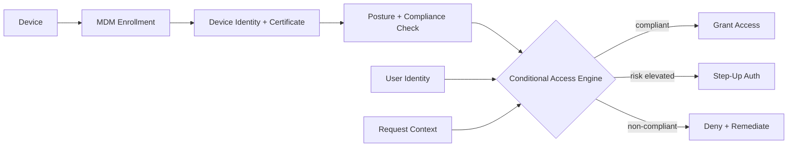

# Volume 12 - Device Trust

| Field | Value |
|---|---|
| Document ID | WORLD-VOL12-022 |
| Title | Device Trust |
| Version | 1.0 |
| Status | Approved |
| Classification | Internal |
| Founder | Mahesh Choudhary |

## Purpose

This chapter defines how Project WORLD establishes and continuously verifies trust in the devices that connect to the platform. Endpoint security (Chapter 21) hardens the device; device trust turns the resulting signals into an explicit, cryptographically anchored trust decision that conditions access. In a Zero Trust model no device is trusted by network location, so trust must be earned through identity, posture, and management state - and re-earned on every request. This chapter establishes device identity, posture checks, and conditional access as the mechanism that binds a request to a known, healthy device.

## Scope

The chapter covers device identity and registration, mobile device management (MDM) and enrollment, posture and compliance checks, conditional access policy, and the trust signal consumed by the access decision point. It operationalizes the Zero Trust principles of Chapter 02 at the device layer, consumes the endpoint posture of Chapter 21, and supplies device context to session management (Chapter 23). User identity and authentication are covered in Section B and Volume 10.

## Architecture

WORLD binds every device to a cryptographic identity at enrollment and evaluates its compliance on each access request. A conditional access engine combines device identity, posture, user identity, and request context into a single, explicit allow, step-up, or deny decision.

Because the trust decision is recomputed continuously, a device that was compliant an hour ago but has since jailbroken, disabled encryption, or fallen behind on patches is denied at the next request - trust is a live state, not a badge issued once.

| Trust Signal | Source | Example Policy Effect |
|---|---|---|
| Device identity | MDM certificate | Unregistered device denied |
| Encryption state | Posture agent | Unencrypted device denied for sensitive data |
| Patch / OS level | Posture agent | Below baseline forces remediation |
| Jailbreak / root | MDM compliance | Compromised device blocked entirely |
| Management state | MDM | Unmanaged device limited to low-risk apps |
| Request risk | Context (geo, time) | Anomalous context triggers step-up auth |

**Enterprise example:** A regional manager travels and tries to approve a large purchase order from a personal tablet that is not enrolled in MDM. The conditional access engine sees no device certificate and no posture signal, so it denies the sensitive approval while still allowing read-only access to low-risk dashboards. When he switches to his managed, encrypted, patched laptop, the same request succeeds - the platform trusted the action only from a device it could verify.

## Implementation Strategy

WORLD registers every device through MDM enrollment, issuing a hardware-anchored certificate that gives the device a strong, non-forgeable identity. Compliance policies define the required state - encryption on, current patch level, EDR healthy, not jailbroken - and the MDM and posture agent evaluate these continuously. A conditional access engine sits in front of every resource and fuses device identity, compliance state, user identity, and request context into an explicit decision aligned with Chapter 02: compliant requests are allowed, elevated-risk requests are challenged with step-up authentication, and non-compliant devices are denied and routed to remediation. Policies are tiered by data sensitivity, so the bar for the ERP ledger is higher than for a public dashboard.

## Business Value

Device trust lets WORLD safely embrace remote work, mobile access, and mixed device fleets without exposing sensitive data to unverified hardware. Conditional access replaces blunt network perimeters with precise, risk-proportionate decisions, reducing breach likelihood while minimizing friction for compliant users. Enforced, provable device compliance is a direct control mapping for frameworks such as SOC 2 and ISO 27001, shortening audits and unlocking regulated customers who mandate managed-device access.

## Relationship to AI

When an AI agent acts on a user's behalf, the device trust context of its originating session bounds what it may do, ensuring autonomous actions inherit only the trust of a verified device. AI additionally sharpens device trust by scoring risk from behavioral and contextual patterns - impossible travel, anomalous access times, unusual device behavior - allowing the conditional access engine to move from static rules toward adaptive, continuously learned trust decisions.

## Relationship to ERP

The most sensitive ERP actions - financial approvals, payroll changes, master-data edits - are gated behind the strictest device-trust tier, so they can be performed only from managed, compliant devices. This binds segregation of duties to verifiable hardware, ensuring a legitimate identity on an untrusted device cannot complete a high-value transaction and closing a gap that identity controls alone leave open.

## Relationship to Infrastructure

Device trust is the enforcement layer that turns the endpoint posture of Chapter 21 into access decisions at the Zero Trust decision point of Chapter 02. It relies on Section C for the certificate authority and key material behind device identity, integrates with Section B identity for the combined user-and-device decision, and streams enrollment and compliance events to Volume 11 observability and Section F monitoring. Its trust output directly conditions the sessions issued in Chapter 23.

## Future Expansion

Future direction includes hardware-rooted remote attestation so a device proves its integrity cryptographically rather than by self-report, continuous and passive verification that removes periodic re-checks, and fully adaptive conditional access driven by real-time risk models. Trust evaluation will extend to IoT and edge devices and to the runtime identities of AI agents as the population of non-human actors on the platform grows.

## Cross-References

- [Zero Trust Architecture](/docs/blueprint/volume-12-security/section-a-security-foundations/02-zero-trust-architecture.md)
- [Endpoint Security](/docs/blueprint/volume-12-security/section-e-endpoint-and-session/21-endpoint-security.md)
- [Session Management](/docs/blueprint/volume-12-security/section-e-endpoint-and-session/23-session-management.md)
- [Volume 10 - API](/docs/blueprint/volume-10-api/README.md)

## References

- [Volume 01 - Vision and Philosophy](/docs/blueprint/volume-01-vision-and-philosophy/README.md)
- [Document Standards](/docs/governance/document-standards.md)

## Change Log

| Version | Date | Author | Notes |
|---|---|---|---|
| 1.0 | 2026-07-12 | Lead Software Engineer | Initial approved version. |
