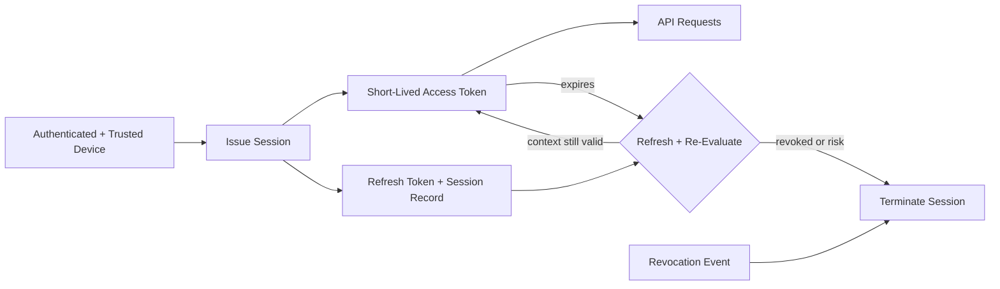

# Volume 12 - Session Management

| Field | Value |
|---|---|
| Document ID | WORLD-VOL12-023 |
| Title | Session Management |
| Version | 1.0 |
| Status | Approved |
| Classification | Internal |
| Founder | Mahesh Choudhary |

## Purpose

This chapter defines how Project WORLD establishes, maintains, and terminates authenticated sessions - the bridge between a proven identity on a trusted device and continued access to the platform. Authentication proves who a user is at one moment; the session carries that proof forward across many requests, and a mishandled session becomes a bypass around every upstream control. This chapter establishes token lifetimes, refresh, revocation, and defenses against session hijacking and fixation so that access remains bound to a live, verified, revocable session.

## Scope

The chapter covers session token issuance and structure, access and refresh token lifetimes, continuous re-evaluation of session validity, revocation and logout, and defenses against session fixation, hijacking, and replay. It builds directly on the authentication and token model of Volume 10 and Section B, consumes the endpoint and device trust of Chapters 21 and 22, and operationalizes the continuous-verification principle of Chapter 02. Cryptographic signing and key management are covered in Section C.

## Architecture

WORLD issues short-lived access tokens backed by longer-lived, revocable refresh tokens, and re-evaluates device and posture context on refresh. Every session is registered so it can be invalidated centrally and immediately.

Because access tokens are short-lived and refresh requires re-evaluating device trust and posture, a session cannot outlive the conditions that justified it: a stolen access token expires quickly, and a revoked or non-compliant session fails at the next refresh.

| Token / Control | Typical Lifetime | Purpose |
|---|---|---|
| Access token | 5-15 minutes | Short-lived bearer for API calls |
| Refresh token | Hours to days, rotating | Obtain new access token after re-evaluation |
| Idle timeout | 15-30 minutes | End inactive sessions |
| Absolute session lifetime | 8-12 hours | Force full re-authentication |
| Revocation | Immediate | Central kill switch per session or user |

**Enterprise example:** A support engineer is offboarded mid-shift. Security triggers a revocation event that invalidates every one of her active session records. Her current access token expires within minutes and cannot be refreshed - the refresh request checks the session registry, finds it revoked, and terminates the session. Within a single token lifetime she is fully locked out across web and API, without waiting for tokens to expire on their own or restarting any service.

## Implementation Strategy

WORLD issues signed, short-lived access tokens for API calls and pairs them with rotating refresh tokens tied to a server-side session record. Refresh-token rotation with reuse detection means a replayed refresh token invalidates the whole session, defeating theft. On every refresh, the platform re-evaluates device trust, posture, and risk, so a session that degrades is not renewed. To defeat session fixation, a fresh session identifier is generated at every authentication and privilege change, and pre-authentication identifiers are never honored afterward. Tokens are bound to context and transmitted only over TLS in secure, HTTP-only cookies or protected stores. Idle and absolute timeouts bound session duration, and a central revocation registry lets any session or all of a user's sessions be terminated immediately.

## Business Value

Disciplined session management closes the gap between strong authentication and lasting exposure: short lifetimes and instant revocation mean a stolen credential or compromised session has a small, controllable blast radius. Immediate, central revocation makes offboarding and incident response fast and provable, a direct control for SOC 2 and ISO 27001. Well-tuned lifetimes balance security with user experience, sparing people constant re-login while ensuring trust is continuously re-earned rather than indefinitely assumed.

## Relationship to AI

AI agents operate within scoped, short-lived sessions bounded by the same lifetimes, refresh re-evaluation, and revocation as human sessions, so an agent's authority ends the moment its session is revoked or its context degrades. AI also strengthens session security by detecting anomalous session behavior - impossible travel, token use from unexpected contexts, abnormal request velocity - and triggering step-up authentication or automatic termination faster than static rules allow.

## Relationship to ERP

Long-running ERP workflows - a multi-step approval chain or a batch posting - must remain secure across their duration without granting indefinite standing access. Short access tokens with re-evaluated refresh keep these workflows continuously authorized while allowing instant revocation, so an ERP session tied to a sensitive financial action can be cut off immediately on suspicion of compromise, preserving transactional integrity.

## Relationship to Infrastructure

Session management consumes the authentication and token framework of Volume 10 and Section B, is conditioned by the endpoint posture (Chapter 21) and device trust (Chapter 22) re-checked on every refresh, and relies on Section C for token signing keys. The session registry and revocation service run on Volume 11 infrastructure, and all session lifecycle events stream into Section F monitoring for anomaly detection and audit.

## Future Expansion

Future direction includes continuous, risk-adaptive session evaluation that adjusts token lifetime dynamically to real-time risk, cryptographic sender-constrained tokens that are useless if stolen, and passwordless, phishing-resistant re-authentication on step-up. Session governance will extend to fleets of AI agents, giving each agent workload its own bounded, attestable, revocable session as autonomous actors proliferate across the platform.

## Cross-References

- [Zero Trust Architecture](/docs/blueprint/volume-12-security/section-a-security-foundations/02-zero-trust-architecture.md)
- [Endpoint Security](/docs/blueprint/volume-12-security/section-e-endpoint-and-session/21-endpoint-security.md)
- [Device Trust](/docs/blueprint/volume-12-security/section-e-endpoint-and-session/22-device-trust.md)
- [Volume 10 - API](/docs/blueprint/volume-10-api/README.md)

## References

- [Volume 01 - Vision and Philosophy](/docs/blueprint/volume-01-vision-and-philosophy/README.md)
- [Document Standards](/docs/governance/document-standards.md)

## Change Log

| Version | Date | Author | Notes |
|---|---|---|---|
| 1.0 | 2026-07-12 | Lead Software Engineer | Initial approved version. |
