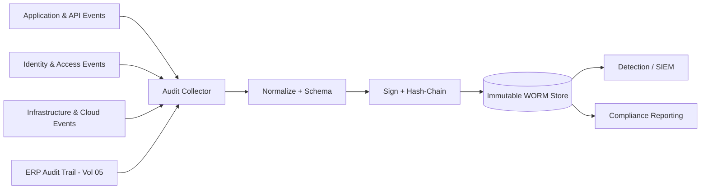

# Volume 12 - Audit Logging

| Field | Value |
|---|---|
| Document ID | WORLD-VOL12-024 |
| Title | Audit Logging |
| Version | 1.0 |
| Status | Approved |
| Classification | Internal |
| Founder | Mahesh Choudhary |

## Purpose

This chapter defines how Project WORLD produces, protects, and retains the authoritative record of security-relevant events across the platform. Audit logging is the memory of the system: it captures who did what, to which resource, from where, and with what result, so that access can be reconstructed, misuse can be proven, and compliance can be demonstrated. Without a complete, tamper-evident audit record, every other security control is unverifiable after the fact. This chapter establishes what must be logged, how log integrity is guaranteed, and how audit data becomes the shared source of truth for detection, response, and attestation.

## Scope

The chapter covers the definition of auditable events, the canonical audit event schema, integrity and tamper-evidence controls, retention and legal hold, and the pipeline that carries audit data to detection and reporting consumers. It aligns the security audit stream with the platform audit data of Volume 09 (Chapter 22) and the ERP audit trail of Volume 05 (Chapter 34), and it feeds Threat Detection (Chapter 25), Incident Response (Chapter 26), and Security Monitoring (Chapter 27). Application-level logging for debugging, and general observability telemetry, are governed by Volume 11 and are consumed here only where they carry security signal.

## Architecture

WORLD treats audit logging as an append-only, integrity-protected pipeline. Every layer emits structured audit events through a common schema; events are signed, chained, and shipped to durable, immutable storage before being made available to detection and reporting consumers.

Because events are hash-chained and written to write-once storage before any consumer reads them, an attacker who compromises a single service cannot silently rewrite history: gaps or edits break the chain and are themselves detectable events.

| Event Attribute | Description | Example |
|---|---|---|
| Actor | Identity that initiated the action | user:e.torres / agent:invoice-bot |
| Action | Operation performed | grant.role / record.update |
| Resource | Target object and scope | ledger:AP-2026 |
| Context | Device, IP, session, tenant | session:9f2a, trusted-device |
| Outcome | Result and reason | denied - policy P-14 |
| Timestamp | Signed, synchronized UTC time | 2026-07-12T09:14:22Z |

**Enterprise example:** During a quarterly access review, an auditor questions who approved elevated finance permissions for a contractor. The security team queries the audit store by resource and action, retrieves the signed chain of grant, use, and revocation events, and verifies the hash chain end to end. The complete, provably unaltered trail is produced in minutes, satisfying the auditor and closing the finding without manual reconstruction.

## Implementation Strategy

WORLD standardizes a single audit event schema and requires every service, identity provider, and infrastructure control plane to emit through it. A collector normalizes events, enriches them with identity, device, and tenant context, and applies a cryptographic hash chain so each record commits to its predecessor. Events are written to immutable, write-once-read-many storage with defined retention and legal-hold support before downstream consumers see them. Time is synchronized so ordering is trustworthy, and clock or sequence anomalies raise alerts. Access to audit data is itself audited and least-privilege, separating those who generate events from those who administer the store. Retention tiers balance hot searchable storage for recent events against cost-efficient cold archives for long-horizon compliance.

## Business Value

A complete, tamper-evident audit record converts trust from assertion into evidence. It is the primary control auditors examine for SOC 2, ISO 27001, and financial regulations, so disciplined audit logging directly shortens audit cycles and de-risks certification. Operationally, it collapses the cost of investigations: incidents are reconstructed from a single authoritative timeline rather than stitched together from fragile, scattered logs. It also deters insider misuse, because every privileged action is known to be recorded and non-repudiable.

## Relationship to AI

Actions taken by AI agents are first-class auditable events, logged with the same schema and rigor as human actions so that autonomous behavior is fully accountable and reconstructable. Conversely, the audit stream is a primary input for AI-assisted detection: models baseline normal actor behavior and surface anomalies far faster than manual review. The AI Business Partner surfaces relevant audit findings to leaders in plain language - for example, flagging an unusual pattern of after-hours privileged access - turning a raw event log into an understandable security signal.

## Relationship to ERP

Every financially material ERP action - a journal posting, an approval, a master-data change - generates an audit event that ties the security record to the ERP audit trail defined in Volume 05, Chapter 34. This linkage enforces non-repudiation for transactions and supports segregation-of-duties analysis, so a suspicious posting can be traced to the exact identity, session, and device that produced it, preserving the integrity of the system of record.

## Relationship to Infrastructure

Audit logging consumes the identity and access events of Section B, the encryption and signing keys of Section C, and the platform audit data model of Volume 09, Chapter 22. The collection pipeline, immutable storage, and time synchronization run on Volume 11 infrastructure and observability foundations. The resulting audit store is the shared substrate that Threat Detection, Incident Response, and Security Monitoring all read from.

## Future Expansion

Future direction includes cryptographic transparency logs and external anchoring so audit integrity can be verified by third parties without trusting WORLD, privacy-preserving audit techniques that prove properties of events without exposing sensitive content, and richer provenance for AI agent decisions capturing the reasoning context behind each automated action. Real-time streaming attestation will let auditors observe control effectiveness continuously rather than at periodic review.

## Cross-References

- [Threat Detection](/docs/blueprint/volume-12-security/section-f-threat-and-response/25-threat-detection.md)
- [Security Monitoring](/docs/blueprint/volume-12-security/section-f-threat-and-response/27-security-monitoring.md)
- [Volume 09 - Database](/docs/blueprint/volume-09-database/README.md)
- [Volume 05 - ERP Foundation](/docs/blueprint/volume-05-erp-foundation/README.md)

## References

- [Volume 01 - Vision and Philosophy](/docs/blueprint/volume-01-vision-and-philosophy/README.md)
- [Document Standards](/docs/governance/document-standards.md)

## Change Log

| Version | Date | Author | Notes |
|---|---|---|---|
| 1.0 | 2026-07-12 | Lead Software Engineer | Initial approved version. |
