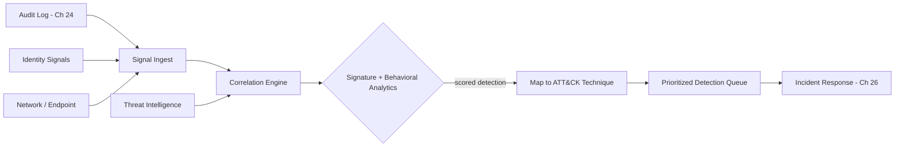

# Volume 12 - Threat Detection

| Field | Value |
|---|---|
| Document ID | WORLD-VOL12-025 |
| Title | Threat Detection |
| Version | 1.0 |
| Status | Approved |
| Classification | Internal |
| Founder | Mahesh Choudhary |

## Purpose

This chapter defines how Project WORLD identifies malicious and anomalous activity across the platform before it becomes a breach. Prevention controls reduce the attack surface, but no control set is perfect; threat detection is the discipline of assuming some attempts will succeed and finding them quickly. This chapter establishes how WORLD turns the audit and telemetry streams into high-confidence detections, how signature, behavioral, and AI-assisted methods combine, and how detections are mapped to adversary techniques so that response is fast, prioritized, and grounded in evidence.

## Scope

The chapter covers detection inputs and normalization, the layered detection model (signature, heuristic, and behavioral analytics), threat intelligence enrichment, mapping of detections to a recognized adversary technique framework, and the handoff of confirmed detections to Incident Response. It consumes the audit record of Chapter 24 and the identity, network, and endpoint signals from Sections B, D, and E, and it feeds Chapters 26 and 27. Automated remediation is introduced here conceptually and operationalized in Incident Response.

## Architecture

WORLD centralizes security signal into a detection engine that correlates events across layers, enriches them with threat intelligence, and scores them into prioritized detections. Analytics run continuously and map findings to adversary techniques so responders receive context, not just alerts.

Because detections are correlated across layers and scored rather than raised in isolation, a single weak indicator becomes a strong, actionable signal when combined with corroborating evidence, and responders spend their attention on ranked threats instead of undifferentiated noise.

| Detection Method | Detects | Strength | Limitation |
|---|---|---|---|
| Signature | Known malware, known IoCs | Precise, low false positives | Misses novel attacks |
| Heuristic / rule | Known bad patterns | Fast, explainable | Rigid, needs tuning |
| Behavioral analytics | Deviations from baseline | Catches unknown threats | Needs learning period |
| AI-assisted correlation | Multi-stage, subtle attacks | Surfaces weak-signal chains | Requires quality data |

**Enterprise example:** An attacker uses valid stolen credentials, so no signature fires. Behavioral analytics notices the account authenticating from a new country minutes after a normal domestic login (impossible travel), then enumerating finance records it never touches. The correlation engine links these events, scores the chain high, maps it to credential-access and discovery techniques, and raises a single prioritized detection. Response begins before any data is exfiltrated.

## Implementation Strategy

WORLD ingests the normalized audit stream and identity, network, and endpoint signals into a correlation engine. Signature and rule-based detections catch known threats cheaply, while behavioral analytics build per-actor and per-workload baselines to surface deviations that signatures miss. Threat intelligence enriches events with known-bad indicators and adversary context, and every confirmed detection is mapped to a technique in the MITRE ATT&CK framework so responders inherit a shared vocabulary and known countermeasures. Detections are scored by confidence and impact, de-duplicated, and queued for response. Detection logic is version-controlled, tested against historical data to measure true and false positive rates, and continuously tuned to fight alert fatigue.

## Business Value

Effective detection compresses attacker dwell time - the interval between compromise and discovery - which is the single largest driver of breach cost. By finding threats in minutes rather than months, WORLD limits blast radius, reduces the likelihood of material data loss, and preserves customer trust. Prioritized, technique-mapped detections make a lean security team effective, focusing scarce expert attention on the few signals that matter and providing auditors concrete evidence that monitoring controls are operating.

## Relationship to AI

AI is central to detection: models learn normal behavior for every user, agent, and workload and flag deviations that static rules cannot express, correlating weak signals into coherent attack narratives. AI agents are also monitored subjects - their actions are baselined so a compromised or manipulated agent is detected like any other anomalous actor. The AI Business Partner surfaces active threats to leaders in plain language, explaining what was detected, why it matters, and what is being done, turning technical detections into decisions the business can act on.

## Relationship to ERP

Threat detection watches ERP activity for fraud and abuse patterns - anomalous approval chains, segregation-of-duties violations, unusual payment or master-data changes - that signal insider threat or account takeover. Because ERP actions are audited and correlated, a manipulated financial workflow is detected as a security event, protecting the integrity of transactions and the system of record.

## Relationship to Infrastructure

Detection consumes the audit record of Chapter 24, the identity signals of Section B, and the network and endpoint telemetry of Sections D and E, all carried over Volume 11 infrastructure and observability. The correlation engine and analytics models run as platform services, and confirmed detections flow into the Incident Response process of Chapter 26 and the dashboards of Chapter 27.

## Future Expansion

Future direction includes autonomous detection agents that hunt proactively rather than waiting for alerts, deception technology such as honeytokens that generate high-fidelity signals, and adversarial-resilient models hardened against evasion and poisoning. Detection will extend deeper into the AI supply chain, identifying prompt-injection and model-abuse attempts against the platform's own agents as autonomous actors become a larger part of the attack surface.

## Cross-References

- [Audit Logging](/docs/blueprint/volume-12-security/section-f-threat-and-response/24-audit-logging.md)
- [Incident Response](/docs/blueprint/volume-12-security/section-f-threat-and-response/26-incident-response.md)
- [Security Monitoring](/docs/blueprint/volume-12-security/section-f-threat-and-response/27-security-monitoring.md)
- [Volume 11 - Infrastructure](/docs/blueprint/volume-11-infrastructure/README.md)

## References

- [Volume 01 - Vision and Philosophy](/docs/blueprint/volume-01-vision-and-philosophy/README.md)
- [Document Standards](/docs/governance/document-standards.md)

## Change Log

| Version | Date | Author | Notes |
|---|---|---|---|
| 1.0 | 2026-07-12 | Lead Software Engineer | Initial approved version. |
