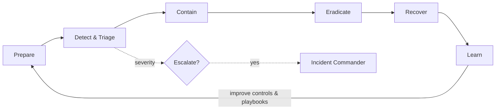

# Volume 12 - Incident Response

| Field | Value |
|---|---|
| Document ID | WORLD-VOL12-026 |
| Title | Incident Response |
| Version | 1.0 |
| Status | Approved |
| Classification | Internal |
| Founder | Mahesh Choudhary |

## Purpose

This chapter defines how Project WORLD responds when a security event becomes a confirmed incident. Detection finds a threat; incident response is the disciplined, rehearsed process that contains it, removes it, restores normal operation, and captures the lessons so it does not recur. In a crisis, improvisation is expensive and error-prone, so this chapter establishes clear phases, roles, decision authority, and automation so that response is fast, coordinated, and provable rather than chaotic.

## Scope

The chapter covers the full incident lifecycle - preparation, detection, containment, eradication, recovery, and learning - along with severity classification, roles and escalation, communication and regulatory notification, and the role of automated playbooks. It consumes detections from Chapter 25 and the audit record of Chapter 24, coordinates with the monitoring of Chapter 27, and connects to the business continuity and disaster-recovery controls of Section G. Detailed step-by-step runbooks live in the Incident Response Playbook appendix.

## Architecture

WORLD structures incident response as a defined lifecycle with an automation-first posture: playbooks execute containment and evidence-collection steps immediately, while humans direct judgment-heavy decisions. Every phase writes to the audit record so the response itself is fully accountable.

Because the lifecycle is a closed loop, every incident feeds preparation for the next: playbooks, detections, and controls are strengthened by what each incident reveals, so the platform grows harder to attack over time rather than merely recovering to its prior state.

| Phase | Objective | Representative Actions |
|---|---|---|
| Prepare | Be ready before an incident | Playbooks, roles, drills, tooling |
| Detect &amp; Triage | Confirm and classify | Validate detection, assign severity |
| Contain | Stop the spread | Isolate hosts, revoke sessions and keys |
| Eradicate | Remove the threat | Delete malware, close the entry vector |
| Recover | Restore safely | Rebuild, restore data, verify integrity |
| Learn | Prevent recurrence | Post-incident review, control updates |

**Enterprise example:** Detection confirms a compromised service account exfiltrating data. An automated playbook fires within seconds: it revokes the account's sessions and keys (contain), isolates the affected workload, and snapshots forensic evidence to the immutable audit store. The incident commander confirms severity, engages legal for notification assessment, and directs eradication of the malicious access path. Clean workloads are rebuilt from trusted images and data is restored (recover). A post-incident review adds a new detection rule and tightens the account's permissions (learn) - closing the loop.

## Implementation Strategy

WORLD codifies response as versioned playbooks aligned to the lifecycle phases, with an incident commander model that gives one person clear decision authority during a crisis. Severity classification determines escalation speed, communication reach, and whether regulatory or customer notification clocks start. Automation handles the fast, deterministic steps - session and key revocation, host isolation, evidence capture - through the SOAR-style orchestration introduced in Chapter 27, while humans own judgment calls such as when to disconnect a production system. Every action is logged to the immutable audit record so the response is reconstructable and defensible. Regular tabletop and live-fire drills validate that playbooks, roles, and tooling actually work under pressure before a real incident tests them.

## Business Value

A rehearsed response process is the difference between a contained event and a headline breach. Fast, disciplined containment limits data loss, regulatory penalty, and reputational damage, and directly satisfies the incident-management requirements of SOC 2, ISO 27001, and breach-notification law. Documented, drilled response also shortens recovery time, reduces the chance of costly mistakes made under stress, and gives customers and regulators evidence that WORLD can be trusted to handle the inevitable well.

## Relationship to AI

AI accelerates response by triaging and correlating incident signals, recommending or executing containment playbook steps, and drafting incident timelines from the audit record for responders to review. The AI Business Partner surfaces active incidents to leadership in plain language - severity, business impact, and current status - so executives can make informed decisions without waiting for a technical translation. AI agents involved in an incident, whether as targets or tools, are contained through the same revocation mechanisms as any other actor, and their scoped authority makes rapid isolation possible.

## Relationship to ERP

When an incident touches financial systems, response must protect the integrity of the ERP system of record: containment may freeze specific transactions or accounts rather than halting the business, and recovery verifies that no unauthorized postings persist. The audit linkage to Volume 05 lets responders prove exactly which financial actions occurred during the incident window, supporting both remediation and any required restatement.

## Relationship to Infrastructure

Incident response consumes detections from Chapter 25 and the audit record of Chapter 24, executes containment through identity revocation (Section B) and endpoint and network controls (Sections D and E), and relies on Volume 11 infrastructure for isolation, rebuild, and restore. Recovery coordinates with the backup, continuity, and disaster-recovery controls of Section G to bring systems back to a trusted state.

## Future Expansion

Future direction includes increasingly autonomous response, where high-confidence, low-risk incidents are contained end to end by trusted automation with human oversight on exceptions, and AI-generated post-incident analysis that proposes concrete control improvements. Cross-organization intelligence sharing will let WORLD respond to emerging campaigns proactively, and continuous, automated response drills will keep readiness measurable rather than assumed.

## Cross-References

- [Threat Detection](/docs/blueprint/volume-12-security/section-f-threat-and-response/25-threat-detection.md)
- [Security Monitoring](/docs/blueprint/volume-12-security/section-f-threat-and-response/27-security-monitoring.md)
- [Audit Logging](/docs/blueprint/volume-12-security/section-f-threat-and-response/24-audit-logging.md)
- [Volume 11 - Infrastructure](/docs/blueprint/volume-11-infrastructure/README.md)

## References

- [Volume 01 - Vision and Philosophy](/docs/blueprint/volume-01-vision-and-philosophy/README.md)
- [Document Standards](/docs/governance/document-standards.md)

## Change Log

| Version | Date | Author | Notes |
|---|---|---|---|
| 1.0 | 2026-07-12 | Lead Software Engineer | Initial approved version. |
