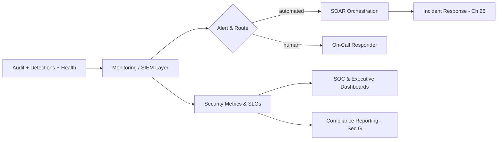

# Volume 12 - Security Monitoring

| Field | Value |
|---|---|
| Document ID | WORLD-VOL12-027 |
| Title | Security Monitoring |
| Version | 1.0 |
| Status | Approved |
| Classification | Internal |
| Founder | Mahesh Choudhary |

## Purpose

This chapter defines how Project WORLD maintains continuous visibility into its security posture and orchestrates the flow from signal to action. Audit logging records events, detection finds threats, and incident response acts on them; security monitoring is the connective operational layer that keeps all of it running, visible, and measurable in real time. This chapter establishes the monitoring surface, the metrics that measure security effectiveness, the alerting and orchestration that turn detections into coordinated response, and the dashboards that make posture legible to operators and leaders.

## Scope

The chapter covers the security monitoring surface, key security metrics and health indicators, alerting and on-call routing, security orchestration and automated response (SOAR-style workflows), and dashboards for both the security operations function and business leadership. It integrates the audit record of Chapter 24, the detections of Chapter 25, and the response process of Chapter 26, and it builds on the observability foundation of Volume 11. Compliance reporting derived from these signals connects to Section G.

## Architecture

WORLD unifies security signals into a monitoring and orchestration layer that continuously evaluates posture, routes alerts to the right responders, and drives automated playbooks. Dashboards render both operational detail for analysts and posture summaries for leadership.

Because monitoring, metrics, alerting, and orchestration share one layer, a detection can move from signal to routed alert to automated containment without leaving the platform, and the same data that drives response also proves control effectiveness to auditors.

| Metric | Measures | Why It Matters |
|---|---|---|
| Mean time to detect (MTTD) | Speed of finding threats | Shorter dwell time, smaller impact |
| Mean time to respond (MTTR) | Speed of containment | Limits blast radius |
| Alert precision | Ratio of true to total alerts | Controls analyst fatigue |
| Control coverage | Assets under monitoring | Reveals blind spots |
| Detection freshness | Age and test status of rules | Keeps detection effective |

**Enterprise example:** A SOC dashboard shows detection coverage drop for a newly deployed workload that is emitting no audit events. Monitoring raises a coverage alert before any attack occurs, an on-call engineer confirms a misconfigured log forwarder, and a SOAR workflow reapplies the correct configuration. A blind spot is closed proactively - the platform catches the absence of signal, not just the presence of a threat.

## Implementation Strategy

WORLD aggregates audit events, detections, and system health into a monitoring layer that continuously computes security metrics and service-level objectives. Alerts are deduplicated, prioritized by severity and confidence, and routed to automated playbooks or human on-call responders based on defined rules, so trivial events self-resolve while serious ones reach a person immediately. SOAR-style orchestration executes multi-step response workflows and hands confirmed incidents to the Chapter 26 process. Dashboards are tailored to audience - operational depth for the SOC, posture and risk trends for leadership - and every alert rule and playbook is version-controlled, tested, and tuned to keep precision high. Coverage monitoring watches for missing signal so blind spots are detected as diligently as active threats.

## Business Value

Continuous monitoring turns security from a periodic audit exercise into a measurable, always-on operational capability. Metrics such as MTTD and MTTR make security effectiveness visible and manageable, letting leadership invest where it matters and demonstrate diligence to customers and regulators. Automation amplifies a lean team, resolving routine events without human effort and reserving expert attention for genuine threats, while executive dashboards give leaders a clear, current picture of risk rather than a stale quarterly report.

## Relationship to AI

AI powers monitoring by scoring and correlating alerts, suppressing noise, and predicting emerging risk from trends before thresholds are crossed. It routes and even resolves routine alerts through orchestration, freeing analysts for judgment work. The AI Business Partner surfaces security posture to leadership in plain language - highlighting rising risk, coverage gaps, or notable incidents - so security signals reach decision-makers as business insight rather than raw telemetry. Monitoring also watches the platform's own AI agents, treating their health and behavior as part of the security surface.

## Relationship to ERP

Security monitoring includes ERP-specific health and risk signals - failed authorization spikes on financial modules, unusual transaction volumes, segregation-of-duties alerts - so operational security visibility extends to the system of record. Leaders see, in one posture view, whether the financial core is operating within expected and safe bounds.

## Relationship to Infrastructure

Security monitoring is built on the observability foundation of Volume 11, extending metrics, logging, and tracing with security-specific signals and correlation. It consumes the audit record of Chapter 24 and detections of Chapter 25, drives the response process of Chapter 26, and feeds the compliance reporting of Section G. The monitoring, alerting, and orchestration services run as platform components across the same infrastructure they observe.

## Future Expansion

Future direction includes predictive posture management that forecasts risk and recommends pre-emptive hardening, fully autonomous handling of routine alerts with human oversight reserved for exceptions, and unified dashboards that fuse security, reliability, and business KPIs into a single operational picture. Monitoring will expand to give every AI agent workload continuous, attestable health and behavior tracking as autonomous actors become a larger share of the platform.

## Cross-References

- [Audit Logging](/docs/blueprint/volume-12-security/section-f-threat-and-response/24-audit-logging.md)
- [Threat Detection](/docs/blueprint/volume-12-security/section-f-threat-and-response/25-threat-detection.md)
- [Incident Response](/docs/blueprint/volume-12-security/section-f-threat-and-response/26-incident-response.md)
- [Volume 11 - Infrastructure](/docs/blueprint/volume-11-infrastructure/README.md)

## References

- [Volume 01 - Vision and Philosophy](/docs/blueprint/volume-01-vision-and-philosophy/README.md)
- [Document Standards](/docs/governance/document-standards.md)

## Change Log

| Version | Date | Author | Notes |
|---|---|---|---|
| 1.0 | 2026-07-12 | Lead Software Engineer | Initial approved version. |
