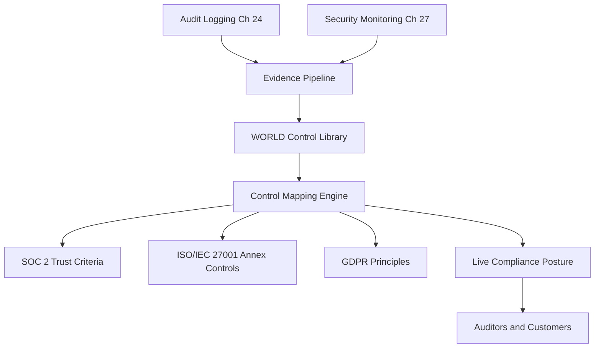

# Volume 12 - Compliance Framework

| Field | Value |
|---|---|
| Document ID | WORLD-VOL12-028 |
| Title | Compliance Framework |
| Version | 1.0 |
| Status | Approved |
| Classification | Internal |
| Founder | Mahesh Choudhary |

## Purpose

This chapter defines how Project WORLD demonstrates, on demand and with evidence, that its security posture satisfies the obligations placed on it by regulators, customers, and its own commitments. WORLD is an AI-Native Business Operating System that processes financial records, contracts, and personal data on behalf of the businesses that run on it; those businesses inherit WORLD's compliance posture and present it to their own auditors and customers. The Compliance Framework converts the controls described throughout Volume 12 into a coherent, mapped, continuously assured system of record so that compliance is a byproduct of correct operation rather than a periodic scramble.

## Scope

The chapter covers the compliance operating model: the standards WORLD aligns to, the mapping of internal controls to those standards, the evidence pipeline, and the roles that own compliance outcomes. It aligns with the ERP compliance capability (Volume 05, Chapter 62) and inherits the audit logging (Chapter 24) and monitoring (Chapter 27) foundations. It addresses SOC 2, ISO/IEC 27001, and GDPR at the level of principles and control families; it does not reproduce regulatory text or assert specific certification status.

## Architecture

The framework is organized as a single control library mapped many-to-many onto external standards. Each WORLD control is authored once, assigned an owner, instrumented for evidence, and then referenced by every standard whose requirements it satisfies. A compliance service aggregates control state, evidence freshness, and exceptions into a live posture that any authorized stakeholder can query.

Because a control is written once and mapped everywhere, adding a new standard is a mapping exercise, not a re-implementation.

## Implementation Strategy

Controls are expressed as testable statements with an owner, a control objective, an implementing mechanism, and an automated evidence source. Evidence is collected continuously from the audit log, configuration state, and monitoring signals rather than assembled at audit time. Exceptions are tracked with compensating controls and expiry dates. Independent review confirms that mappings are complete and evidence is authentic.

| WORLD Control | SOC 2 | ISO/IEC 27001 | GDPR | Evidence Source |
|---|---|---|---|---|
| Least-privilege access | Security, Confidentiality | Access control family | Data minimization | Permission Engine logs |
| Encryption at rest and in transit | Confidentiality | Cryptography family | Integrity and confidentiality | Key management records |
| Immutable audit logging | Security | Logging and monitoring | Accountability | Audit log integrity checks |
| Incident response | Security, Availability | Incident management | Breach notification readiness | IR drill records |
| Data retention and deletion | Confidentiality, Privacy | Asset handling | Storage limitation | Retention job attestations |

**Enterprise example:** A healthcare-adjacent SaaS company adopts WORLD and must pass a SOC 2 Type II audit while honoring GDPR subject-access requests. Because WORLD's data-retention control is mapped to both the SOC 2 confidentiality criteria and the GDPR storage-limitation principle, one implemented control and one evidence stream satisfy both. The auditor pulls live evidence directly from the compliance posture, and the review that historically took six weeks is completed in days.

## Business Value

Continuous compliance turns audits from disruptive events into routine reads of a live posture. It lowers the cost of entering regulated markets, shortens sales cycles by answering security questionnaires with authoritative evidence, and reduces the risk of fines and remediation. For businesses on WORLD, inherited compliance is a competitive asset they could not affordably build alone.

## Relationship to AI

The AI Business Partner (Volume 03) is both a subject of compliance and a tool for achieving it. Its actions are governed by the same mapped controls as human actors, and its decisions are logged as compliance evidence. The AI also assists compliance operations by drafting control narratives, detecting evidence gaps, and pre-filling questionnaires, always under human review and within scoped authority.

## Relationship to ERP

The ERP compliance module (Volume 05, Chapter 62) governs business-process compliance such as financial controls and segregation of duties; this chapter governs the security controls beneath them. The two share one control library so that a financial-approval control and its underlying access control are traced as a single lineage, giving auditors an unbroken chain from business rule to technical enforcement.

## Relationship to Infrastructure

Compliance evidence originates in the infrastructure layers (Volumes 08-11): configuration state, network posture, backup success, and observability signals. The framework consumes these as authoritative sources so that compliance reflects the system as actually deployed, not as documented intent.

## Future Expansion

The control library is designed to absorb new standards - emerging AI-governance regimes, sector-specific regulations, and evolving privacy law - through mapping rather than rebuilding. As continuous assurance matures, evidence collection moves ever closer to real time, and the framework trends toward always-audit-ready operation.

## Cross-References

- [Business Continuity](/docs/blueprint/volume-12-security/section-g-compliance-and-continuity/29-business-continuity.md)
- [Security Governance](/docs/blueprint/volume-12-security/section-h-governance-and-evolution/31-security-governance.md)
- [Volume 05 - ERP Compliance](/docs/blueprint/volume-05-erp-core/README.md)
- [Volume 02 - Governance](/docs/blueprint/volume-02-principles-and-governance/README.md)

## References

- [Volume 01 - Vision and Philosophy](/docs/blueprint/volume-01-vision-and-philosophy/README.md)
- [Document Standards](/docs/governance/document-standards.md)

## Change Log

| Version | Date | Author | Notes |
|---|---|---|---|
| 1.0 | 2026-07-12 | Lead Software Engineer | Initial approved version. |
