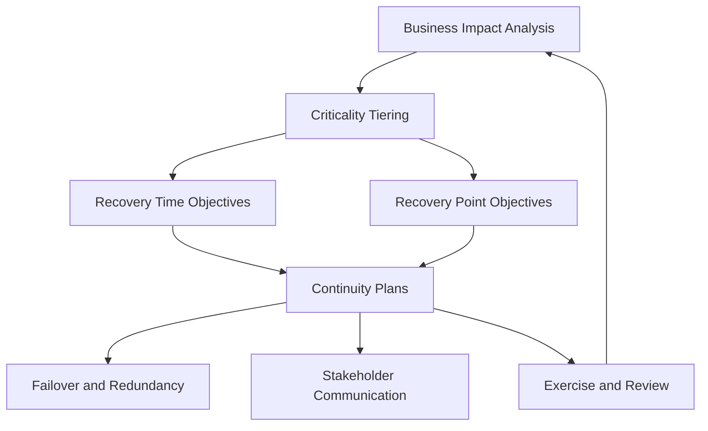

# Volume 12 - Business Continuity

| Field | Value |
|---|---|
| Document ID | WORLD-VOL12-029 |
| Title | Business Continuity |
| Version | 1.0 |
| Status | Approved |
| Classification | Internal |
| Founder | Mahesh Choudhary |

## Purpose

This chapter defines how Project WORLD keeps the businesses that depend on it operating through disruption - from a single-service failure to a regional outage or a security incident. Because WORLD runs the core operations of its customers, its availability is their availability; an hour of WORLD downtime is an hour those businesses cannot invoice, pay, or serve customers. Business continuity establishes the objectives, plans, and rehearsed responses that hold the platform's essential functions up when conditions are worst, and it does so with security preserved rather than suspended.

## Scope

The chapter covers the business continuity operating model: criticality tiering of services, recovery objectives, continuity plans, and the exercise regime that keeps them credible. It complements the security-specific recovery controls of Chapter 30 and aligns with the disaster-recovery capabilities of Volume 08 (Chapter 27) and Volume 11 (Chapters 21-22). It does not specify low-level infrastructure failover mechanics, which those volumes own; it governs the objectives and coordination above them.

## Architecture

Continuity is organized around a business impact analysis that assigns every service a criticality tier and a pair of recovery objectives: a Recovery Time Objective (how quickly it must return) and a Recovery Point Objective (how much data loss is tolerable). Tiers drive investment: the most critical services run active-active across zones, while lower tiers accept longer recovery. A continuity control plane monitors health, triggers failover, and coordinates communication.

The loop from exercise back to impact analysis ensures objectives are corrected by what rehearsals reveal, not by assumption.

## Implementation Strategy

Each critical service has a continuity plan naming its objectives, dependencies, failover procedure, and the roles responsible during an event. Plans are validated through scheduled exercises ranging from tabletop walkthroughs to live failover tests. Findings feed a corrective backlog. Continuity is treated as a security concern: failover paths, backups, and alternate sites carry the same encryption, access control, and logging as primary systems.

| Tier | Example Service | RTO | RPO | Continuity Pattern |
|---|---|---|---|---|
| Tier 0 | Authentication and Permission Engine | Minutes | Near zero | Active-active, multi-zone |
| Tier 1 | ERP transaction processing | Under one hour | Minutes | Hot standby with replication |
| Tier 2 | Reporting and analytics | Several hours | Under one hour | Warm standby |
| Tier 3 | Batch and archival | Next business day | Hours | Restore from backup |

**Enterprise example:** A logistics operator runs dispatch and invoicing on WORLD when a cloud availability zone fails at peak. Tier 0 authentication and Tier 1 ERP processing fail over to a healthy zone within their objectives, dispatch continues, and the operator's customers see no interruption. The continuity control plane notifies the operator's administrators of the event and the automatic recovery, and a post-incident review confirms objectives were met.

## Business Value

Continuity protects revenue, reputation, and contractual commitments for both WORLD and its customers. Explicit, tested recovery objectives let businesses make credible availability promises to their own customers and satisfy resilience requirements in enterprise procurement. Rehearsed response turns disruption from an existential threat into a managed event.

## Relationship to AI

The AI Business Partner (Volume 03) depends on continuity to keep operating and contributes to it. During disruption the AI can triage impact, execute pre-approved continuity runbooks within its scoped authority, and keep stakeholders informed. Its own critical functions are tiered and recovered like any other service, and its actions during an event are logged for later review.

## Relationship to ERP

The ERP (Volumes 05-06) holds the transactional heart of the businesses on WORLD, so its services occupy the highest continuity tiers. Recovery objectives are aligned with the integrity guarantees of the financial ledger: failover must never compromise transactional consistency, and RPO for financial data trends toward zero.

## Relationship to Infrastructure

Continuity is realized on the resilience primitives of the infrastructure volumes: multi-zone deployment and disaster recovery in Volume 11 (Chapters 21-22), and the architectural availability patterns of Volume 08. This chapter sets the objectives those layers must meet and coordinates their behavior into a business-level response.

## Future Expansion

As WORLD grows, continuity extends toward multi-region and eventually multi-cloud resilience, chaos-engineering practices that continuously validate recovery, and AI-driven prediction that pre-positions capacity ahead of forecast disruption. Objectives tighten as the business criticality of the platform rises.

## Cross-References

- [Disaster Recovery Security](/docs/blueprint/volume-12-security/section-g-compliance-and-continuity/30-disaster-recovery-security.md)
- [Compliance Framework](/docs/blueprint/volume-12-security/section-g-compliance-and-continuity/28-compliance-framework.md)
- [Volume 08 - Disaster Recovery](/docs/blueprint/volume-08-architecture/README.md)
- [Volume 11 - Disaster Recovery and Business Continuity](/docs/blueprint/volume-11-infrastructure/README.md)

## References

- [Volume 01 - Vision and Philosophy](/docs/blueprint/volume-01-vision-and-philosophy/README.md)
- [Document Standards](/docs/governance/document-standards.md)

## Change Log

| Version | Date | Author | Notes |
|---|---|---|---|
| 1.0 | 2026-07-12 | Lead Software Engineer | Initial approved version. |
