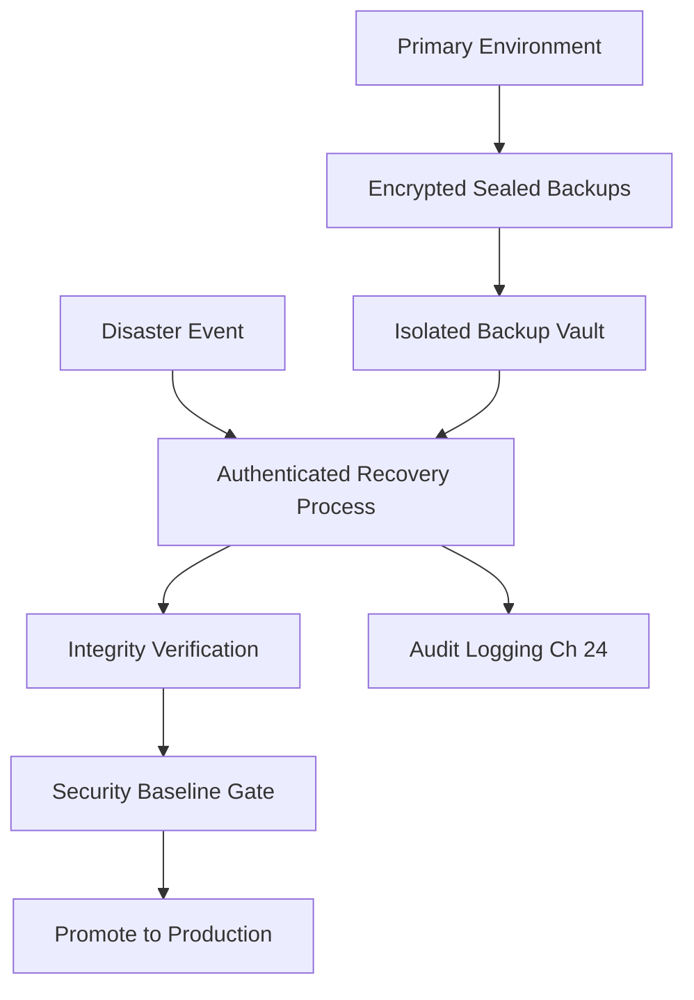

# Volume 12 - Disaster Recovery Security

| Field | Value |
|---|---|
| Document ID | WORLD-VOL12-030 |
| Title | Disaster Recovery Security |
| Version | 1.0 |
| Status | Approved |
| Classification | Internal |
| Founder | Mahesh Choudhary |

## Purpose

This chapter ensures that when Project WORLD recovers from disaster, it recovers securely. Disaster recovery is a moment of maximum exposure: backups are moved, alternate environments are activated, and pressure invites shortcuts. A recovery that restores availability while dropping encryption, access control, or logging trades one catastrophe for another. This chapter establishes the security requirements that every recovery path must satisfy so that the recovered system is as trustworthy as the primary it replaces.

## Scope

The chapter covers the security of the disaster-recovery lifecycle: protection of backups, integrity of recovery data, access control over failover procedures, and validation that a recovered environment meets the full security baseline before it carries production traffic. It builds on the continuity objectives of Chapter 29 and the recovery infrastructure of Volume 08 (Chapter 27) and Volume 11 (Chapters 21-22). It does not define recovery mechanics themselves; it defines the security constraints those mechanics must honor.

## Architecture

Recovery security spans three domains: protected backups, a secured recovery process, and a verified recovered state. Backups are encrypted, integrity-sealed, and access-controlled independently of the primary so that a compromise of production cannot corrupt or delete the means of recovery. The recovery process is itself an authenticated, logged, least-privilege operation. A recovered environment must pass a security gate before promotion.

The security baseline gate prevents an environment from carrying live data until encryption, access control, and monitoring are confirmed active.

## Implementation Strategy

Backups are encrypted with keys managed separately from production and written to immutable, access-restricted storage to resist ransomware and insider deletion. Every restore verifies cryptographic integrity before use. Recovery runbooks require multi-party authorization for high-impact actions and log every step to the immutable audit trail. Recovery exercises test not only that data returns but that it returns secure.

| Recovery Security Control | Requirement | Verification |
|---|---|---|
| Backup encryption | Independent keys, encrypted at rest | Key custody audit |
| Backup immutability | Write-once, deletion-protected | Restore-from-immutable test |
| Integrity verification | Checksums validated on restore | Automated integrity check |
| Access control | Least privilege, multi-party for critical steps | Recovery access review |
| Baseline gate | Full security posture before promotion | Pre-promotion security scan |

**Enterprise example:** A ransomware attack encrypts a professional-services firm's primary WORLD data store. Because backups are held in an isolated, immutable vault with independent keys, the attacker cannot reach them. Recovery runs under multi-party authorization, integrity checks confirm the restored data is untampered, and the recovered environment passes the security baseline gate before customers are routed to it. The firm resumes operation on a clean, fully secured system, and the attacker gains no leverage.

## Business Value

Secure recovery removes the false choice between speed and safety. It defeats the ransomware playbook of destroying backups, protects customer data during the platform's most vulnerable moments, and lets businesses trust that recovery restores a system worthy of that trust. It also satisfies auditor and insurer expectations that resilience does not come at security's expense.

## Relationship to AI

The AI Business Partner (Volume 03) can orchestrate recovery runbooks under scoped, pre-approved authority, accelerating response while remaining inside guardrails. Critically, the AI cannot bypass the security baseline gate or unilaterally authorize high-impact recovery actions; those require the same multi-party controls as any actor, ensuring autonomy never weakens recovery security.

## Relationship to ERP

ERP data (Volumes 05-06) is the highest-value recovery target and demands near-zero data loss and provable integrity. Recovery security guarantees that a restored ledger is complete and untampered, preserving the financial correctness on which the businesses on WORLD depend.

## Relationship to Infrastructure

This chapter applies security constraints to the recovery infrastructure of Volume 11 (Chapters 21-22) and the architectural recovery patterns of Volume 08 (Chapter 27). It ensures backup storage, replication channels, and failover environments inherit the encryption, access control, and logging defined across Volume 12.

## Future Expansion

Recovery security advances toward continuously validated backups, automated clean-room recovery that rebuilds environments from known-good state, and AI-assisted forensic triage that certifies a recovered system is free of the compromise that caused the disaster. Immutable, cryptographically attested recovery becomes the default.

## Cross-References

- [Business Continuity](/docs/blueprint/volume-12-security/section-g-compliance-and-continuity/29-business-continuity.md)
- [Audit Logging](/docs/blueprint/volume-12-security/section-f-threat-and-response/24-audit-logging.md)
- [Volume 08 - Disaster Recovery](/docs/blueprint/volume-08-architecture/README.md)
- [Volume 11 - Disaster Recovery and Business Continuity](/docs/blueprint/volume-11-infrastructure/README.md)

## References

- [Volume 01 - Vision and Philosophy](/docs/blueprint/volume-01-vision-and-philosophy/README.md)
- [Document Standards](/docs/governance/document-standards.md)

## Change Log

| Version | Date | Author | Notes |
|---|---|---|---|
| 1.0 | 2026-07-12 | Lead Software Engineer | Initial approved version. |
