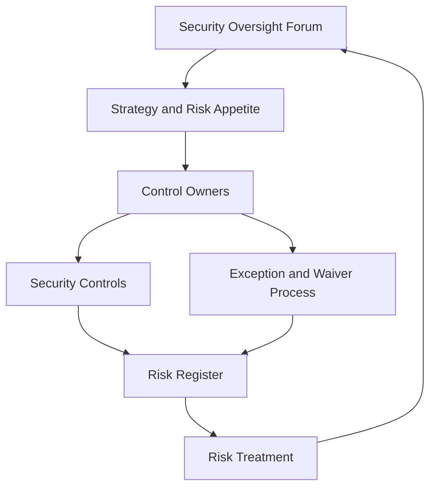

# Volume 12 - Security Governance

| Field | Value |
|---|---|
| Document ID | WORLD-VOL12-031 |
| Title | Security Governance |
| Version | 1.0 |
| Status | Approved |
| Classification | Internal |
| Founder | Mahesh Choudhary |

## Purpose

This chapter establishes how security decisions are made, owned, and held accountable across Project WORLD. Controls without governance drift: ownership blurs, exceptions accumulate, and risk goes unmanaged. Security governance provides the durable structure - roles, authorities, forums, and risk processes - that keeps the entire Volume 12 program coherent, funded, and answerable. It is the mechanism by which the security philosophy of Chapter 01 becomes a sustained organizational commitment rather than a founding aspiration.

## Scope

The chapter covers the security governance operating model: decision rights and roles, the risk management process, the exception and waiver lifecycle, and the oversight forums that review posture and direct investment. It aligns with the platform governance of Volume 02 and feeds the policy system of Chapter 32. It does not define individual controls; it defines who owns them and how decisions about them are made.

## Architecture

Governance is layered. A security oversight forum sets strategy and accepts residual risk at the highest level. Control owners are accountable for the design and operation of specific controls. A risk register records identified risks with owners, treatment plans, and status. An exception process allows time-boxed deviations under compensating controls. Every layer reports into a single posture view.

The cycle from risk register back to the oversight forum ensures accountability is continuous, not annual.

## Implementation Strategy

Every control has a named owner accountable for its effectiveness. Risks are logged with likelihood, impact, owner, and a treatment decision - mitigate, transfer, accept, or avoid. Accepted risks and exceptions are time-boxed, carry compensating controls, and expire automatically, forcing reconsideration. The oversight forum reviews posture, exceptions, and incidents on a regular cadence and sets priorities for the coming period.

| Governance Role | Primary Accountability | Key Artifact |
|---|---|---|
| Security Oversight Forum | Risk appetite, strategy, funding | Posture review record |
| Control Owner | Design and operation of a control | Control attestation |
| Risk Owner | Treatment of a specific risk | Risk register entry |
| Exception Approver | Time-boxed deviations | Waiver with expiry |
| Compliance Lead | Standards mapping and evidence | Compliance posture (Ch 28) |

**Enterprise example:** A product team requests a temporary exception to ship a feature that logs more customer data than the retention standard allows. The exception process requires a risk-register entry, a compensating control (shortened retention and stricter access), a named owner, and a 90-day expiry. The oversight forum reviews it, accepts the bounded risk, and the exception auto-expires - forcing either a permanent fix or a fresh, deliberate decision rather than silent, indefinite drift.

## Business Value

Governance makes security predictable and defensible. It gives leadership a clear view of risk, prevents the quiet accumulation of unmanaged exposure, and produces the ownership records auditors and customers expect. Clear decision rights let the organization move quickly without sacrificing accountability, turning security from a bottleneck into a governed capability.

## Relationship to AI

The AI Business Partner (Volume 03) is governed like any other actor: its permissions, exceptions, and risk contributions are owned and reviewed. Governance also defines the guardrails for AI autonomy - what the AI may decide alone, what requires human approval, and how its risk decisions are recorded - ensuring autonomous action remains within a deliberate risk appetite.

## Relationship to ERP

Security governance connects to ERP governance (Volume 05) so that segregation-of-duties and financial-control decisions are consistent with the underlying security controls. A change to who may approve payments in the ERP is reflected as a governed security decision, keeping business and technical authority aligned.

## Relationship to Infrastructure

Governance sets the risk appetite that infrastructure teams (Volumes 08-11) implement: acceptable exposure, required redundancy, and change-control rigor. Infrastructure changes with security impact flow through the same risk and exception processes, ensuring the substrate evolves within governed boundaries.

## Future Expansion

Governance evolves toward continuous, data-driven oversight: real-time risk scoring, automated exception tracking, and AI-assisted risk analysis that surfaces emerging exposure before it materializes. As the platform and its regulatory context grow, governance forums and decision rights scale with them while the accountability model remains constant.

## Cross-References

- [Security Policies](/docs/blueprint/volume-12-security/section-h-governance-and-evolution/32-security-policies.md)
- [Security Architecture Evolution](/docs/blueprint/volume-12-security/section-h-governance-and-evolution/33-security-architecture-evolution.md)
- [Compliance Framework](/docs/blueprint/volume-12-security/section-g-compliance-and-continuity/28-compliance-framework.md)
- [Volume 02 - Governance](/docs/blueprint/volume-02-principles-and-governance/README.md)

## References

- [Volume 01 - Vision and Philosophy](/docs/blueprint/volume-01-vision-and-philosophy/README.md)
- [Document Standards](/docs/governance/document-standards.md)

## Change Log

| Version | Date | Author | Notes |
|---|---|---|---|
| 1.0 | 2026-07-12 | Lead Software Engineer | Initial approved version. |
