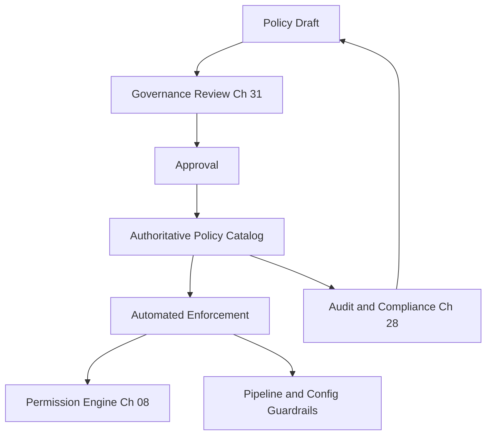

# Volume 12 - Security Policies

| Field | Value |
|---|---|
| Document ID | WORLD-VOL12-032 |
| Title | Security Policies |
| Version | 1.0 |
| Status | Approved |
| Classification | Internal |
| Founder | Mahesh Choudhary |

## Purpose

This chapter defines the policy system that translates Project WORLD's security governance into binding, enforceable rules. A policy states what must be true; a control makes it true; governance holds someone accountable for it. Without a coherent policy catalog, controls become tacit knowledge and enforcement becomes inconsistent. This chapter establishes how security policies are authored, approved, published, enforced, and kept current so that expectations are explicit and machine-enforceable wherever possible.

## Scope

The chapter covers the security policy lifecycle and the catalog of policy domains. It defines the structure of a policy, the approval and review cadence, and the link between written policy and automated enforcement. It operates under the governance model of Chapter 31 and supplies the requirements that controls throughout Volume 12 implement. It does not restate every control; it catalogs the policies those controls satisfy.

## Architecture

Policies are authored to a common template, approved through governance, published to a single authoritative catalog, and - wherever feasible - compiled into automated enforcement through the Permission Engine (Chapter 08), pipeline gates, and configuration guardrails. Each policy names an owner, the standards it supports, and its enforcement mechanism, closing the loop from written intent to runtime behavior.

Compiling policy into enforcement means the written rule and the running system cannot silently diverge.

## Implementation Strategy

Each policy follows a fixed structure: intent, scope, mandatory requirements, roles, enforcement mechanism, and review date. Policies are versioned, reviewed on a defined cadence, and mapped to the compliance framework so that each supports identifiable standard requirements. Where a policy can be enforced by code, the written policy references its automated control so that drift between statement and enforcement is detectable.

| Policy | Domain | Owner | Enforcement |
|---|---|---|---|
| Access Control Policy | Identity and access | Security Governance | Permission Engine, access reviews |
| Data Protection Policy | Encryption and privacy | Data Protection Lead | Encryption standards, retention jobs |
| Acceptable Use Policy | Human and AI actors | Security Governance | Monitoring, session controls |
| Change Management Policy | Software and config change | Engineering Lead | Pipeline gates, approvals |
| Incident Response Policy | Detection and response | Security Operations | IR runbooks (Ch 26) |
| Backup and Recovery Policy | Continuity and DR | Infrastructure Lead | Immutable backups (Ch 30) |

**Enterprise example:** The Change Management Policy requires that no code reaches production without peer review and a passing security scan. This policy is not merely written - it is compiled into pipeline gates that reject non-compliant merges automatically. When a developer under deadline pressure attempts to bypass review, the gate blocks the deployment and records the attempt. The policy enforces itself, and governance sees the exception without relying on anyone to report it.

## Business Value

A clear, enforced policy catalog removes ambiguity about what is required and demonstrates control to auditors and customers with a single authoritative source. Automated enforcement lowers the cost of compliance and eliminates the gap between stated and actual practice. For businesses on WORLD, inherited, enforced policies provide a governance baseline they can adopt rather than author from scratch.

## Relationship to AI

Policies apply to the AI Business Partner (Volume 03) as explicitly as to humans - acceptable use, data handling, and change management all bind the AI's behavior. Machine-readable policies are especially powerful for AI actors, because the AI can evaluate them at decision time, refusing actions that would violate policy and citing the specific rule. The AI can also assist in drafting and reviewing policies under human approval.

## Relationship to ERP

Policies governing financial data, segregation of duties, and retention are shared with ERP governance (Volumes 05-06) so that a single rule set spans business processes and their security enforcement. A data-retention policy applies identically to ERP records and the security controls that protect them.

## Relationship to Infrastructure

Many policies are enforced directly in the infrastructure layers (Volumes 08-11) as configuration guardrails, network rules, and pipeline gates. The policy catalog is the authoritative source those layers implement, ensuring infrastructure configuration reflects deliberate, approved policy rather than ad hoc convention.

## Future Expansion

Policy management trends toward fully policy-as-code, where every policy is expressed in a machine-evaluable form, continuously tested against live state, and automatically flagged when reality diverges. AI assists in keeping the catalog current, proposing updates as standards and threats evolve, always subject to governed human approval.

## Cross-References

- [Security Governance](/docs/blueprint/volume-12-security/section-h-governance-and-evolution/31-security-governance.md)
- [Permission Engine](/docs/blueprint/volume-12-security/section-b-identity-and-access/08-permission-engine.md)
- [Compliance Framework](/docs/blueprint/volume-12-security/section-g-compliance-and-continuity/28-compliance-framework.md)
- [Volume 02 - Governance](/docs/blueprint/volume-02-principles-and-governance/README.md)

## References

- [Volume 01 - Vision and Philosophy](/docs/blueprint/volume-01-vision-and-philosophy/README.md)
- [Document Standards](/docs/governance/document-standards.md)

## Change Log

| Version | Date | Author | Notes |
|---|---|---|---|
| 1.0 | 2026-07-12 | Lead Software Engineer | Initial approved version. |
