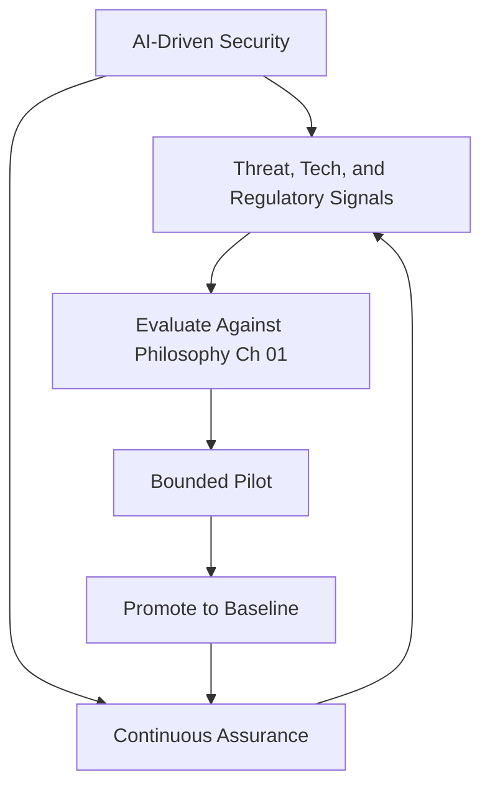

# Volume 12 - Security Architecture Evolution

| Field | Value |
|---|---|
| Document ID | WORLD-VOL12-033 |
| Title | Security Architecture Evolution |
| Version | 1.0 |
| Status | Approved |
| Classification | Internal |
| Founder | Mahesh Choudhary |

## Purpose

This chapter defines how Project WORLD's security architecture changes over time without losing its integrity. Threats, technologies, and regulations move continuously; a security posture fixed at a point in time decays into obsolescence. This closing chapter of Volume 12 establishes the disciplined process by which the platform's security evolves - adopting new defenses, retiring weakened ones, and raising the baseline - while remaining anchored to the founding convictions of Chapter 01. It ensures evolution is deliberate and governed rather than reactive and ad hoc.

## Scope

The chapter covers the model for evolving security architecture: how emerging capabilities are evaluated and adopted, how the posture is continuously assured, and how AI-driven security is incorporated. It operates under the governance of Chapter 31 and the policy system of Chapter 32. It is intentionally free of fixed dates; it describes the mechanism of evolution and the direction of travel, not a schedule.

## Architecture

Evolution is a governed loop. Signals - new threats, new standards, new technologies, and lessons from incidents - are continuously scanned. Candidate changes are evaluated against the security philosophy and risk appetite, piloted in bounded environments, and, if proven, promoted into the baseline. Continuous assurance verifies the whole posture at all times, and its findings feed the next cycle.

Because every candidate is tested against the founding convictions, the architecture can change substantially while its principles remain constant.

## Implementation Strategy

Evolution is managed as a maturity progression rather than a series of disconnected upgrades. Each domain has a current state and a target direction, and change is promoted only after piloting and governance approval. Continuous assurance - automated control testing, posture scanning, and independent review - replaces periodic audits as the primary confidence mechanism. AI-driven security is adopted incrementally, always under human oversight and within least-privilege bounds.

| Evolution Vector | Current Posture | Direction of Travel |
|---|---|---|
| Cryptography | Strong classical algorithms | Crypto-agility and post-quantum readiness |
| Assurance | Continuous automated evidence | Real-time, always-audit-ready posture |
| Detection and response | Analytics with human triage | AI-driven detection and assisted response |
| Trust model | Zero Trust enforcement | Adaptive, context-aware trust decisions |
| Data protection | Encryption at rest and in transit | Confidential computing for data in use |

**Enterprise example:** Advances in computing begin to threaten current cryptographic assumptions. Because WORLD's architecture is crypto-agile, the security team pilots a post-quantum algorithm in a bounded environment, validates it against the philosophy and performance requirements, and promotes it into the baseline through governance - rotating keys and certificates without re-architecting the platform. Businesses on WORLD inherit stronger cryptography with no disruption, and the change is fully evidenced for auditors.

## Business Value

Governed evolution protects the platform's most valuable asset - trust - across time. It prevents the accumulation of technical and security debt, keeps WORLD ahead of emerging threats, and lets the organization adopt innovation confidently because every change is tested against durable principles. For customers, it means the security posture they rely on today only strengthens, never silently decays.

## Relationship to AI

AI-driven security is central to the platform's evolution. The AI Business Partner and dedicated security agents increasingly detect anomalies, correlate signals, and propose or execute pre-approved responses at machine speed. Governance ensures this autonomy is bounded: AI expands what the security architecture can do while human oversight and least privilege ensure it never exceeds its mandate. The AI also helps drive continuous assurance by constantly testing controls.

## Relationship to ERP

As the ERP (Volumes 05-06) grows in capability and the value it holds, the security architecture evolves to protect it - stronger controls around financial data, tighter segregation of duties, and enhanced assurance for the system of record. Evolution keeps the protection of the crown jewels ahead of their rising value.

## Relationship to Infrastructure

Security evolution tracks infrastructure evolution (Volumes 08-11): new deployment models, new platform capabilities, and confidential-computing hardware all create opportunities and obligations for the security architecture. This chapter ensures those infrastructure advances are adopted with security co-evolving rather than lagging.

## Future Expansion

The end state is a self-assuring, adaptive security architecture: continuous real-time assurance, AI-driven detection and response operating within strict guardrails, crypto-agility that absorbs cryptographic change without disruption, and context-aware trust that tunes controls to live risk. The convictions of Chapter 01 remain the fixed point around which all of this turns, closing Volume 12 as a living system rather than a static specification.

## Cross-References

- [Security Governance](/docs/blueprint/volume-12-security/section-h-governance-and-evolution/31-security-governance.md)
- [Security Policies](/docs/blueprint/volume-12-security/section-h-governance-and-evolution/32-security-policies.md)
- [Security Philosophy](/docs/blueprint/volume-12-security/section-a-security-foundations/01-security-philosophy.md)
- [Volume 02 - Governance](/docs/blueprint/volume-02-principles-and-governance/README.md)

## References

- [Volume 01 - Vision and Philosophy](/docs/blueprint/volume-01-vision-and-philosophy/README.md)
- [Document Standards](/docs/governance/document-standards.md)

## Change Log

| Version | Date | Author | Notes |
|---|---|---|---|
| 1.0 | 2026-07-12 | Lead Software Engineer | Initial approved version. |
