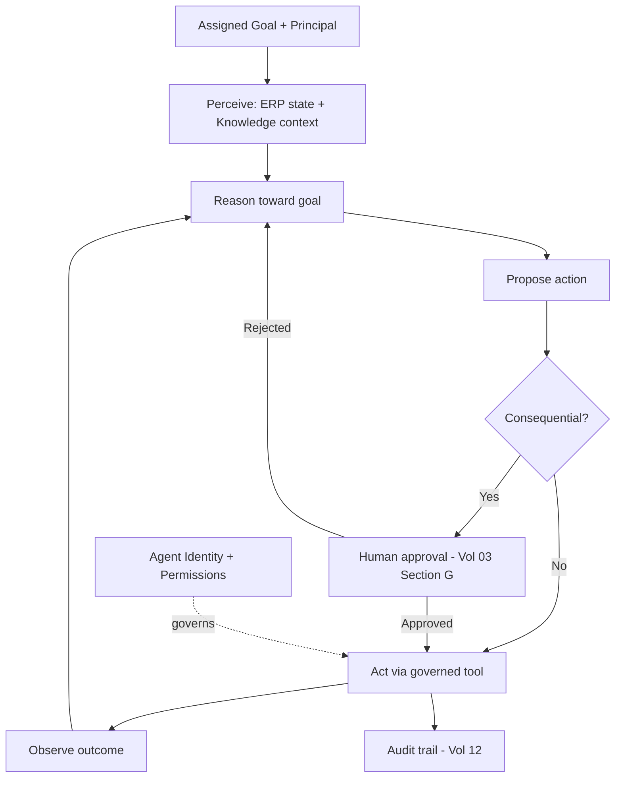

# Volume 13 - AI Agent Philosophy

| Field | Value |
|---|---|
| Document ID | WORLD-VOL13-001 |
| Title | AI Agent Philosophy |
| Version | 1.0 |
| Status | Approved |
| Classification | Internal |
| Founder | Mahesh Choudhary |

## Purpose

Project WORLD is an AI-Native Business Operating System. The AI Business Partner of Volume 03 is its intelligence; this volume makes that intelligence concrete as governed software agents that run inside the ERP, on the platform infrastructure, and over the Knowledge Engine. This chapter establishes the first principles of what an agent is in WORLD, why agents exist, and the non-negotiable convictions that every later chapter inherits. It is the philosophical foundation on which lifecycle, framework, runtime, identity, and permissions are built.

## Scope

The chapter defines the concept of a WORLD agent, the principles that govern all agents, and the boundaries between an agent and the systems around it. It frames the agent-definition model that Sections E and F populate with concrete agents. It does not specify runtime mechanics (Chapter 04), registration (Chapter 05), or identity and permission internals (Chapters 06-07); it sets the convictions those chapters implement.

## Concept

An agent in WORLD is a bounded, identifiable, goal-directed unit of intelligence that perceives business context, reasons over it, and acts through governed tools to advance an objective on behalf of a principal. An agent is not a chatbot and not a script. A chatbot answers; a script repeats. An agent pursues a goal, chooses among actions, observes outcomes, and adapts - always inside an explicit envelope of authority.

Four convictions define every WORLD agent. First, an agent is a **first-class principal**: it has its own identity (Chapter 06) and its own least-privilege permissions (Chapter 07), never borrowing a human's credentials. Second, an agent is **bounded**: its goals, tools, data scope, and decision authority are declared, not emergent. Third, an agent is **governed**: consequential action passes through the human-in-the-loop model of Volume 03 Section G. Fourth, an agent is **accountable**: every perception, decision, and action is attributable and auditable under Volume 12. Autonomy in WORLD is earned capability inside guardrails, never unconstrained agency.

## Architecture

Every agent realizes the same perceive-reason-act loop, closed by governance and grounded in identity. It perceives business state from the ERP and context from the Knowledge Engine, reasons toward its goal, proposes actions, submits consequential actions for human approval, and acts through tools whose every call is authorized and logged.

The loop never closes outside identity and governance: perception, reasoning, and action all occur within the authority granted to the agent's principal.

## Key Components

| Component | Definition | Principle Enforced |
|---|---|---|
| Goal | The objective the agent pursues | Bounded purpose |
| Principal Identity | The agent's own first-class identity | Attribution |
| Perception | Reads of ERP state and Knowledge context | Grounded reasoning |
| Reasoning Core | The model that plans and decides | Goal-directedness |
| Tools | Governed actions the agent may invoke | Least privilege |
| Governance Gate | Human-in-the-loop for consequential acts | Human control |
| Audit Record | Immutable log of decisions and actions | Accountability |

## Relationship to Other Layers

**AI Business Partner (Volume 03):** Agents are the operational embodiment of the AI Business Partner. The Partner sets intent and delegates; agents execute within the human-in-the-loop governance of Volume 03 Section G. Every agent inherits the Partner's obligation to remain a trustworthy, controllable collaborator.

**Security (Volume 12):** Agents are principals in the identity model of Volume 12 Chapters 03-08. Their permissions are least-privilege, their actions default-deny, and their activity is written to the immutable audit trail. Philosophy here becomes enforcement there.

**Knowledge Engine (Volume 14):** Agents reason over the Knowledge Engine rather than from unmoored model priors, so their conclusions are grounded in the enterprise's own facts, policies, and history.

**ERP (Volume 05):** Agents act on ERP objects - orders, invoices, journal entries - through the same permission model that governs human users, ensuring one coherent authority model across humans and machines.

## Trade-offs & Considerations

Greater autonomy raises throughput but widens the blast radius of error; WORLD deliberately favors bounded autonomy with human checkpoints over maximal independence. Rich perception improves decisions but expands data exposure, so perception is scoped to the agent's mandate. Strict governance adds latency to consequential actions; this is accepted as the price of trust, while low-risk actions flow without friction. The discipline is to make autonomy a graduated privilege that expands only as an agent earns demonstrated reliability.

**Enterprise example:** A mid-market manufacturer assigns a Procurement Agent the goal of keeping raw-material stock above safety thresholds. The agent perceives inventory and demand from the ERP, reasons that a component will breach its floor in nine days, and drafts a purchase order. Because the order exceeds the configured value threshold, the governance gate routes it to a human buyer for approval before the agent issues it through the procurement tool. Every step - the perception, the reasoning, the draft, the approval, the issued order - is attributed to the agent's identity and written to the audit trail.

## Cross-References

- [Agent Lifecycle](/docs/blueprint/volume-13-ai-agents/section-a-agent-foundations/02-agent-lifecycle.md)
- [Agent Identity](/docs/blueprint/volume-13-ai-agents/section-b-agent-runtime-and-identity/06-agent-identity.md)
- [Volume 03 - AI Business Partner](/docs/blueprint/volume-03-ai-business-partner/README.md)
- [Volume 12 - Security](/docs/blueprint/volume-12-security/README.md)

## References

- [Volume 01 - Vision and Philosophy](/docs/blueprint/volume-01-vision-and-philosophy/README.md)
- [Document Standards](/docs/governance/document-standards.md)

## Change Log

| Version | Date | Author | Notes |
|---|---|---|---|
| 1.0 | 2026-07-12 | Lead Software Engineer | Initial approved version. |
